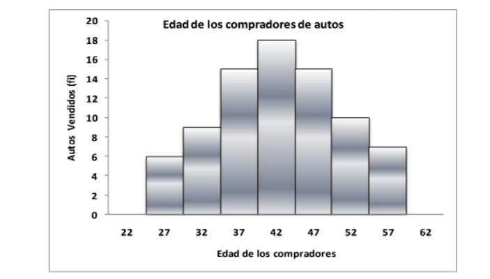
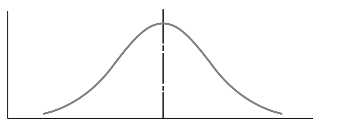

## Estadística

El término estadística se refiere a datos numéricos, tales como promedios, medianas, porcentajes y números índices que ayudan a entender una gran variedad situaciones.<br>
En un sentido amplio, la estadística se define como el arte y la ciencia de reunir datos, analizarlos, presentarlos e interpretarlos. Esto ayuda a las personas que deben tomar decisiones una mejor comprensión del entorno, permitiéndoles así tomar mejores decisiones con base en mejor información.


#### Lectura recomendada:

["Estadística Inferencial 1 Para Ingeniería y Ciencias" - Unidad 1](https://github.com/soyHenry/DS-M2/blob/main/Estad%C3%ADstica%20Inferencial.pdf)

["Estadística para Administración Economía" - Capítulo 2 y 3](https://github.com/soyHenry/DS-M2/blob/main/Anderson.pdf)


### Estadística Descriptiva
La mayor parte de la información estadística en periódicos, revistas, informes de empresas y otras publicaciones consta de datos que se resumen y presentan en una forma fácil de leer y de entender. A estos resúmenes de datos, que pueden ser tabulares, gráficos o numéricos se les conoce como estadística descriptiva. Mediante estadísticos se pueden describir y comprender un entorno.


### Estadística Inferencial
En muchas situaciones se requiere información acerca de grupos grandes de elementos (individuos, empresas, votantes, hogares, productos, clientes, etc.). Pero, debido al tiempo, costo y a otras consideraciones, sólo es posible recolectar los datos de una pequeña parte de este grupo. Al grupo grande de elementos en un determinado estudio se le llama población y al grupo pequeño muestra. En términos formales se emplean las definiciones siguientes. <br>
Al proceso de realizar un estudio para recolectar datos de toda una población se le llama censo. Al proceso de efectuar un estudio para recolectar datos de una muestra se le llama encuesta muestral. Una de las principales contribuciones de la estadística es emplear datos de una muestra para hacer estimaciones y probar hipótesis acerca de las características de una población mediante un proceso al que se le conoce como inferencia estadística.

#### Librerías para trabajar en python

```python

import numpy as np # importando numpy
from scipy import stats # importando scipy.stats
import pandas as pd #importando pandas
import matplotlib.pyplot as plt # importando matplotlib
import seaborn as sns # importando seaborn

```
#### Lectura recomendada:

[Estadísticas con python](https://realpython.com/python-statistics/#:~:text=Python%27s%20statistics%20is%20a%20built,%2D%20and%20multi%2Ddimensional%20arrays.)

[Estadísticas con numpy](https://numpy.org/doc/stable/reference/routines.statistics.html)

[Histogramas con  matplotlib](https://matplotlib.org/1.5.0/examples/statistics/index.html)

##### Lectura complementaria:

[Estadísticas con pandas](https://pandas.pydata.org/docs/getting_started/intro_tutorials/06_calculate_statistics.html)


### Población y muestra

Al recoger datos relativos a las características de un grupo de individuos u objetos, por ejemplo edad de los estudiantes de Henry, suele ser imposible o poco práctico observar todo el grupo, en especial si es muy grande. En vez de examinar el grupo entero, llamado población o universo, se examina una pequeña parte del grupo, llamado muestra.
Población es un conjunto de elementos, que responden a una determinada característica.
Es un conjunto homogéneo de elementos. El concepto de población en Estadística va más allá de la clásica definición que se da en la Demografía, esto es, la población de seres humanos exclusivamente. En la actividad estadística una población puede estar constituida por elementos de cualquier tipo, no solamente por seres humanos. Por ejemplo, se puede hablar de la población de viviendas de un barrio; de la población de comprobantes contables de una empresa; de la población de alumnos en Henry, etc.


### Distribución de frecuencias

La distribución de frecuencias es una forma de presentación de los datos que facilita su tratamiento conjunto y permite una comprensión diferente de ellos. Es una tabla de datos en base a observaciones (frecuencias). La frecuencia es el número de casos que pertenecen a un valor determinado.<br>
Por ejemplo si dos alumnos obtuvieron un 10 en su checkpoint, la frecuencia de 10 es igual a 2.<br>
En esta tabla los datos pierden la individualidad (se deja de conocer el valor particular de cada uno) porque se presentan en clases o categorías que agrupan a un conjunto de valores. Estos grupos se denominan intervalos.

Para construir una distribución de frecuencias se debe:
- Seleccionar el número apropiado de intervalos de clase
- Obtener el tamaño de cada intervalo de clase
- Establecer los límites de cada clase para evitar superposiciones

A continuación un ejemplo con las edades de compradores de automóviles:


### Histograma

El Histograma es un gráfico de la distribución de frecuencias, que se construye con rectángulos de superficie proporcional al producto de la amplitud por la frecuencia absoluta (o relativa) de cada uno de los intervalos de clase.<br>
Está formado por una serie de rectángulos, la variable de interés se representa en el eje horizontal, el número o porcentaje de observaciones se representa en el eje vertical. La base está sobre el eje horizontal y el centro en el punto medio. Los extremos de cada rectángulo coinciden con los verdaderos límites. La longitud es el tamaño de cada intervalo de clase y la superficie es proporcional a la frecuencia. La superficie total del histograma representa el 100 % de los datos.




```python
data = [1,2,2,3,5,6,7,8,8,9,9]

frecuencias, extremos = np.histogram(data, bins=5)
print(frecuencias, extremos)


plt.hist(x=data, bins=5, color='#F2AB6D', rwidth=0.85)
plt.title('Histograma ejemplo')
plt.xlabel('Data')
plt.ylabel('Frecuencia')
plt.show() 
 
```


### Medidas de tendencia central y de posición

- La tendencia central se refiere al punto medio de una distribución. Las medidas de tendencia central se conocen también como medidas de posición.<br>
- La dispersión se refiere a la separación de los datos en una distribución, es decir, al grado en que las observaciones se separan de la tendencia central.<br>
- El sesgo se produce cuando al trazar una linea vertical que pase por el punto más alto de la curva dividirá su área en dos partes que no son iguales. Cuando se da el caso de que cada parte es una imagen de espejo de la otra, esta cruva se denomina simétrica. Si la curva esta sesgada hacia la derecha, se considera positivamente sesgada y si el sesgo se pronuncia hacia la izquierda, se denomina negativamente sesgada.<br>

   

- La curtosis se denomina a la medición de la pronunicación de una curva. Puede que dos curvas tengan la misma posición central y la misma dispersión, y ambas son simétricas. En este caso estadísticos dicen que tienen un grado diferente de curtosis.


#### Media aritmética

Casi siempre, cuando nos referimos al “promedio” de algo, estamos hablando de la media aritmética. En una muestra de una población que consiste en n observaciones (con n minúscula), la media se denomina con x (x barra). Las medidas calculadas para una muestra se conocen como estadísticos.
La notación es diferente cuando calculamos medidas para la población entera, es decir, para el grupo que contiene a todos los elementos que estamos describiendo. La media de una población se simboliza con la letra griega mu.

   

Ventajas:

- Como un solo número que representa a un conjunto de datos completo.<br>
- Se trata de un concepto familiar para la mayoría de las personas y es intuitivamente claro.<br>
- Cada conjunto de datos tiene una media; es una medida que puede calcularse y es única debido a que cada conjunto de datos posee una y sólo una media.<br>
- Es útil para llevar a cabo procedimientos estadísticos como la comparación de medias de varios conjuntos de datos.<br>

Desventajas:
 
- Puede verse afectada por valores extremos que no son representativos del resto de los datos.<br>
- Para grandes conjuntos de datos que no están agrupados en frecuencias relativas resulta un cálculo tedioso.<br>
- Cuando existen valores de clase extermos abiertos ("60 años o más", "18 años o menos", etc.) no se puede cálcular.

Existen también otros conceptos relacionados a la media como media ponderada en donde el cálculo en base a la importancia de un valor en la muestra, o la media geométrica (se utiliza en tasas de interés) que se obtiene a partir de la raíz (n) del producto de los valores. 

```python
print(data.mean()) # Media

print(np.mean(data)) #Media numpy
```
      

#### La Mediana 

La mediana es un solo valor del conjunto de datos que mide la observación central del conunto. Es decir que esta sola observación es el elemento que está más al centro del conjunto de números, la mitad de los elementos están por arriba de este punto y la otra mitad está por debajo. Entendiendo al conjunto de datos como la cantidad total de obervaciones.<br>
Para hallar la mediana de un conjunto de datos, primero se organizan en orden descendente o ascendente. Si el conjunto de datos contiene un número impar de elementos, el de en medio en el arreglo es la mediana; si hay un número par de observaciones, la mediana es el promedio de los dos elementos de en medio.

Ventajas:<br>
- Los valores extremos no afectan a la mediana de manera tan grave como a la media.<br>
- Es fácil de entender y se puede calcular a partir de cualquier tipo de datos, incluso a partir de datos agrupados con clases de extremo abierto.<br>
- Podemos encontrar la mediana incluso cuando nuestros datos son descripciones cualitativas como color o nitidez, en lugar de números.

Desventajas:<br>
- Ciertos procedimientos estadísticos que utilizan la mediana son más complejos que aquellos que utilizan la media.<br>
- Debemos ordenar los datos antes de llevar a cabo cualquier cálculo.<br>
tema de la estimación con detalle.<br>

```python

print(np.median(data)) # Mediana numpy

```

 

#### La Moda

La moda es el valor que más se repite en el conjunto de datos. Como en todos los demás aspectos de la vida, el azar puede desempeñar un papel importante en la organización de datos. En ocasiones, el azar hace que un solo elemento no representativo se repita lo suficiente para ser el valor más frecuente del conjunto de datos. Es por esto que rara vez utilizamos la moda de un conjunto de datos no agrupados como una medida de tendencia central.<br>
Cuando los datos ya se encuentran agrupados en una distribución de frecuencias, podemos suponer que la moda está localizada en la clase que contiene el mayor número de elementos, es decir, en la clase que tiene la mayor frecuencia.<br>

Ventajas:<br>
- Se puede utilizar como una posición central para datos tanto cualitativos como cuantitativos.<br>
- También, al igual que la mediana, los valores extremos no afectan indebidamente a la moda.<br>
- Una tercera ventaja de la moda es que la podemos utilizar aun cuando una o más clases sean de extremo abierto.<br>

Desventajas:<br>
- La moda no se utiliza tan a menudo como medida de tendencia central.<br>
- Muchas veces, no existe un valor modal debido a que el conjunto de datos no contiene valores que se presenten más de una vez.<br>
- Cuando los conjuntos de datos contienen dos, tres o más modas, es difícil interpretarlos y compararlos.<br>

```python

print(stats.mode(data)) #Moda de stats en scipy 

```


Cuando trabajamos problemas de estadística, debemos decidir si vamos a utilizar la media, la mediana o la moda como medidas de tendencia central. Las distribuciones simétricas que sólo contienen una moda siempre tienen el mismo valor para la media, la mediana y la moda. En esos casos, no es necesario escoger la medida de tendencia central, pues ya está hecha la selección.<br>
En una distribución con sesgo positivo (es decir, sesgada a la derecha), la moda todavía se encuentra en el punto más alto de la distribución, la mediana está a la derecha de la moda y la media se encuentra todavía más a la derecha de la moda y la mediana.<br>
En una distribución con sesgo negativo (es decir, sesgada a la izquierda), la moda sigue siendo el punto más alto de la distribución, la mediana está a la izquierda y la media se encuentra todavía más a la izquierda de la moda y la mediana.<br>
Cuando la población está sesgada negativa o positivamente, la mediana suele ser la mejor medida de posición, debido a que siempre está entre la moda y la media. La frecuencia de ocurrencia de un solo valor no influye mucho en la mediana como es el caso de la moda, ni la distorsionan los valores extremos como la media.
En cualquier otro caso, no existen guías universales para la aplicación de la media, la mediana o la moda como medidas de tendencia central para diferentes poblaciones.

### La dispersión

Observa la imagen debajo de este párrafo, la media de las tres curvas es la misma, pero la curva A tiene menor separación (o
variabilidad) que la curva B, y ésta tiene menor variabilidad que la C. Si medimos sólo la media de estas tres distribuciones, estaremos pasando por alto una diferencia importante que existe entre las tres curvas. Al igual que sucede con cualquier conjunto de datos, la media, la mediana y la moda sólo nos revelan una parte de la información que debemos conocer acerca de las características de los datos. Para aumentar nuestro entendimiento del patrón de los datos, debemos medir también su dispersión, separación o variabilidad.


#### El Rango

El rango es la diferencia entre el más alto y el más pequeño de los valores observados. Es fácil entender y encontrar el rango, pero su utilidad como medida de dispersión es limitada. El rango sólo toma en cuenta los valores más alto y más bajo de una distribución y ninguna otra observación del conjunto de datos. Como resultado, ignora la naturaleza de la variación entre todas las demás observaciones, y tiene una gran influencia de los valores extremos.

#### La Varianza

Cada población tiene una varianza, su símbolo es sigma cuadrada. Para calcular la varianza de una población, la suma de los cuadrados de las distancias entre la media y cada elemento de la población se divide entre el número total de observaciones en población. Al elevar al cuadrado cada distancia, logramos que todos los números sean positivos y, al mismo tiempo, asignamos más peso a las desviaciones más grandes (desviación es la distancia entre la media y un valor).

Para poder realizar una interpretación intuitiva de la varinza, debemos hacer un cambio significativo en la varianza y que en consecuencia, sea menos confusa. Esta medida se conoce como la desviación estándar y es la raíz cuadrada de la varianza. La desviación estándar, entonces, queda en las mismas unidades que los datos originales. Si utilizaramos la varianza, tendríamos nuestros valores al cuadrado, lo cual resulta complejo de entender.


```python

print(np.var(data)) #Varianza Numpy

```

#### La Desviación Estándar

La desviación estándar de la población, es simplemente la raíz cuadrada de la varianza de la población. Como la varianza es el promedio de los cuadrados de las distancias de las observaciones a la media, la desviación estándar es la raíz cuadrada del promedio de los cuadrados de las distancias entre las observaciones y la media. Mientras que la varianza se expresa con el cuadrado de las unidades utilizadas para medir los datos, la desviación estándar está en las mismas unidades que las que se usaron para medir los datos.

```python

print(np.std(data)) #Desvío estándar Numpy

```


#### Coeficientes de variación

No podemos conocer la dispersión de un conjunto de datos hasta que conocemos su desviación estándar, su media y cómo se compara
la desviación estándar con la media.Necesitamos es una medida relativa que nos proporcione una estimación de la magnitud
de la desviación respecto a la magnitud de la media. El coeficiente de variación es una de estas medidas relativas de dispersión. Relaciona la desviación estándar y la media, expresando la desviación estándar como porcentaje de la media. La unidad de medida, entonces, es “porcentaje”, en lugar de las unidades de los datos originales.


=======
## Enlaces recomendados

[Brilliant](https://brilliant.org/)

#### Matemóvil

[Introducción a la estadística - Matemóvil](https://www.youtube.com/watch?v=gl9EEbT7viM&list=PL3KGq8pH1bFTdYhAMbC0XHRpe_njRSctM)

## Homework

1. Considere el siguiente areglo que contiene la altura de un grupo de estudiantes de Henry y cálcule:

```python
muestra = np.array( [[1.85, 1.8, 1.8 , 1.8],
                    [1.73,  1.7, 1.75, 1.76],
                    [ 1.65, 1.69,  1.67 ,  1.6],
                    [1.54,  1.57, 1.58, 1.59],
                    [ 1.4 , 1.42,  1.45, 1.48]]) 
```
- Media.
- Mediana.
- Moda
- Varianza
- Desvío estándar.

2. Convierta el arreglo en una lista y realice un Histograma de 5 intervalos. ¿Tiene distribución normal?.
3. Utilizando pandas describa el dataframe.
4. Con los siguientes datos construye un df y un array que permitan describir adecuadamente la muestra.<br>
'Ingreso en miles' : 10.5	6.8	20.7	18.2	8.6	25.8	22.2	5.9	7.6	11.8 <br>
'Años de estudio': 17	18	21	16	16	21	16	14	18	18 <br>
5. Realice un histograma para de 6 secciones para 'Ingreso en miles' y 'Años de estudio'.
6. Cálcula la media de 'Ingreso en miles' (df) utilizando pandas.
7. Cálcula la media de 'Ingreso en miles' (array) utilizando numpy.
8. Agregue los siguientes valores extremos al df [ 50, 35 ], [ 120, 30 ]. ¿En cuanto vario la media?, ¿Qué conclusiones obtiene de este resultado sobre la media?.


<table class="hide" width="100%" style='table-layout:fixed;'>
  <tr>
    <td>
      <a href="https://airtable.com/shrSzEYT4idEFGB8d?prefill_clase=00-PrimerosPasos">
        
        <br>
        Hacé click acá para dejar tu feedback sobre esta clase.
      </a>
    </td>
  </tr>
</table>
