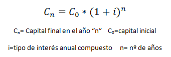
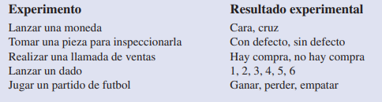
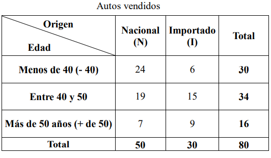
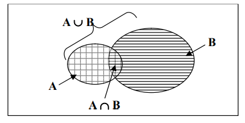
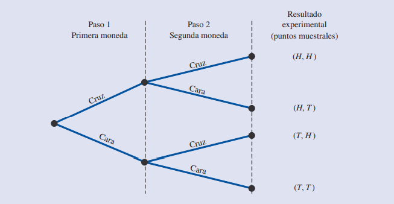
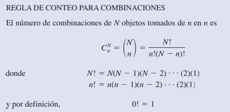
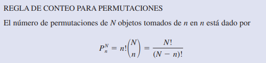
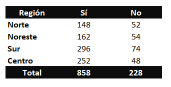
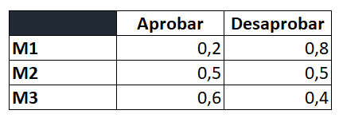

## Introducción a la teoría de probabilidad

La incertidumbre siempre ha tenido un interés particular para la humanidad, desde conocer el clima, el resultado del lanzamiento de una moneda o un dado, hasta situaciones modernas, como la cantidad de artículos defectuosos en un lote de tamaño n, curso del valor del dólar en un día determinado y los movimientos en la bolsa de valores para conocer cuáles acciones tienen mayor o menor riesgo en su inversión, entre otras.

La probabilidad es una medida numérica de la posibilidad de que ocurra un evento. Por tanto, las probabilidades son una medida del grado de incertidumbre asociado con cada uno de los eventos previamente enunciados. Si cuenta con las probabilidades, tiene la capacidad de determinar la posibilidad de ocurrencia que tiene cada evento. Los valores de probabilidad se encuentran en una escala de 0 a 1. Los valores cercanos a 0 indican que las posibilidades de que ocurra un evento son muy pocas. Los cercanos a 1 indican que es casi seguro que ocurra un evento. Otras probabilidades entre cero y uno representan distintos grados de posibilidad de que ocurra un evento. Por ejemplo, si considera el evento “que llueva mañana”, se entiende que si el pronóstico del tiempo dice “la probabilidad de que llueva es cercana a cero”, implica que casi no hay posibilidades de que llueva. En cambio, si informan que la probabilidad de que llueva es 0.90, sabe que es muy posible que llueva. La probabilidad de 0.50 indica que es igual de posible que llueva como que no llueva. En la figura 4.1 se presenta la probabilidad como una medida numérica de la posibilidad de que ocurra un evento.


Hoy día, la teoría de la probabilidad es una herramienta importante en la mayoría de las áreas de ingeniería, ciencias y administración. De manera que realizar un estudio adecuado de la probabilidad es fundamental para el éxito de muchas compañías.

En este módulo ratamos los fundamentos teóricos en los que se basa la construcción de la Teoría de las probabilidades haciendo énfasis en los modelos matemáticos, los cuales se clasifican en:<br>
• Determinísticos.<br>
• Probabilísticos.<br>

Como vimos en módulos anteriores, el origen de los modelos se justifica con el fin de estudiar un fenómeno el cual debemos imitar o reproducir.

Así como en las bases de datos, un modelo matemático es una representación simbólica de un fenómeno cualquiera, realizada con el fin de estudiarlo mejor, dichas representaciones puede ser fenómenos físicos, económicos, sociales, etcétera.

Los modelos matemáticos pueden clasificarse en determinísticos y probabilísticos, y para poderlos diferenciar es necesario conocer su definición y algunos ejemplos. 

#### Lectura recomendada:

["Estadística para administración y economía" - Capítulo 4.1](https://github.com/soyHenry/DS-M2/blob/main/Anderson.pdf)


### Modelos determinísticos.

Cuando se realiza el modelo matemático de un fenómeno y en este se pueden manejar los factores que intervienen en su estudio con el propósito de predecir sus resultados, se llamará modelo determinístico.

* Ejemplo: Cuando tenemos una inversión c a una tasa r, podemos calcular su Valor Futuro. El modelo es determinístico, puesto que tiene una inversión fija c a una tasa fija r; por tanto, es posible predecir el resultado que ocurrirá al cabo de n años mediante el uso de la siguiente fórmula:



Si inivirtieras $120.000 y manteniendo la inversión por 5 años al 8% -> 120.000 (1+0.08)^5 = 176.319,369216

```Python
#Función de interes compuesto
def interes(capitalInicial,i,n):
    valorFinal = capitalInicial*(1+i)**n
    return valorFinal

#Valore de cálculo
capital = 120000
i= 0.08
n = 5
 #Implementación
print(interes(capital,i,n))

```

### Modelos probabilisticos.

En los modelos probabilisticos, no podemos controlar los factores que intervienen en dichos modelos. A partir de lo cual surge la definición de modelo probabilístico o estocástico. Además de que dichos factores ocurren de tal manera que no es posible predecir sus resultados.
 

1. En el lanzamiento de una moneda equilibrada 10 veces para obtener cinco águilas, el modelo es de tipo probabilístico, puesto que no podemos predecir el resultado que va a ocurrir en el siguiente lanzamiento.
2. En una línea de producción, al realizar el control de calidad de los artículos se detecta cierta cantidad de productos defectuosos; no es posible determinar la cantidad o porcentaje de estos en la línea.


### Experimentos.
Al reproducir cualquier fenómeno, ya sea de manera determinística o probabilística, estamos experimentando, por lo que es necesario aclarar lo siguiente: ¿qué entenderemos por experimento al utilizar un modelo matemático de tipo probabilístico (cabe aclarar que hasta este momento no se ha dado la definición de probabilidad)? Así, para ir aclarando los conceptos, a continuación se presenta la definición formal de experimento aleatorio.

Llamaremos experimento aleatorio al proceso de obtención de una observación en que se cumple alguna de las siguientes condiciones:
a) Todos los resultados posibles son conocidos.
b) Antes de realizar el experimento el resultado es desconocido.
c) Es posible repetir el experimento en condiciones ideales.

Existen también experimientos del tipo determinísticos que se basan en la aplicación de modelos como el desarrollado en el ejemplo.

En el contexto de la probabilidad, un experimento es definido como un proceso que genera resultados definidos. Y en cada una de las repeticiones del experimento, habrá uno y sólo uno de los posibles resultados experimentales. A continuación se dan varios ejemplos de experimentos con sus correspondientes resultados.



Al especificar todos los resultados experimentales posibles, está definiendo el espacio muestral de un experimento.

### Espacio muestral:
El espacio muestral es el conjunto de todos los resultados posibles de un experimento, la colección de todos los posibles eventos. La forma en que se subdivide el espacio muestral depende del tipo de probabilidades que se va a determinar.

Hay varias formas alternativas de observar un espacio muestral:
- Clasificación cruzada de los eventos en una tabla llamada tabla de contingencias o tabla 
de probabilidad.<br>
- Representación gráfica de los diversos eventos como uniones o intersecciones de círculos en un diagrama de Venn. 

Una tabla de contingencia es aquella en la que las filas figuran todos los resultados posibles de una de las características de la variable y en columnas todos los resultados posibles de otra característica de la variable, y en cada celda figura los sucesos o eventos conjuntos.<br>
La tabla de contingencias o probabilidades ofrece una representación clara del número de posibles resultados de la variable pertinente, en especial si hay dos o más sucesos o eventos que se consideran simultáneamente.



Un diagrama de Venn es una segunda forma de presentar un espacio muestral. Es un diagrama asociado con la teoría de conjuntos de las matemáticas en el cual se describen los eventos que pueden ocurrir en una observación o experimento en particular. Una figura cerrada representa el espacio muestral, mientras que porciones del área, dentro del espacio representan eventos simples o compuestos particulares. En el diagrama se representan gráficamente los eventos como “uniones” o “intersecciones” de círculos. 



## Reglas de conteo, combinaciones y permutaciones

Al asignar probabilidades es necesario saber identificar y contar los resultados experimentales.<br>
A continuación tres reglas de conteo que son muy utilizadas.<br>
### Experimentos de pasos múltiples 

La primera regla de conteo sirve para experimentos de pasos múltiples. Considere un experimento que consiste en lanzar dos monedas. Defina los resultados experimentales en términos de las caras y cruces que se observan en las dos monedas. ¿Cuántos resultados experimentales tiene este experimento? El experimento de lanzar dos monedas es un experimento de dos pasos: el paso 1 es lanzar la primera moneda y el paso 2 es lanzar la segunda moneda. Si se emplea H para denotar cara y T para denotar cruz, (H, H) será el resultado experimental en el que se tiene cara en la primera moneda y cara en la segunda moneda. Si continúa con esta notación, el espacio muestral (S) en este experimento del lanzamiento de monedas será el siguiente:



Por tanto, hay cuatro resultados experimentales. En este caso es fácil enumerar todos los resultados experimentales. La regla de conteo para experimentos de pasos múltiples permite determinar el número de resultados experimentales sin tener que enumerarlos.<br>
Si considera el experimento del lanzamiento de dos monedas como la sucesión de lanzar primero una moneda y después lanzar la otra, siguiendo la regla de conteo (2)(2) = 4, entonces hay cuatro resultados distintos. El número de resultados experimentales de seis monedas es (2)(2)(2)(2)(2)(2) = 64.

### Combinaciones 

Otra regla de conteo útil le permite contar el número de resultados experimentales cuando el experimento consiste en seleccionar n objetos de un conjunto (usualmente mayor) de N objetos. Ésta es la regla de conteo para combinaciones:



Si no recuerdas el como cálcular un factorial, recuerda repasar los conceptos de funciones dados en el prepcourse.<br>
Como ejemplo del uso de la regla de conteo para combinaciones, considere un procedimiento de control de calidad en el que un inspector selecciona al azar dos de cinco piezas para probar que no tengan defectos. En un conjunto de cinco partes.<br>
 ¿cuántas combinaciones de dos partes pueden seleccionarse? De acuerdo con la regla de conteo, es claro que con N = 5 y n = 2 se tiene: 5! / 2! * (5-2)! = 10.<br>
 Asigando A,B,C,D,E para cada una de las partes, las 10 combinaciones o resultados experimentales serán AB, AC, AD, AE, BC, BD, BE, CD, CE y DE.<br>
Tomando otro ejemplo de la lotería en la que se seleccionan seis números de un conjunto de 53 números para determinar al ganador de la semana. Para establecer las distintas variables en la selección de seis enteros de un conjunto de 53, se usa la regla de conteo para combinaciones: 53! / 6! (53-6)! = 22.957.480.<br>
Si una persona compra un billete de lotería, tiene una en 22.957.480 posibilidades de ganar la lotería.

### Permutaciones

La tercera regla de conteo que suele ser útil, es para permutaciones. Dicha regla permite calcular el número de resultados experimentales cuando se seleccionan n objeto un conjunto de N objetos y el orden de selección es relevante. Los mismos n objetos seleccionados en orden diferente se consideran un resultado experimental diferente.



Con el mismo número de objetos, el número de permutaciones que se obtiene en un experimento es mayor que el número de combinaciones, ya que cada selección de n objetos se ordena de n! maneras diferentes.<br>
Para ver un ejemplo, reconsidere el proceso de control de calidad en el que un inspector selecciona dos de cinco piezas para probar que no tienen defectos. ¿Cuántas permutaciones puede seleccionar?: 5! / (5-2)! = 20.<br>

De manera que el experimento de seleccionar aleatoriamente dos piezas de un conjunto de cinco piezas, teniendo en cuenta el orden en que se seleccionen, tiene 20 resultados. Si las piezas se etiquetan A, B, C, D y E.<br> 
Las 20 permutaciones son AB, BA, AC, CA, AD, DA, AE, EA, BC, CB, BD, DB, BE, EB, CD, DC, CE, EC, DE y ED.

## Interpretaciones de la probabilidad.

No existe una forma única de asignación de probabilidades. Solo contamos con diferentes corrientes de probabilidad, las cuales se aplican para asignar un valor numérico a la posibilidad de la ocurrencia de algún suceso probabilístico.<br>

Recuerda estas reglas generales a la hora de asiganr probabilidades:<br>
- La probabilidad asignada a cada resultado experimental debe estar entre 0 y 1, inclusive.<br>
- La suma de las probabilidades de los resultados experimentales debe ser igual a 1.0.<br>

### Corriente clásica:<br>
En la corriente clásica se consideran espacios muestrales uniformes, es decir, se asignan probabilidades a eventos con base en resultados equiprobables (igualmente verosímiles). Esto es, los clasistas asignan la misma probabilidad a cada punto del espacio muestral. Si un experimento admite una cierta cantidad de resultados posibles, entonces las probabilidad de un suceso es el cociente entre el número de casos del suceso y el número total de casos del experimento.

"La probabilidad de un evento que se está llevando a cabo se calcula dividiendo el número de resultados favorables por el número de resultados posibles".

Si lanzamos una moneda al aire, la probabilidad de obtener cara es 0.5 y de obtener cruz es 0.5, la probabilidad total es 1.<br>
Si lanzamos un dado, cada lado tiene una probailidad de obtener cada lado es de 0.16666, (1/6) * 6 = 1. 

### Corriente frecuentista:<br>
Se asigna un valor de probabilidad a un evento, a partir del cual se considera que ocurrirá. La definición o interpretación de la probabilidad está basada, como su nombre lo indica, en la frecuencia relativa con la cual se obtendría el evento, para esto el experimento se repite una gran cantidad de veces.<br>
Para el cálculo de probabilidades mediante la aplicación de la definición clásica se requiere conocer cuáles son los valores correspondientes tanto a los casos favorables como a los  casos posibles. Sin embargo, a menudo ocurre que alguno de estos datos, o ambos, resultan o completamente desconocidos o muy difíciles de conocer.<br>
La existencia de estas alternativas permite pensar que, cuando los valores requeridos para aplicar la definición clásica son desconocidos, resulta necesario definir a la probabilidad de otra manera.

No es posible repetir una gran cantidad de veces algunos fenómenos, por ejemplo:<br>
  a) Para calcular la probabilidad de que el lanzamiento de un cohete resulte exitoso, evidentemente no es posible realizar una gran cantidad de lanzamientos de cohetes; por tanto, la probabilidad se obtiene en forma frecuentista del éxito de un lanzamiento.<br>
  b) ¿Cómo calcular la probabilidad de que Manuel viva 70 años? ¿Cuáles serían las repeticiones?<br>
  c) Para calcular la probabilidad de que Juan Pérez se case este año, tampoco podemos realizar una gran cantidad de repeticiones del experimento.

Considere, por ejemplo un estudio sobre los tiempos de espera en el departamento de rayos x de un hospital pequeño. Durante 20 días sucesivos un empleado registra el número de personas que están esperando el servicio a las 9:00 a.m.; los resultados son los siguientes:<br>


Con el método de la frecuencia relativa, la probabilidad que se le asignará a cada resultado experimental para pacientes esperan el servicio, será:<br>
- O pacientes --> 2/20 = 0.10
- 1 pacientes --> 5/20 = 0.25
- 2 pacientes --> 6/20 = 0.30
- 3 pacientes --> 4/20 = 0.20
- 4 pacientes --> 3/20 = 0.15

La suma total de las probilidades es igual a 1.

### Corriente subjetivista:<br>
En la corriente subjetivista (interpretación de la probabilidad que es muy empleada en el estudio del análisis de decisiones) se asignan probabilidades a eventos basándose en el conocimiento o experiencia que cada persona tiene sobre el experimento; por tanto, la probabilidad asignada está sujeta al conocimiento que el científico tenga con respecto al fenómeno estudiado. De este modo, para un mismo experimento las probabilidades asignadas por diferentes personas pueden ser distintas.

Por ejemplo, si en una empresa se está programando la logística de distribución de material final, la asignación de probabilidad de que los recorridos se realicen con éxito al no tener información de datos históricos, se puede asignar de forma subjetiva.

###  Corriente bayesiana:<br>
En la corriente bayesiana se asignan probabilidades a los eventos después del experimento. Es decir, la asignación de probabilidades está basada en el conocimiento de la ocurrencia de eventos que estén en dependencia con el evento de estudio. Por ejemplo, si queremos asignar una probabilidad al evento de que el día 3 de septiembre llueva y tenemos la siguiente información:<br>
  a) Los días 1 y 2 de septiembre no llovió.
  b) Los días 1 y 2 de septiembre llegó un huracán a 400 kilómetros de distancia y llovió ambos días.<br>
Es obvio suponer que la asignación de probabilidades en ambos casos es muy diferente, ya que tenemos información que hace cambiar nuestra asignación de probabilidades. En tal situación decimos que la información obtenida influyó en la asignación de probabilidades.

## Diferencia entre Estadística y Probabilidad.

Es común confundir estos términos; la estadística se basa en el estudio de los datos para analizarlos e intentar obtener conclusiones sobre fenómenos que ocurren de forma aleatoria. En estadística se utiliza el método deductivo, que se basa en la observación de los hechos ocurridos para generar leyes o hipótesis generales.

Por otro lado, la probabilidad se encarga del estudio de variables aleatorias para medir la frecuencia con la que se consigue un resultado determinado en un fenómeno aleatorio que en la mayoría de ocasiones depende del azar.  La probabilidad hace uso del método deductivo para intentar establecer patrones que permitan determinar qué es lo que va ocurrir en condiciones estables, dentro de todos los resultados posibles. De esta manera, definimos la probabilidad como la certidumbre que tenemos sobre la ocurrencia de un evento o suceso.

### Cuantificar la incertidumbre.<br>
La teoría de probabilidad, brinda herramientas medir la incertidumbre, pero ¿cómo se puede medir lod eventos aleatorios y hacer inferencias?

El Espacio de muestreo:<br>
El espacio de muestreo en general se expresa con la letra S, y consiste en el conjunto de todos los resultados posibles de un experimento. Si el experimento consiste en el lanzamiento de una moneda, entonces el espacio de muestreo será S= {cara,seca}, ya que estas dos alternativas representan a todos los resultados posibles. Si en lugar de considerar el lanzamiento de una moneda, lanzamos dos monedas; uno podría pensar que el espacio de muestreo para este caso será S={ 2 caras,2 secas,cara y seca}.
 La probabilidad de que obtengamos dos caras es 1 en 3; pero la verdadera probabilidad de obtener dos caras, confirmada por la experimentación, es 1 en 4; la cual se hace evidente si definimos correctamente el espacio de muestreo, que será el siguiente: S={ 2 caras,2 secas,cara y seca,seca y cara}. Hay que ser muy riguroso al definir el espacio de muestreo, para no inducir a cálculos errados de probabilidad.

Ejemplos:

Situación 1 - La coincidencia de cumpleaños:<br>
 Vamos a una fiesta a la que concurren un total de 50 personas. Allí un amigo nos desafía afirmando que en la fiesta debe haber por lo menos 2 personas que cumplen años el mismo día y nos apuesta 100 pesos a que está en lo correcto. Es decir, que si él acierta deberíamos pagarle los 100 pesos; o en caso contrario, el nos pagará los 100 pesos. ¿Deberíamos aceptar la apuesta?<br>

Supongamos que el grupo sólo tiene una persona, en ese caso, hay una probabilidad del 100% que esta persona no comparte un cumpleaños puesto que no hay nadie más quien compartir. Podemos añadir una segunda persona al grupo. ¿Cuáles son las posibilidades de que tenga un cumpleaños diferente de esa persona? Hay 364 otros días en el año, así que las posibilidades son 364/365. Agregamos una tercera persona al grupo, ahora hay 363/365 días. Para obtener la probabilidad general de que no hay cumpleaños compartidos simplemente multiplicamos las probabilidades individuales. Si utilizamos este procedimiento, con la ayuda de Python podemos calcular fácilmente las probabilidades de un cumpleaños compartido en un grupo de 50 personas.

```Python

prob = 1.0
asistentes = 50

for i in range(asistentes):
    prob = prob * (365-i)/365

print("Probabilidad de que compartan una misma fecha de cumpleaños es {0:.2f}"
      .format(1 - prob))
```

[Introducción a la probabilidad - Matemóvil](https://www.youtube.com/watch?v=0lxZMaoeUno&list=PL3KGq8pH1bFQ5ZdTbz7DRXMDWv_wFvE1K)

## Homework
Utilizando Python cálcular las siguientes probabilidades. Para cada uno intenta determinar que método aplicaste.<br>

1. Lanza una moneda al aire 10 veces, ¿cuantos resultados posibles forman parte del espacio muestral?.
2. En un aeropuerto se tiene a 10 pasajeros esperando en la sala de preembarque, la polícia debe controlar a 3 de ellos. ¿Cuantas combinaciones posibles se pueden obtener?.
3. La Agencia Nacional de Seguridad Vial realizó una investigación para saber si los conductores de están usando sus cinturones de seguridad. Los datos muestrales fueron los siguientes:<br>
Conductores que emplean el cinturón <br>



- a) ¿Qué metodo cree que se utilizo para asignar probabilidades?.
- b) Construya un cuadro similar, pero con la asignación de probabilidades.
- c) ¿Cuál sería el mejor método pára estimar la probabilidad de que en Estados Unidos un conductor lleve puesto el cinturón?.
- d) Un año antes, la probabilidad en Argentina de que un conductor llevara puesto el cinturón era 0.75. El director de ANSV, se esperaba que la probabilidad llegara a 0.78. ¿Estará satisfecho con los resultados del estudio? (Utilizar tabla adjunta ()
- e) ¿Cuál es la probabilidad de que se use el cinturón en las distintas regiones del país? ¿En qué región se usa más el cinturón?(Utilizar misma tabla que el ejercicio anterior).


4. Crear una funcion que permita calcular a probabilidad de los siguientes eventos en un baraja de 52 cartas.<br>
- Obtener una carta roja.<br>
- Obtener una carta negra.<br>
- Obtener una pica.<br>
- Obtener un trébol.<br>
- Obtener un corazón.<br>
- Obtener un diamante.<br>
5. La probabilidad de que salga un 7 o un 8 al seleccionar una carta de una baraja de las 52 cartas que contiene el mazo. <br>
6. La probabilidad de tu país gane el mundial de fútbol.<br>
7. Un experimento que tiene tres resultados es repetido 50 veces y se ve que E1 aparece 20 veces, E2 13 veces y E3 17 veces. Asigne probabilidades a los resultados.<br>


## Desafíos complementarios 

### Investiga e intenta resolver los siguientes ejercicios

1. Si la probabilidad de que un cliente pague en efectivo (E) es 6/15, con tarjeta de crédito (TD) es 7/15 y con tarjeta de débito (TD) es 2/15. Hallar la probabilidad de que dos clientes sucesivos que pagan sus cuentas lo hagan:<br>
 a) el primero en efectivo y el segundo con tarjeta de crédito.<br>
 b) Los dos clientes en efectivo<br>
2. La probabilidad de que un Henry repruebe el M1 de 0.8, de que apruebe M2 es 0.5 y de que repruebe el M3 es de 0.4.<br>
 (Los eventos no interfieren entre si) <br>



Determinar la probabilidad de que:<br>
 a) Apruebe un módulo.<br>
 b) Repruebe las tres materias.

Completa la tarea descrita en el archivo [README](https://github.com/soyHenry/Python-Prep/blob/4aec1885136fdcff98899d2be13c8908b39f8b21/02%20-%20Variables%20y%20Tipos%20de%20Datos/Prep_Course_Homework_02.md)

<table class="hide" width="100%" style='table-layout:fixed;'>
  <tr>
    <td>
      <a href="https://airtable.com/shrSzEYT4idEFGB8d?prefill_clase=00-PrimerosPasos">
        
        <br>
        Hacé click acá para dejar tu feedback sobre esta clase.
      </a>
    </td>
  </tr>
</table>
