# ESPACIOS MUESTRALES Y SUCESOS

Los elementos básicos de la teoría de la probabilidad son los resultados de un experimento aleatorio. Un experimento es un ensayo o juego que puede constar de uno o más intentos y cuyo resultado es la ocurrencia de uno, y sólo uno de los varios resultados posibles y no se sabe cual ocurrirá.

Los siguientes son ejemplos de experimentos aleatorios porque cumplen con esas condiciones, acompañando en cada caso posibles resultados de la variable aleatoria a la cual dan origen: 

- Lugar de origen de los autos vendidos por la concesionaria: nacional e importado.<br>
- Edades de los compradores de auto de la concesionaria.<br>
- La forma de pago de un cliente: en efectivo, con tarjeta de crédito o con tarjeta de débito.<br>
- El precio de una acción en el mercado: aumente, permanezca sin cambios o disminuya.<br>
Los elementos básicos de la teoría de la probabilidad son los resultados individuales de una variable que se somete a estudio. Un evento o suceso es el conjunto de uno o más resultados de un experimento. El suceso o evento es un acontecimiento que puede ocurrir o no. 

EVENTO
Un evento es una colección de puntos muestrales.

##### Resultados de un estudio en base a observación de frecuencias:<br>
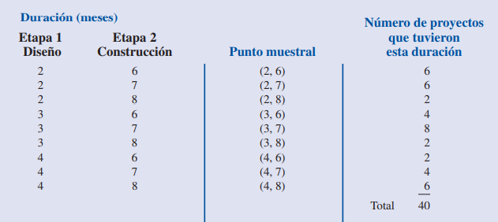

##### Asignación de probabilidades:<br>
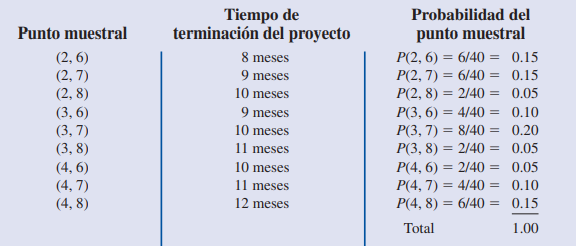

Considere que al encargado del proyecto anterior le interesa conocer la probabilidad de terminar el proyecto en 10 meses o menos. 
En la primer tabla aparecen los puntos muestrales (2, 6), (2, 7), (2, 8), (3, 6), (3, 7), (4, 6) correspondientes a
una duración del proyecto de 10 meses o menos. C denota el evento de que el proyecto dura 10
meses o menos:<br>
C = {(2, 6), (2, 7), (2, 8), (3, 6), (3, 7), (4, 6)}<br>

Si cualquiera de estos puntos muestrales es el resultado experimental, entonces ocurre el evento C.<br>
Otros eventos de posible interés para el administrador del proyecto son los siguientes:<br>
L = El evento de que el proyecto esté acabado en menos de 10 meses<br>
M = El evento de que el proyecto esté acabado en más de 10 meses<br>
De acuerdo con la segunda tabla, dichos eventos consisten de los siguientes puntos muestrales:<br>
L = {(2, 6), (2, 7), (3, 6)}<br>
M = {(3, 8), (4, 7), (4, 8)}<br>
Para el proyecto existen otros muchos eventos, pero todos serán una colección de puntos muestrales del experimento.
Para calcular la probabilidad de cualquier evento que interese al administrador del proyecto, se emplea la definición siguiente:<br>

PROBABILIDAD DE UN EVENTO
La probabilidad de cualquier evento es igual a la suma de las probabilidades de los puntos muestrales que forman el evento.

P(C) = P(2, 6) + P(2, 7) + P(2, 8) + P(3, 6) + P(3, 7) + P(4, 6) <br>
P(C) = 0.15 + 0.15 + 0.05 + 0.10 + 0.20 + 0.05 = 0.70

P(L) = P(2, 6) + P(2, 7) + P(3, 6)<br>
P(L) = 0.15 + 0.15 + 0.10 = 0.40

P(M) = P(3, 8) + P(4, 7) + P(4, 8)<br>
P(M) = 0.05 + 0.10 + 0.15 = 0.30

Con estas probabilidades, ahora puede informarle al administrador del proyecto las probabilidades siguientes: <br>
- El proyecto dure 10 meses o menos es 0.70. <br>
- Que dure menos de 10 meses es 0.40.<br>
- Que dure más de 10 meses es 0.30. 

#### Lectura recomendada:

["Estadística para administración y economía" - Capítulo 4.2](https://github.com/soyHenry/DS-M2/blob/main/Anderson.pdf)

## Clasificación de los sucesos:

- Simple: es un evento que puede describirse con una característica única. Ejemplos: el auto sea Nacional, el comprador tenga más de 40 años, el cliente pague con tarjeta de débito, el precio de la acción suba.<br>
- Compuesto: es un evento que puede describirse con más de una característica. Es una combinación de eventos simples. Ejemplo: el cliente de la concesionaria compre un auto nacional y tenga 40 años o más.


### Sucesos Simples.

La probabilidad simple, es la probabilidad de ocurrencia de un suceso o evento simple P(A), suceso descrito por una sola característica, como la probabilidad de una comprador de 40 años o menos, la probabilidad de que se venda un auto nacional, la probabilidad de que un cliente pague en efectivo o con tarjeta de débito, la probabilidad de que una acción suba.

```python
#Probabilidad de que un comprador tenga 40 años.
sucesos = 30
total = 80
probalidad = sucesos / total
print(probabilidad)
```

Esta probabilidad se llama también probabilidad marginal, porque el número total de casos favorables se puede obtener en el margen apropiado de la tabla de contingencias.<br>
La probabilidad conjunta se aplica al fenómeno que contiene 2 o más eventos o sucesos, como la probabilidad de un comprador de auto importado y de más de 40.<br>
El evento conjunto “A y B”, significa que tanto el evento A, como el evento B, deben ocurrir en forma simultánea. Es el resultado de una celda en la tabla de contingencias.

```python
#Probabilidad de un comprador entre 40 y 50 años y auto importado
sucesos = 15
total = 80
probalidad = sucesos / total
print(probabilidad)
```
### Sucesos Excluyentes.
En una sola realización de un experimento aleatorio dos sucesos A y B son mutuamente excluyentes cuando no se pueden presentar simultáneamente, es decir, cuando la ocurrencia de uno cualquiera de ellos imposibilita la ocurrencia de los otros. Ejemplo: auto nacional o importado.<br>
Todos los sucesos opuestos son excluyentes, pero no todos los sucesos excluyentes son opuestos.<br>
Un conjunto de eventos es colectivamente exhaustivo si uno de los eventos debe ocurrir.<br>
Que el auto sea nacional o importado, son sucesos colectivamente exhaustivos. Uno de ellos debe ocurrir. Si no ocurre nacional, debe ocurrir importado y viceversa.<br>

### Sucesos Compatibles.
Dos sucesos son compatibles cuando pueden ocurrir al mismo tiempo. Ejemplo: nacional o más de 40 años. Esta definición no indica que estos sucesos deban necesariamente ocurrir en forma conjunta.<br>
Dos sucesos son compatibles cuando es posible que ocurran al mismo tiempo. Obsérvese que esta definición no indica que esos eventos deban ocurrir necesariamente en forma conjunta

Ejemplos:

- Sucesos pago en efectivo, con tarjeta de débito o con tarjeta de crédito son excluyentes.<br>
- Sucesos precio de la acción sube, precio de la acción baja, precio de la acción no cambia excluyentes.<br>
- Sucesos origen de los autos y edad de los compradores, según la tabla de contigencias.<br>

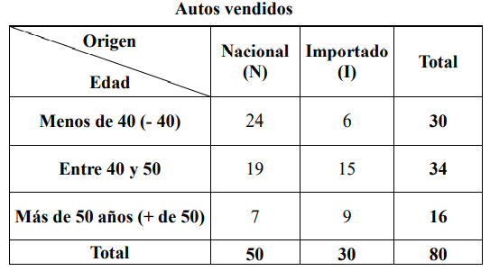

Si elegimos aleatoriamente un auto vendido, en este caso los sucesos:
- Auto Nacional (N) o Auto Importado (I) son excluyentes (no se presentan simultáneamente). <br>
- Edad del comprador: Menos de 40 años, entre 40 y 50 o Más de 50 (+ de 50) son excluyentes.<br>
- Auto Nacional (N) o Menos 40 años o menos (- 40) son compatibles (se presentan simultáneamente).<br>
- Auto Nacional (N) o Más de 50 años (+ de 50) son compatibles.<br>

En una sola realización de un experimento aleatorio se denomina ocurrencia conjunta de dos sucesos A y B, a su aparición simultánea.<br>
La ocurrencia conjunta se simboliza (A y B), también denominada como suceso intersección.<br>
Debe quedar claro a partir de esta definición, que en una sola realización de un experimento la aparición simultánea de dos sucesos A y B no es posible si ellos son excluyentes.<br>

En la selección de una venta:<br> 
- Los sucesos (N) e (I) son excluyentes, su ocurrencia conjunta nunca puede presentarse. Luego, en ese caso, la P(N e I) = 0.<br>
- Los sucesos Menos de 40 y Más de 50 son excluyentes, de modo que su ocurrencia conjunta nunca puede suceder.<br>
Por consiguiente la P( 40 y  de 50) = 0 .
- en cambio los sucesos (N) o (+ de 50) son compatibles, así que puede presentarse su ocurrencia conjunta. En ese caso la probabilidad se obtiene dividiendo los casos favorables, que figuran en la celda de intersección de la columna (N) con la fila (+ de 50) (7 autos vendidos), con los casos posibles, que son el número total de ventas, igual a 80. De esa forma P(N y + de 50) = 7/80.


# Regla de la adición: 
Se utiliza cuando se desea determinar la probabilidad de que ocurra un evento u otro o ambos en una sola observación. Nos permite encontrar la probabilidad del evento “A ó B”: considera la ocurrencia de cualquiera de los eventos, evento A o evento B o ambos A y B.<br>

La ley de la adición sirve para determinar la probabilidad de que ocurra por lo menos uno de dos eventos. Es decir, si A y B son eventos, nos interesa hallar la probabilidad de que ocurra el evento A o el B o ambos. Recuerda las lógicas booleanas.

Antes de presentar la ley de la adición es necesario ver dos conceptos relacionados con la combinación de eventos: La unión y la intersección de eventos.

UNIÓN DE DOS EVENTOS<br>
La unión de A y B es el evento que contiene todos los puntos muestrales que pertenecen a A o a B o a ambos. La unión se denota "A U B". 

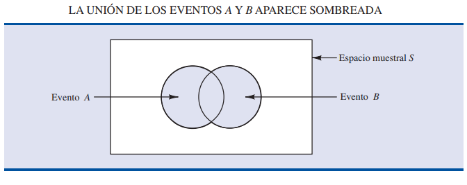

INTERSECCIÓN DE DOS EVENTOS<br>
Dados dos eventos A y B, la intersección de A y B es el evento que contiene los puntos muestrales que pertenecen tanto a A como a B.

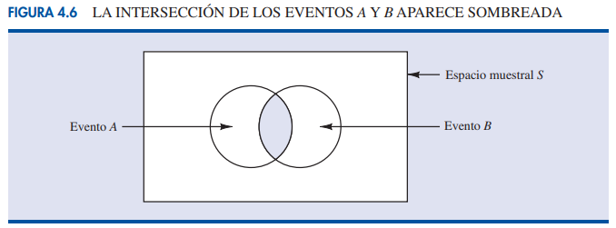

La ley de la adición proporciona una manera de calcular la probabilidad de que ocurra el evento A o el evento B o ambos. En otras palabras, la ley de la adición se emplea para calcular la probabilidad de la unión de los dos eventos.

La ley de la adición se expresa.

LEY DE LA ADICIÓN<br>
P(A U B) = P(A) U P(B) - P(A ∩ B)

Observe que en la ley de la adición, los dos primeros términos P(A) + P(B), corresponden a los puntos muestrales en A U B.Pero, como los puntos muestrales que se encuentran en la intersección A ∩ B están tanto en A como en B, cuando se calcula P(A) + P(B), los puntos que se encuentran en A U B cuentan dos veces. Esto se corrige restando P(A ∩ B).


##### Ejemplo 
Considere el caso de una pequeña empresa de ensamble en la que hay 50 empleados. Se espera que todos los trabajadores terminen su trabajo a tiempo y que pase la inspección final. A veces, alguno de los empleados no
satisface el estándar de desempeño, ya sea porque no termina a tiempo su trabajo o porque no ensambla bien una pieza. Al final del periodo de evaluación del desempeño, el jefe de producción encuentra que 5 de los 50 trabajadores no terminarón su trabajo a tiempo, 6 de los 50 trabajadores ensamblaron mal una pieza y 2 de los 50 trabajadores no terminarón su trabajo a tiempo y armaron mal una pieza.

L = el evento no se terminó el trabajo a tiempo.<br>
D = el evento se armó mal la pieza.<br>

P(L) = 5/50 = 0.1 <br>
P(D) = 5/50 = 0.12<br>
P(L ∩ D) = 2/50 = 0.04<br>

Si el jefe de producción decide dar una calificación baja al desempeño de los trabajadores que no terminaron a tiempo su trabajo o que armaron mal alguna pieza; el evento de interés es L U D. ¿Cuál es la probabilidad de que el jefe de producción dé a un trabajador una calificación baja de desempeño?

P(L U D) = P(L) + P(D) - P(L ∩ D) <br>
P(L U D) = 0.1 + 0.12 - 0.04 = 0.18

Este cálculo indica que la probabilidad de que un empleado elegido al azar obtenga una calificación baja por su desempeño es 0.18.

Si decididera que a aquellos trabajadores que no terminaron a tiempo su trabajo y que armaron mal alguna pieza se les de una calificación "mala". ¿Cuál es la probabilidad de que el jefe de producción dé a un trabajador una calificación mala de desempeño?

P(L ∩ D) = 2/50 = 0.04
 

#### Eventos mutuamente excluyentes

EVENTOS MUTUAMENTE EXCLUYENTES<br>
Se dice que dos eventos son mutuamente excluyentes si no tienen puntos muestrales en común.

Los eventos A y B son mutuamente excluyentes si, cuando un evento ocurre, el otro no puede ocurrir. Por tanto, para que A y B sean mutuamente excluyentes, se requiere que su intersección no contenga ningún punto muestral. En este caso P(A ∩ B) = 0. 

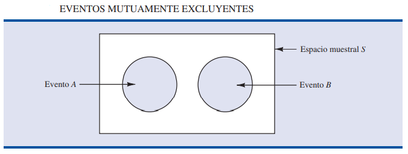

La ley de la adición se expresa como sigue:

P(A U B) = P(A) + P(B) <br>


```python
#Probabilidad de que al seleccionar una venta el comprador tenga menos de 40 años o más 50 años.

menor40 = 30/80
mayor50 = 16/80
probalidad = menor40 + mayor50
print(probabilidad)
```

Para eventos compatibles, se resta a la suma de las probabilidades simples de los dos eventos, la probabilidad de ocurrencia conjunta:
 P(A U B) =  P(A) + P(B) – P(A ∩ B)

```python
#Probabilidad de que al seleccionar una venta el comprador tenga más de 50 años o el auto sea importado

mayor50 = 16/80
importado = 30/80
mayor50importado = 9/80
probalidad = mayor50 + importado - mayor50importado
print(probabilidad)
```
Repasando lo derrollado en el apartado anterior:<br>
En una sola realización de un experimento aleatorio, la probabilidad de ocurrencia de un suceso A, o de un suceso B, o de ambos simultáneamente, se resuelve mediante la suma de las probabilidades de ambos y la posterior resta de la probabilidad de su ocurrencia conjunta.

#### Puedes repasar con este video:

[Regla de adición - Matemóvil](https://www.youtube.com/watch?v=yPXreAHcfJg)

# Regla de la multiplicación:

Mientras que la ley de las suma de probabilidades sirve para calcular la probabilidad de la unión de dos eventos, la ley de la multiplicación es útil para calcular la probabilidad de la intersección de dos eventos. La ley de la multiplicación se basa en la definición de probabilidad condicional.

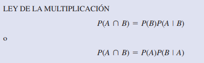

##### Ejemplo

Para ilustrar el uso de la ley de la multiplicación, considere el caso del departamento de circulación de un periódico al que 84% de los hogares de cierta región están suscritos a la edición diaria del periódico. Si D denota el evento un hogar suscrito a la edición diaria, P(D) = 0.84.<br>
Además, sabe que la probabilidad de que un hogar ya suscrito a la edición diaria se suscriba también a la edición dominical (evento S) es 0.75; esto es, P(S | D) = 0.75.

¿Cuál es la probabilidad de que un hogar se subscriba a ambas, a la edición diaria y a la dominical? Emplee la ley de la multiplicación y calcule P(S ∩ D).<br>

P(S ∩ D) = P(D) * P(S ∩ D) = 0.84*(0.75) = 0.63

Así, sabe que 63% de los hogares se suscriben a ambas ediciones, a la diaria y a la dominical.<br>
Antes de terminar esta sección hay que considerar el caso especial de la ley de la multiplicación cuando los eventos involucrados son independientes.<br>

LEY DE LA MULTIPLICACIÓN PARA EVENTOS INDEPENDIENTES
P(A ∩ B) = P(A) * P(B)

Considera el caso del jefe de una gasolinería que por experiencia sabe que 80% de los clientes usan tarjeta de
crédito al pagar la gasolina. ¿Cuál es la probabilidad de que los dos siguientes clientes paguen la gasolina con tarjeta de crédito?<br>
A = el evento el primer cliente paga con tarjeta de crédito.<br>
B = el evento el segundo cliente paga con tarjeta de crédito.<br>

P(A ∩ B) = P(A) * P(B) = (0.80)*(0.80) = 0.64

Desarrollaremos estos conceptos a contunuación, una vez que lo leas, regresa a esta introducción para afianzar este tema.

### Sucesos Condicionales

Con frecuencia, en la probabilidad de un evento influye el hecho de que un evento relacionado con él ya haya ocurrido. Suponga que tiene un evento A cuya probabilidad es P(A). Si obtiene información nueva y sabe que un evento relacionado con él, denotado por B, ya ha ocurrido, deseará aprovechar esta información y volver a calcular la probabilidad del evento A. A esta nueva probabilidad del evento A se le conoce como probabilidad condicional y se expresa P(A | B).<br>
La notación | indica que se está considerando la probabilidad del evento A dada la condición de que el evento B ha ocurrido. Por tanto, la notación P(A | B) se lee “la probabilidad de A dado B”.<br>
Dos sucesos o eventos son condicionales cuando la ocurrencia o no ocurrencia de un suceso o evento afecta la probabilidad de ocurrencia del otro.

##### Ejemplo
Como ejemplo de la probabilidad condicional, considere el caso de las promociones de los agentes de policía de una determinada ciudad. La fuerza policiaca consta de 1200 agentes, 960 hombres y 240 mujeres. De éstos, en los últimos dos años, fueron promovidos 340. En la tabla 4.4 se muestra cómo quedaron repartidas estas promociones entre los hombres y mujeres:

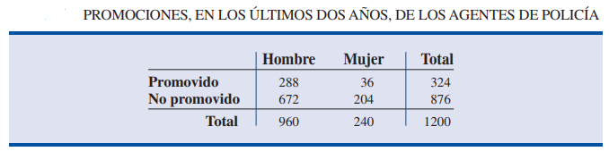

Después de analizar el registro de las promociones, un comité femenil protestó, ya que habían sido promovidos 288 agentes hombres, frente a sólo 36 mujeres. Los directivos de la fuerza policiaca argumentaron que el número de mujeres promovidas no se debía a una discriminación, sino a que el número de mujeres que son agentes de policía es una cantidad pequeña. Ahora verá cómo emplear la probabilidad condicional para analizar esta acusación de discriminación.

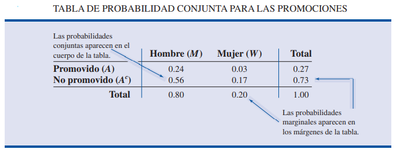

Considera

M = el evento que un agente de policía sea hombre.<br>
W = el evento que un agente de policía sea mujer.<br>
A = el evento que un agente de policía sea promovido.<br>
Ac = el evento que un agente de policía no sea promovido.<br>

P(M ∩ A) = 288/1200 = 0.24 = probabilidad de que un agente de policía, escogido en forma aleatoria, sea hombre y haya sido promovido.<br>
P(M ∩ Ac) = 672/1200 = 0.56 = probabilidad de que un agente de policía, escogido en forma aleatoria, sea hombre y no haya sido promovido.<br>
P(W ∩ A) = 36/1200 = 0.03 = probabilidad de que un agente de policía, escogido en forma aleatoria, sea mujer y haya sido promovido.<br>
P(W ∩ Ac) = 204/1200 = 0.17 = probabilidad de que un agente de policía, escogido en forma aleatoria, sea mujer y no haya sido promovido.

Como cada uno de estos valores da la probabilidad de la intersección de dos eventos, se les llama probabilidades conjuntas.<br>
Las cantidades que aparecen en los márgenes de una tabla de las probabilidades conjuntas son las probabilidades de cada uno de los eventos por separado. Es decir, P(M) = 0.80, P(W) = 0.20.<br>
P(A) = 0.27, P(Ac) = 0.73. A estas probabilidades se les conoce como probabilidades marginales por encontrarse en los márgenes de una tabla de probabilidad conjunta.<br>
Observa que las probabilidades marginales se obtienen al sumar las probabilidades conjuntas del renglón o columna correspondiente de la tabla de probabilidades conjuntas. Por ejemplo,la probabilidad marginal de ser promovido es:<br> 

P(A) = P(M ∩ A) + P(W ∩ A) = 0.24 + 0.03 = 0.27. 

En las probabilidades marginales se observa que 80% de la fuerza policiaca está formada por hombres y 20% por mujeres, que 27% de los agentes de policía fueron promovidos y 73% no fueron promovidos.

Ahoera calcula la probabilidad de que un agente de policía sea promovido dado que ese agente sea hombre. Emplea la notación para probabilidad condicional para determinar P(A | M). Para calcular P(A | M) se observa, primero, que esta notación sólo significa que se considera la probabilidad del evento A (promoción) ya que la condición designada como evento M (que el agente de policía sea hombre) está dada. Así que P(A | M) indica que sólo interesan los promovidos dentro de los 960 agentes de policía que son hombres. Como 288 de los 960 agentes de policía que son hombres fueron promovidos, la probabilidad de ser promovido dado que se es un agente hombre es:
P(A | M) = 288/960 = 0.30. <br>
En otras palabras, puesto que un agente de policía es hombre, ese agente tuvo 30% de probabilidades de ser promovido en los dos últimos años.

Ahora es interesante mostrar cómo calcular probabilidades condicionales, como P(A | M), a partir de las probabilidades de eventos relacionados y no a partir de los datos de frecuencias.

Entonces, P(A | M) = 288/960 = 0.30. Ahora, tanto el numerador como el denominador de esta fracción se dividen entre 1200, cantidad total de agentes de policía en el estudio.

P(A M)= 288/960 = (288/1200) / (960/1200) = 0.24 / 0.80 = 0.30

Por tanto, la probabilidad condicional P(A | M) se calcula como la razón entre P(A ∩ M) y la probabilidad margina P(M).<br>
P(A | M) = P(A ∩ M) / P(M) = 0.24 / 0.80 = 0.30

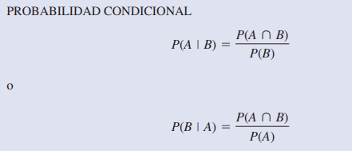

Sin embargo, la cuestión relevante en el caso de la discriminación tiene que ver con las probabilidades condicionales P(A | M) y P(A | W). Es decir, ¿cuál es la probabilidad de que un agente de la policía sea promovido dado que es hombre y cuál es la probabilidad que un agente de la policía sea promovido dado que es mujer? Si estas dos probabilidades son iguales, no hay fundamentos para un argumento de discriminación ya que las oportunidades de ser promovidos son las mismas para agentes de la policía hombres o mujeres. Pero, si hay diferencia entre estas dos probabilidades condicionales se confirmará que los hombres y mujeres agentes de policía son considerados de
manera distinta cuando se trata de las decisiones para promoverlos.

P(A | W) = P(A ∩ W) / P(W) = 0.03 / 0.20 = 0.15

La probabilidad de que un agente de policía sea promovido dado que es hombre es 0.30, el doble de 0.15, que es la probabilidad de que un agente de policía sea promovido dado que es mujer. Aunque el uso de la probabilidad condicional no demuestra por sí misma que haya discriminación en este caso, los valores de probabilidad condicional confirman el argumento presentado por las mujeres agentes de policía.

En resumen:<br>
La probabilidad de un suceso B condicionado a la previa ocurrencia de un suceso o evento particular A, se calcula dividiendo la cantidad de casos favorables a la ocurrencia conjunta de los sucesos o eventos A y B por la cantidad de casos posibles de ocurrencia del suceso o evento A. Ese cálculo también puede efectuarse dividiendo la probabilidad de la ocurrencia conjunta por la probabilidad del suceso o evento condicionante (en este caso, el suceso o evento I).


Si la selección de las dos ventas se realiza sin reposición. Hallar la probabilidad de que las ventas sean:<br>
```python
#La primera de un comprador de “menos de 40 años” y la segunda de uno de"entre 40 y 50 años". Los sucesos son condicionales.
menor40 = 30/80
entre40y50 = 34/79 #La seleccion anterior afecta al suceso condicionado.
probalidad = menor40  * entre40y50
print(probabilidad)

#Probabilidad de que las dos sean de autos "nacionales".

autoNacional = 50/80
autoNacional2 = 49/79
probalidad = autoNacional * autoNacional2
print(probabilidad)

"""
En los casos anteriores, la regla de la multiplicación se aplicó considerando que los sucesos ocurrían en un orden estricto de presentación (primero el suceso A y segundo el suceso B).
"""
```
### Sucesos Independientes
Dos eventos son independientes cuando la ocurrencia o no ocurrencia de un suceso o evento no tiene ningún efecto en la probabilidad de ocurrencia de otro suceso o evento.<br>
Cuando para dos sucesos o eventos cualquiera A y B la P(A/B)=P(A), ambos sucesos son independientes. 
En ese caso también ocurre que P(B/A)=P(B), y a partir de estas dos últimas igualdades, se verifica que, si A y B son independientes:<br>
P(AyB) = P(A)*P(B).

Cuando se trata de la forma de pago: en efectivo, con tarjeta de débito o con tarjeta de crédito, y dos (o más) clientes se encuentran uno a continuación del otro en la cola de las cajas el suceso forma de pago que elija el primero es independiente del suceso forma de pago que elija el segundo (o los siguientes).

Si la probabilidad de que un cliente pague en efectivo (E) es 6/15, con tarjeta de crédito (TD) es 7/15 y con tarjeta de crédito (TC) es 2/15. Hallar la probabilidad de que dos clientes sucesivos que pagan sus cuentas lo hagan:<br>

```python
#Probabilidad de que dos clientes sucesivos, el primero pague en efectivo y el segundo con tarjeta de crédito. Estos sucesos son independientes

efectivo = 6/15
tarjetaCredito = 7/15
probalidad = efectivo * tarjetaCredito
print(probabilidad)

#Probabilidad de que dos clientes sucesivos, los dos paguen en efectivo:

efectivo = 6/15
probalidad = efectivo * efectivo
print(probabilidad)
```

#### Puedes repasar con este video:
[Regla de multiplicación - Matemóvil](https://www.youtube.com/watch?v=S7W5Tlpa3mA)

## Homework

1. Suponga dos eventos, A y B, y que P(A) = 0.50, P(B) = 0.60 y P(A ∩ B) = 0.40.<br>
- a. Halle P(A | B).
- b. Halle P(B | A).
- c. ¿A y B son independientes? ¿Por qué sí o por qué no?

2. Suponga dos eventos, A y B, que son mutuamente excluyentes. Admita, además, que P(A) = 0.30 y P(B) = 0.40.<br>
- a. Obtenga P(A ∩ B). ¿Existe intersección entre los dos conjuntos?.
- b. Calcule P(A | B).
- c. Un estudiante de estadística argumenta que los conceptos de eventos mutuamente excluyentes y eventos independientes son en realidad lo mismo y que si los eventos son mutuamente excluyentes deben ser también independientes. ¿Está usted de acuerdo? Use la información sobre las probabilidades para justificar su respuesta.

Dada la siguiente tabla:<br>
<br>

3. Si en la concesionaria se seleccionan dos ventas con reposición (Los sucesos son independientes.). Hallar la probabilidad de que las ventas sean:<br>
 
  - a. La primera de un comprador de “menos de 40 años” y la segunda de uno de "entre 40 y 50 años". 
  
  - b. las dos sean de autos "nacionales".

4. Si la selección de las dos ventas se realiza sin reposición. Hallar la probabilidad de que las ventas sean:<br>
  Los sucesos son condicionales.

 - a. la primera de un comprador de “menos de 40 años” y la segunda de uno de "entre 40 y 50 años".

 - b. las dos sean de autos "nacionales".

5. Si la selección de las dos ventas se realiza sin reposición. Hallar la probabilidad de que las ventas sean:<br>
  Los sucesos son condicionales.
  
 - a. De un comprador de “menos de 40 años” y de uno de "entre 40 y 50 años".

 6. Debido al aumento de los costos de los seguros, en un país 43 millones de personas, hay personas que no cuentan con un seguro médico. En la tabla siguiente se muestran datos muestrales representativos de la cantidad de personas que cuentan con seguro médico:<br>
 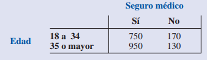

- a. Con estos datos elabore una tabla de probabilidad conjunta y úsela para responder las preguntas restantes.
- b. ¿Qué indican las probabilidades marginales acerca de la edad de la población?
- c. ¿Cuál es la probabilidad de que una persona tomada en forma aleatoria no tenga seguro médico?
- d. Si la persona tiene entre 18 y 34 años, ¿cuál es la probabilidad de que no tenga seguro médico?
- e. Si la persona tiene 35 años o más ¿cuál es la probabilidad de que no tenga seguro médico?
- f. Si la persona no tiene seguro médico, ¿cuál es la probabilidad de que tenga entre 18 y 34 años?

#### Puedes complementar con los ejercicios del 33 al 40 del Capitula 4 del libro "ESTADÍSTICA PARA ADMINISTRACIÓN Y ECONOMÍA"

<table class="hide" width="100%" style='table-layout:fixed;'>
  <tr>
    <td>
      <a href="https://airtable.com/shrSzEYT4idEFGB8d?prefill_clase=00-PrimerosPasos">
        
        <br>
        Hacé click acá para dejar tu feedback sobre esta clase.
      </a>
    </td>
  </tr>
</table>
