## Distribuciones de probabilidad


Una variable aleatoria es un suceso o evento numérico cuyo valor se determina por medio de un proceso aleatorio. Cuando a todos los posibles valores numéricos de una variable aleatoria se le asignan valores de probabilidad, ya sea mediante un listado o una función matemática el resultado es una distribución de probabilidad. La suma de las probabilidades de todos los resultados numéricos posibles debe ser igual a 1.<br>
En resumen, una distribución de probabilidad es una función que puede asignar valores de probabilidad a cada estado del espacio muestral.
Las variables aleatorias se pueden clasificar en: discretas (surgen de un proceso de conteo) y continuas (surgen de un proceso de medición).
La distribución de probabilidad es de doble eje, constituida por todos los valores de la variable aleatoria (x1, x2,…, xN), a los cuales se asocian con sus correspondientes probabilidades (p1, p2,…, pN). A lo largo de esta distribución y como condición de cierre, la suma de todas las probabilidades debe ser 1.

p1 + p2 +,…,+ pN = 1

#### Lectura recomendada:

["Estadística para administración y economía" - Capítulo 5 y 6](https://github.com/soyHenry/DS-M2/blob/main/Anderson.pdf)

### Ejemplo: <br>


Si en la concesionaria se seleccionan tres ventas con reposición y deseamos hacer una distribución de probabilidad del número de autos nacionales, los resultados posibles serían:

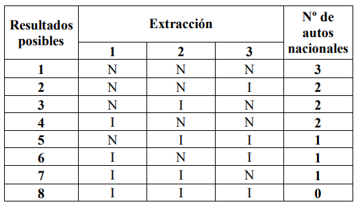

Hay ocho resultados posibles. Para obtener la distribución de probabilidad, aplicamos la regla de la adición y de la multiplicación siendo x el número de autos importados. Si las ventas seleccionadas fueran 2, los resultados posibles serían 4.


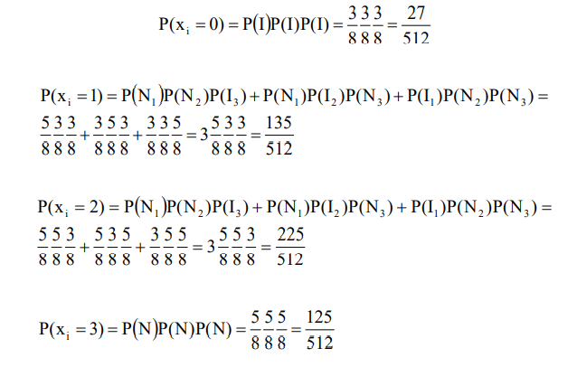

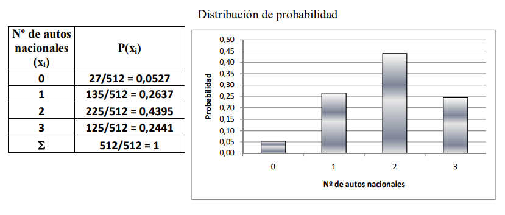

La Distribución de Probabilidad constituye un sistema completo de sucesos. Es análoga a una distribución de frecuencias relativas, con probabilidad en lugar de frecuencia relativa. De manera que podemos pensar en las distribuciones de probabilidad como formas teóricas o ideales en el límite, de distribuciones de frecuencia relativa cuando el número de observaciones es muy 
grande. Por eso podemos imaginarnos a las distribuciones de probabilidad como si fueran distribuciones de poblaciones, mientras que las distribuciones de frecuencia relativa son distribuciones de muestras de esa población.<br>
Si la variable aleatoria es continua, no pueden listarse todos los posibles valores de la 
variable, motivo por el cual las probabilidades que se determinan por medio de una función matemática son gráficamente representadas por una función de densidad de probabilidad, o curva de probabilidad.

## Características de las Distribuciones de Probabilidad:
Las características generales de las distribuciones de probabilidad difieren según el tipo de variable aleatoria, discreta o continua, que se encuentre bajo estudio. 

Por otro lado existen ciertas normas a la hora de nombrar variables:

#### Si la variable aleatoria es discreta:
1. Puede tomar solamente algunos valores dentro de un intervalo definido.<br>
2. Las probabilidades se representan con los símbolos pi o p(xi).<br>
3. El gráfico de la distribución de probabilidad se denomina gráfico de bastones, por la particular forma que adopta la probabilidad al afectar sólo a determinados puntos del eje de la variable aleatoria xi.<br>
4. Las probabilidades se calculan mediante la aplicación de las reglas provenientes de la teoría clásica de probabilidad como de fórmulas específicas.<br>
5. La condición de cierre se verifica realizando la sumatoria de las probabilidades.<br>
6. La distribución de probabilidad en el caso de una variable aleatoria discreta se denomina genéricamente función de probabilidad.<br>

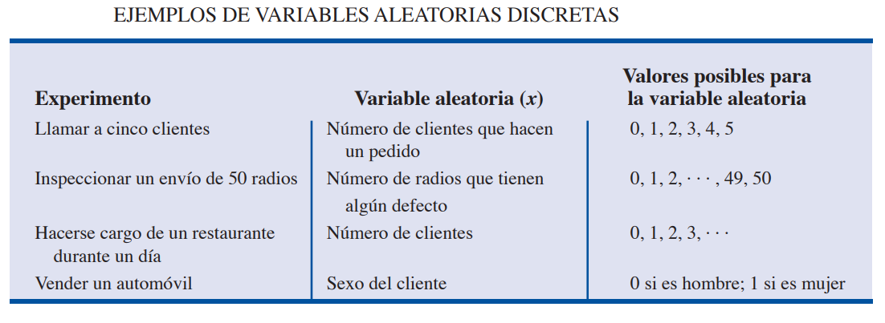

#### Si la variable aleatoria es continua:
1. Puede tomar cualquier valor en un determinado campo de variación.<br>
2. La probabilidad se representa con los símbolos fi o f(x).<br>
3. En un punto la probabilidad no tiene sentido. Sólo tiene sentido en un intervalo particular de la variable aleatoria xi, por más pequeño que éste sea.<br>
4. En el gráfico, la distribución de probabilidad se ve como una función continua f(x), y la probabilidad en sí misma, denominada A, se representa como un área entre los puntos x1 y x2.<br>
5. La probabilidad se obtiene calculando la integral, según el criterio de Riemann, de la función f(x), entre los puntos x1 y x2.<br>
6. La condición de cierre se verifica efectuando la integral de la función en todo el campo de variación de la variable aleatoria.<br>
7. La denominación genérica de la distribución de probabilidad en el caso continuo es la de función de densidad debido a que se considera que las probabilidades adquieren densidad, es decir que se "adensan", convirtiéndose en áreas.

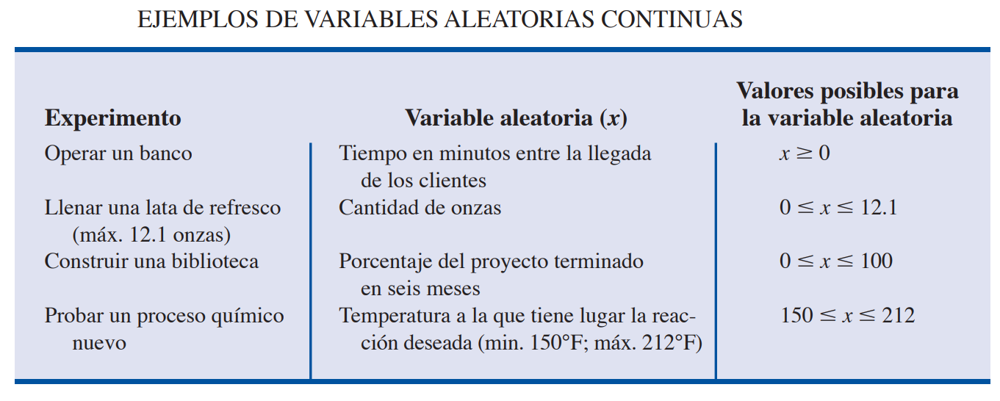

#### Histograma

```Python
# importando modulos necesarios
%matplotlib inline

import matplotlib.pyplot as plt
import numpy as np 
from scipy import stats 
import seaborn as sns 

np.random.seed(2016) # replicar random

# parametros esteticos de seaborn
sns.set_palette("deep", desat=.6)
sns.set_context(rc={"figure.figsize": (8, 4)})

# Graficando histograma
mu, sigma = 0, 0.2 # media y desvio estandar
datos = np.random.normal(mu, sigma, 1000) #creando muestra de datos

# histograma de distribución normal.
cuenta, cajas, ignorar = plt.hist(datos, 20)
plt.ylabel('frequencia')
plt.xlabel('valores')
plt.title('Histograma')
plt.show()
``` 
## Distribuciones de Probabilidad - Variables Discretas

##### Las distribuciones de probailidad que estudiaremos para variables discreta son: Binomial, Poisson e Hipergeométrica. <br>

Considera el experimento de observar los automóviles que llegan a una caseta de peaje. La variable aleatoria que interesa es x = número de automóviles que llega a la caseta de peaje en un día. Los valores que puede tomar la variable aleatoria son los de la secuencia 0, 1, 2, etc. Así, x es una variable aleatoria discreta que toma uno de los valores de esta sucesión infinita.

Aunque los resultados de muchos experimentos se describen mediante valores numéricos, los de otros no. Por ejemplo, en una encuesta se le puede preguntar a una persona si recuerda el mensaje de un comercial de televisión. Este experimento tiene dos resultados: que la persona no
recuerda el mensaje y que la persona recuerda el mensaje. Sin embargo, estos resultados se describen numéricamente definiendo una variable aleatoria x como sigue: sea x = 0 si la persona no recuerda el mensaje y sea x = 1 si la persona recuerda el mensaje.


#### Distribución Binomial <br>

PROPIEDADES DE UN EXPERIMENTO BINOMIAL<br>
1. El experimento consiste en una serie de n ensayos idénticos.
2. En cada ensayo hay dos resultados posibles. A uno de estos resultados se le llama éxito y al otro se le llama fracaso.
3. La probabilidad de éxito, que se denota p, no cambia de un ensayo a otro. Por ende, la probabilidad de fracaso, que se denota 1 - p, tampoco cambia de un ensayo a otro.
4. Los ensayos son independientes.

Si se presentan las propiedades 2, 3 y 4, se dice que los ensayos son generados por un proceso de Bernoulli. Si, además, se presenta la propiedad 1, se trata de un experimento binomial.

En un experimento binomial lo que interesa es el número de éxitos en n ensayos. Considera el experimento que consiste en lanzar una moneda cinco veces y observar si la cara de la moneda que cae hacia arriba es cara o cruz. Si desea contar el número de caras. ¿Presenta este experimento las propiedades de un experimento binomial? ¿Cuál es la variable aleatoria que interesa? Observe que:

1. El experimento consiste en cinco ensayos idénticos; cada ensayo consiste en lanzar una moneda.
2. En cada ensayo hay dos resultados posibles: cara o cruz. Se puede considerar cara como éxito y cruz como fracaso.
3. La probabilidad de éxito y la probabilidad de fracaso son iguales en todos los ensayos, siendo p=0.5 y 1-p=0.5.
4. Los ensayos o lanzamientos son independientes porque al resultado de un ensayo no afecta a lo que pase en los otros ensayos o lanzamientos.

Otro ejemplo, considera a un vendedor de seguros que visita a 10 familias elegidas en forma aleatoria. El resultado correspondiente de la visita a cada familia se clasifica como éxito si la familia compra un seguro y como fracaso si la familia no compra ningún seguro. Por experiencia, el vendedor sabe que la probabilidad de que una familia tomada aleatoriamente compre un seguro es 0.10. Al revisar las propiedades de un experimento binomial aparece que:
1. El experimento consiste en 10 ensayos idénticos; cada ensayo consiste en visitar a una familia.
2. En cada ensayo hay dos resultados posibles: la familia compra un seguro (éxito) o la familia no compra ningún seguro (fracaso).
3. Las probabilidades de que haya compra y de que no haya compra se supone que son iguales en todas las visitas, siendo p=0.10 y 1-p =0.90.
4. Los ensayos son independientes porque las familias se eligen en forma aleatoria.

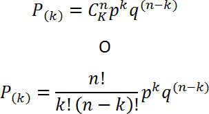

p= probabilidad de éxito.<br>
q= Probabilidd de fracaso.<br>
n= espacio muestral.<br>
k= número de éxitos.<br>

```Python
# Construir una función Binomial
from math import factorial

def funcion_binomial(k,n,p):
  num_exitos = factorial(n) #Factorial de la cantidad de casos de éxito buscados.
  num_eventos = factorial (k) * factorial(n-k) #Factorial del espacio muestral.
  exitos_fracaso=pow(p,k) * pow(1-p,(n-k)) # Probabilidad de exitos y fracasos.

  binomial = (num_exitos / num_eventos) * exitos_fracaso #Aplicación de la función binomial.

  return binomial

#Probabilidad de obtener 3 caras en 5 lanzamientos y una probabilidad de éxito del 0.5.
print(funcion_binomial(3,5,0.5))
```
Si bien se utiliza para casos binarios, no quiere decir que la probabilidad de éxito siempre sea del 0.5.<br>

Aquí otro ejemplo:<br>

Una novela ha tenido un gran éxito, y se estima que el 80% de un grupo de lectores ya la han leído.<br>
En un grupo de 4 amigos aficionados a la lectura:<br>
- ¿Cuál es la probabilidad de que en el grupo hayan leído la novela 2 personas?

 ```Python

#Probabilidad de que 2 integrantes del grupo hayan leido la novela con una probabilidad de éxito del 0.8.

print(funcion_binomial(2,4,0.8))
```

```Python
# Graficando Binomial
N, p = 30, 0.4 # parametros de forma 
binomial = stats.binom(N, p) # Distribución
x = np.arange(binomial.ppf(0.01),
              binomial.ppf(0.99))
fmp = binomial.pmf(x) # Función de Masa de Probabilidad
plt.plot(x, fmp, '--') #Esta función recibe un conjunto de valores x e y y los muestra en el plano como puntos unidos por línea.
plt.vlines(x, 0, fmp, colors='b', lw=5, alpha=0.5) #Esta función da formato a las figuras.
plt.title('Distribución Binomial') #Esta función asigna un título.
plt.ylabel('probabilidad') #Esta función etiqueta el eje Y.
plt.xlabel('valores') #Esta función etiqueta el eje X.
plt.show() #Esta función muestra las figuras
```

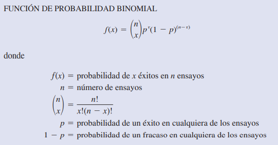

[Binomial - Matemóvil](https://www.youtube.com/watch?v=-XxZGvNClkg)

#### Distribución de Bernoulli<br>
Una variable aleatoria sigue una distribución de Bernoulli si solo tiene dos resultados posibles: 0 o 1. Por ejemplo, supongamos que lanzamos una moneda al aire una vez. Sea p la probabilidad de que caiga cara . Esto significa que la probabilidad de que caiga en cruz es de 1 p. Nuevamente la moneda, que confuso ¿no?.<br>
Ahora, si lanzamos una moneda varias veces, la suma de las variables aleatorias de Bernoulli seguirá una distribución binomial.<br>
Por ejemplo, supongamos que lanzamos una moneda 5 veces y queremos saber la probabilidad de obtener caras k veces. Diríamos que la variable aleatoria X sigue una distribución Binomial. ¿Queda más claro?. Muy bien.

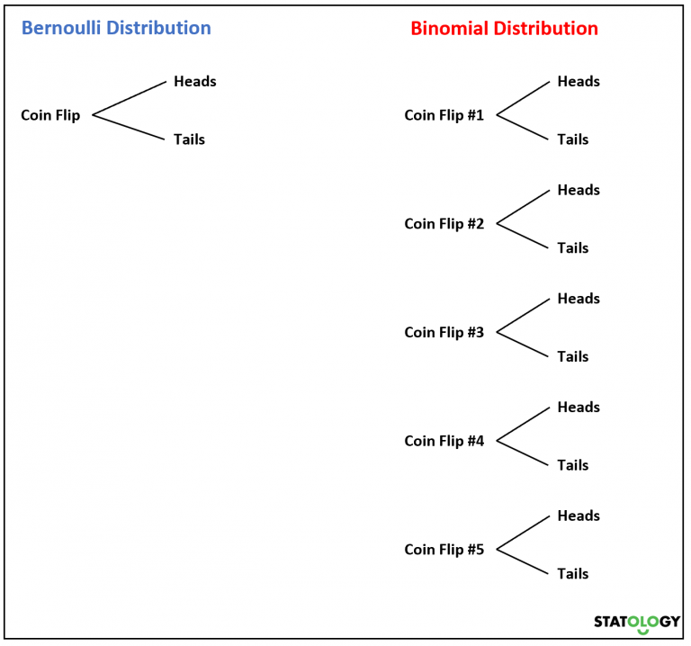

```Python
# Graficando Bernoulli
p =  0.5 # parametro de forma 
bernoulli = stats.bernoulli(p)
x = np.arange(-1, 3)
fmp = bernoulli.pmf(x) # Función de Masa de Probabilidad
fig, ax = plt.subplots()
ax.plot(x, fmp, 'bo')
ax.vlines(x, 0, fmp, colors='b', lw=5, alpha=0.5)
ax.set_yticks([0., 0.2, 0.4, 0.6])
plt.title('Distribución Bernoulli')
plt.ylabel('probabilidad')
plt.xlabel('valores')
plt.show()
```

[Bernoulli - Matemóvil](https://www.youtube.com/watch?v=olGbPzIGJ4M)

#### Distribución Poisson<br>

Se suele usar para estimar el número de veces que sucede un hecho determinado (ocurrencias) en un intervalo de tiempo o de espacio. Por ejemplo, la variable de interés va desde el número de automóviles que llegan (llegadas) a un lavado de coches en una hora o el número de reparaciones necesarias en 10 km de una autopista hasta el número de fugas en 100 km de tubería. Si se satisfacen las condiciones siguientes, el número de ocurrencias es una variable aleatoria discreta, descrita por la distribución de probabilidad de Poisson.

PROPIEDADES DE UN EXPERIMENTO DE POISSON
1. La probabilidad de ocurrencia es la misma para cualesquiera dos intervalos de la misma magnitud.
2. La ocurrencia o no-ocurrencia en cualquier intervalo es independiente de la ocurrencia o no-ocurrencia en cualquier otro intervalo. La varibale aleatoria es el número de veces que ocurre un evento en un intervalo de tiempo, distancia, area, volumen u otra similar. 

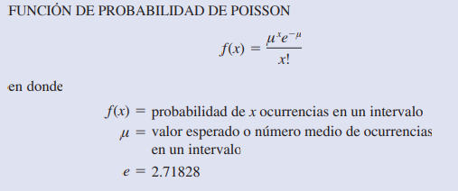

Suponga que desea saber el número de llegadas, en un lapso de 15 minutos, a un cajero automático de un banco. Si se puede suponer que la probabilidad de llegada de los clientes es la misma en cualesquiera dos lapsos de la misma duración y si la llegada o no–llegada de una persona en cualquier lapso es independiente de la llegada o no–llegada de una persona en cualquier otro lapso, se puede aplicar la función de probabilidad de Poisson. Dichas condiciones se satisfacen y en un análisis de datos pasados encuentra que el número promedio de automóviles que llegan en un lapso de 15 minutos es 10; en este caso use la función de probabilidad siguiente:

f(x) = ((10 ^ x) * (e^-10)) / x!

Si la administración desea saber la probabilidad de que lleguen exactamente cinco automóviles en 15 minutos, x = 5, y se obtiene:

f(x) = ((10 ^ 5) * (e^-10)) / 5! = 0.0378

En el ejemplo anterior se usó un lapso de 15 minutos, pero también se usan otros lapsos. Suponga que desea calcular la probabilidad de una llegada en un lapso de 3 minutos. Como 10 es el número esperado de llegadas en un lapso de 15 minutos: 10/15 = 2/3 es el número esperado de llegadas en un lapso de un minuto y que (2/3)(3 minutos) = 2 es el número esperado de llegadas en un lapso de 3 minutos. Entonces, la probabilidad de x llegadas en un lapso de 3 minutos con μ = 2 está dada por la siguiente función de probabilidad de Poisson.

f(x) = ((2 ^ 1) * (e^-2)) / 1! = 0.2707

Ejemplo:

La probabilidad de que en el lapso de una semana en el taller de la concesionaria uno de los autos vendidos tenga problemas cubiertos por la garantía es 0,02. Suponiendo que en el taller se atienden 450 autos semanalmente. ¿Cuál es la probabilidad de que:<br>
- Se presenten 5 autos con problemas por semana?

```Python
from math import e,factorial
def probabilidad_poisson(lamba_np,x):
     probabilidad = (pow(e,-lamba_np) * pow(lamba_np,x))/factorial(x)
     return probabilidad

#Probabilidad de que lleguen exactamente cinco automóviles en 15 minutos
print(probabilidad_poisson(10,5))

#Probabilidad de que se presenten 5 autos con problemas por semana.
print(probabilidad_poisson((450*0.02),5))

```

```Python
# Graficando Poisson
mu =  3.6 # parametro de forma 
poisson = stats.poisson(mu) # Distribución
x = np.arange(poisson.ppf(0.01),
              poisson.ppf(0.99))
fmp = poisson.pmf(x) # Función de Masa de Probabilidad
plt.plot(x, fmp, '--')
plt.vlines(x, 0, fmp, colors='b', lw=5, alpha=0.5)
plt.title('Distribución Poisson')
plt.ylabel('probabilidad')
plt.xlabel('valores')
plt.show()

# histograma
aleatorios = poisson.rvs(1000)  # genera aleatorios
cuenta, cajas, ignorar = plt.hist(aleatorios, 20)
plt.ylabel('frequencia')
plt.xlabel('valores')
plt.title('Histograma Poisson')
plt.show()

```

[Poisson Desarrollo - Matemóvil](https://www.youtube.com/watch?v=PMX75m4-s9A)

[Poisson Ejercicios - Matemóvil](https://www.youtube.com/watch?v=x9jF11I5x-g)

####  Distribución Hipergeométrica<br>

La distribución de probabilidad hipergeométrica está estrechamente relacionada con la distribución binomial. Pero difieren en dos puntos: en la distribución hipergeométrica los ensayos no son independientes y la probabilidad de éxito varía de ensayo a ensayo.<br>
En la notación usual en la distribución hipergeométrica, r denota el número de elementos considerados como éxitos que hay en una población de tamaño N, y N - r denota el número de elementos considerados como fracasos que hay en dicha población. La función de probabilidad
hipergeométrica se usa para calcular la probabilidad de que en una muestra aleatoria de n elementos, seleccionados sin reemplazo, se tengan x éxitos y n - x fracasos. Para que se presente este resultado, debe tener x éxitos de los r éxitos que hay en la población y n - x fracasos de los N - r fracasos. La siguiente función de probabilidad hipergeométrica proporciona f(x), la probabilidad de tener x éxitos en una muestra de tamaño n. En la distribución binomial, la probabilidad de éxito es constante en todas las obsevaciones del experimento y el resultado de cualquier observación es independiente de cualquier otro. En un experimento de características hipergeometricas el resultado de una observación es afectado por los resultados de las observaciones previas, por tanto las probabilidades son condicionales.<br>

La Distribución Hipergeométrica se aplica cuando las realizaciones del experimento aleatorio se realizan sin reposición o generan sucesos que son condicionales, lo cual marca la principal diferencia con las distribuciones Binomial y de Poisson.

Una empresa fabrica fusibles que empaca en cajas de 12 unidades cada una. Asuma que un inspector selecciona al azar tres de los 12 fusibles de una caja para inspeccionarlos. Si la caja contiene exactamente cinco fusibles defectuosos, ¿cuál es la probabiidad de que el inspector encuentre que uno de los tres fusibles está defectuoso? En esta aplicación n - 3 y N - 12. Si r - 5 fusibles defectuosos en la caja, la probabilidad de hallar x - 1 defectuoso es:

f(1) = [5! / (1! * 4!) * 7! / (2! * 5!)] / [12! / (3! * 9!)] = 5 * 21 / 220 = 0.4773

Ahora suponga que desea conocer la probabilidad de hallar por lo menos un fusible defectuoso. La manera más sencilla de contestar es calcular primero la probabilidad de que el inspector no encuentre ningún fusible defectuoso. La probabilidad de x = 0 es:

f(0) = [5! / (0! * 5!) * 7! / (3! * 4!)] / [12! / (3! * 9!)] = 1 * 35 / 220 = 0.1591

Si la probabilidad de cero fusibles defectuosos es f(0) = 0.1591, se concluye que la probabilidad de hallar por lo menos un fusible defectuoso debe ser 1 - 0.1591 = 0.8409. Así, existe una probabilidad razonablemente alta de que el inspector encuentre por lo menos un fusible defectuso.

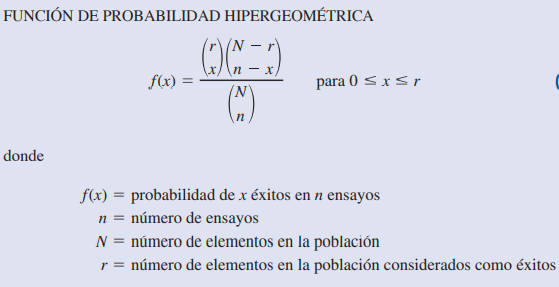

Ejemplo:<br>
Una empresa que importa los autos que vende una concesionaria, desea hacer una encuesta de satisfacción a los compradores de estos autos. De una muestra de 80 autos, 30 son importados. Si se seleccionan 9 clientes. ¿Cuál es la probabilidad de que haya 2 que compraron autos importados?.

```Python
from math import factorial

N,X,n,x= 80,30,9,2
def probabilidad_hipergeometrica(N,X,n,x):
  Xx = factorial(X)/(factorial(x)*factorial(X-x))
  NX_nx= factorial(N-X)/(factorial(n-x)*factorial((N-X)-(n-x)))
  Nn = factorial(N)/(factorial(n)*factorial(N-n))
  hipergeometrica = (Xx * NX_nx)/Nn

  return hipergeometrica

print(probabilidad_hipergeometrica)
```

```Python
# Graficando Hipergeométrica
M, n, N = 30, 10, 12 # parametros de forma 
hipergeometrica = stats.hypergeom(M, n, N) # Distribución
x = np.arange(0, n+1)
fmp = hipergeometrica.pmf(x) # Función de Masa de Probabilidad
plt.plot(x, fmp, '--')
plt.vlines(x, 0, fmp, colors='b', lw=5, alpha=0.5)
plt.title('Distribución Hipergeométrica')
plt.ylabel('probabilidad')
plt.xlabel('valores')
plt.show()
```


## Distribuciones de Probabilidad - Variables Continuas

##### Las distribuciones de probabilidad que estudiaremos para variables continuas es la Normal. <br>

Conseidera el experimento de observar las llamadas telefónicas que llegan a la oficina de atención de una importante empresa de seguros. La variable aleatoria que interesa es x = tiempo en minutos entre dos llamadas consecutivas. Esta variable aleatoria puede tomar cualquier valor en el intervalo x >= 0. En efecto, x puede tomar un número infinito de valores, entre los que se encuentran valores como 1.26 minutos, 2.751 minutos, 4.3333 minutos, etc. }
Otro ejemplo, considere el tramo de 90 km de una carretera entre dos ciudades. Para el servicio de ambulancia de emergencia, la variable aleatoria x es x = número de km hasta el punto en que se localiza el siguiente accidente de tráfico en este tramo de la carretera. En este caso, x es una variable aleatoria continua que toma cualquier valor en el intervalo 0 =< x =< 90.
probabilidad serán tema del capítulo 6.

#### Distribución Normal<br>

La distribución de probabilidad más usada para describir variables aleatorias continuas es la distribución de probabilidad normal. La distribución normal tiene gran cantidad de aplicaciones prácticas, en las cuales la variable aleatoria puede ser el peso o la estatura de las personas, puntuaciones de exámenes, resultados de mediciones científicas, precipitación pluvial u otras cantidades similares. La distribución normal también tiene una importante aplicación en inferencia estadística. En estas aplicaciones, la distribución normal describe qué tan probables son los resultados obtenidos de un muestreo.

Esta dada por una función de densidad y la probabilidad se obtiene en base a una variable aleatoria xi que se encuentra entre dos valores arbitrarios de x1 y x2, la cual está dada por el área A bajo la curva cuyo valor se encuentra integrando la función f(x) entre ambos valores, es decir que en tanto la probabilidad en un punto cualquiera no tiene sentido.<br>
La solución práctica para obtener esas probabilidades consiste en utilizar la Tabla de Probabilidades apropiada para calcular cualquier probabilidad en el caso normal, sin que importe cuáles son los valores particulares de la variable aleatoria ni los parámetros de la distribución.<br>

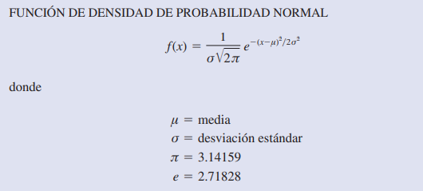

Las siguientes son observaciones importantes acerca de las características de las distribuciones normales.
1. Toda la familia de distribuciones normales se diferencia por medio de dos parámetros: la media μ y la desviación estándar σ.
2. El punto más alto de una curva normal se encuentra sobre la media, la cual coincide con la mediana y la moda.
3. La media de una distribución normal puede tener cualquier valor: negativo, positivo o cero.
4. La distribución normal es simétrica, siendo la forma de la curva normal al lado izquierdo de la media, la imagen especular de la forma al lado derecho de la media. Las colas de la curva normal se extienden al infinito en ambas direcciones y en teoría jamás tocan el eje horizontal. Dado que es simétrica, la distribución normal no es sesgada; su sesgo es cero.
5. La desviación estándar determina qué tan plana y ancha es la curva normal. Desviaciones estándar grandes corresponden a curvas más planas y más anchas, lo cual indica mayor variabilidad en los datos. A continuación se muestran dos curvas normales que tienen la misma media pero distintas desviaciones estándar.
6. Las probabilidades correspondientes a la variable aleatoria normal se dan mediante áreas bajo la curva normal. Toda el área bajo la curva de una distribución normal es 1. Como esta distribución es simétrica, el área bajo la curva y a la izquierda de la media es 0.50 y el área bajo la curva y a la derecha de la media es 0.50.
7. Los porcentajes de los valores que se encuentran en algunos intervalos comúnmente usados son:
  - a. 68.3% de los valores de una variable aleatoria normal se encuentran más o menos una desviación estándar de la media.
  - b. 95.4% de los valores de una variable aleatoria normal se encuentran más o menos dos desviaciones estándar de la media.
  - c. 99.7% de los valores de una variable aleatoria normal se encuentran más o menos tres desviaciones estándar de la media.


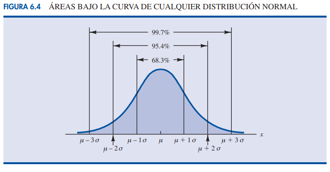

La distribución normal requiere al estandarización de las variables mediante la siguiente fórmula:<br>

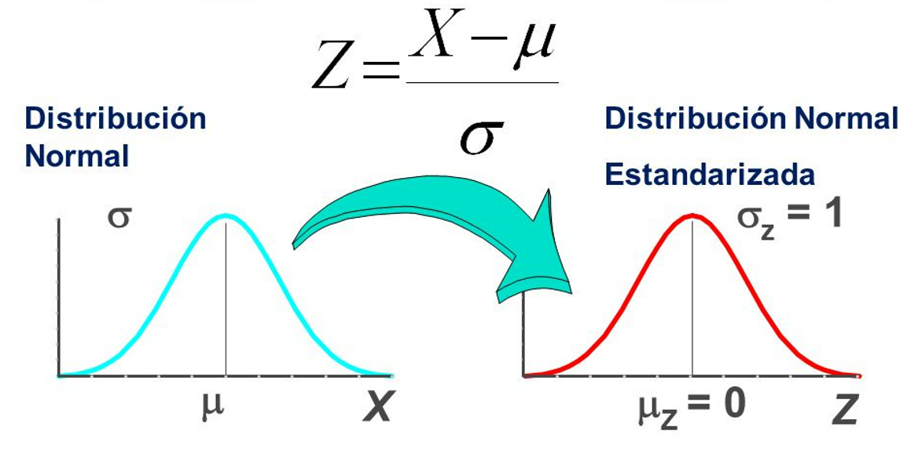

X = Variable aleatoria.<br>
mu = Media.
sigma = Desvío estándar.

Luego de estandarizar las variables, se debe buscar el valor de Z en la tabla de distribución normal y determinar la probabilidad en base al area delimitada por el experimiento.

La razón por la cual la distribución normal estándar se ha visto de manera tan amplia es que todas las distribuciones normales son calculadas mediante la distribución normal estándar. Esto es, cuando distribución normal con una media μ cualquiera y una desviación estándar σ cualquiera, las preguntas sobre las probabilidades en esta distribución se responden pasando primero a la distribución normal estándar. Usa las tablas de probabilidad normal estándar y los valores apropiados de z para hallar las probabilidades deseadas.


```python
# Graficando Normal
mu, sigma = 0, 0.2 # media y desvio estandar
normal = stats.norm(mu, sigma)
x = np.linspace(normal.ppf(0.01),
                normal.ppf(0.99), 100)
fp = normal.pdf(x) # Función de Probabilidad
plt.plot(x, fp)
plt.title('Distribución Normal')
plt.ylabel('probabilidad')
plt.xlabel('valores')
plt.show()
```

[Normal - Matemóvil](https://www.youtube.com/watch?v=T7_ktqfVseU)

#### Distribución Chi cuadrado <br>

A diferencia de la distribución normal, se utiliza para muestras pequeñas, es especifica en cuanto a los grados de libertad y el parámetro de no centralidad. La distribución es positivamente asimétrica, pero la asimetría disminuye al aumentar los grados de libertad. Esta distribución es muy utilizada en Inferencia Estadística para realizar pruebas de hipótesis y la construcción de intervalos de confianza.
Esta distribución se utiliza la n <= 30

```python
# Graficando Chi cuadrado
df = 34 # parametro de forma.
chi2 = stats.chi2(df)
x = np.linspace(chi2.ppf(0.01),
                chi2.ppf(0.99), 100)
fp = chi2.pdf(x) # Función de Probabilidad
plt.plot(x, fp)
plt.title('Distribución Chi cuadrado')
plt.ylabel('probabilidad')
plt.xlabel('valores')
plt.show()
```
#### Distribución T de Student

En las muestras de tamaño mayor a 30, llamadas muestras grandes, las distribuciones de muchos estadísticos son aproximadamente normales, y la aproximación es tanto mejor conforme aumenta el tamaño de la muestra<br>
Para muestras de tamaño menor o igual a 30, llamadas muestras pequeñas, esta aproximación no es buena y va siendo peor a medida que el tamaño de la muestra disminuye.
Es una distribución simétrica, con forma de campana similar a la distribución normal, pero con colas más gruesas. Recordemos que Chi cuadrado carecia de centralidad, si bien también se aplica a muestras pequeñas.<br>
La Distribución t de Student es utilizada para probar si la diferencia entre las medias de dos muestras de observaciones es estadísticamente significativa. Por ejemplo, las alturas de una muestra aleatoria de los jugadores de baloncesto podría compararse con las alturas de una muestra aleatoria de jugadores de fútbol; esta distribución nos podría ayudar a determinar si un grupo es significativamente más alto que el otro.

```python
# Graficando t de Student
df = 50 # parametro de forma.
t = stats.t(df)
x = np.linspace(t.ppf(0.01),
                t.ppf(0.99), 100)
fp = t.pdf(x) # Función de Probabilidad
plt.plot(x, fp)
plt.title('Distribución t de Student')
plt.ylabel('probabilidad')
plt.xlabel('valores')
plt.show()
```


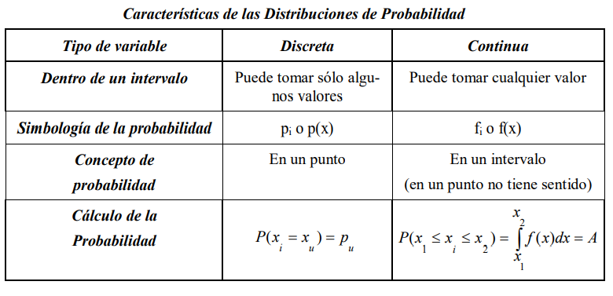


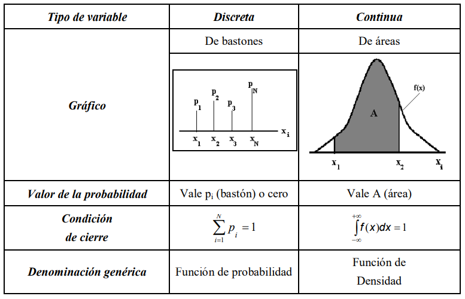


## Homework <br>

1. Considera el experimento que consiste en un empleado que arma un producto.
  - a. Defina la variable aleatoria que represente el tiempo en minutos requerido para armar el producto.<br>
  - b. ¿Qué valores toma la variable aleatoria?<br>
  - c. ¿Es una variable aleatoria discreta o continua?<br>
2. Considera el experimento que consiste en lanzar una moneda dos veces.
  - a. Enumere los resultados experimentales.
  - b. Defina una variable aleatoria que represente el número de caras en los dos lanzamientos.
  - c. Dé el valor que la variable aleatoria tomará en cada uno de los resultados experimentales.
  - d. ¿Es una variable aleatoria discreta o continua?
3. Considera las decisiones de compra de los próximos tres clientes que lleguen a la tienda de ropa Martin Clothing Store. De acuerdo con la experiencia, el gerente de la tienda estima que la probabilidad de que un cliente realice una compra es 0.30. 
  - a. Describa si cumple con las reglas para clasificarlo como un experimiento binomial.
  - b. ¿Cuál es la probabilidad de que dos de los próximos tres clientes realicen una compra?
  - c. ¿Cuál es la probabilidad de que cuatro de los próximos diez clientes realicen una compra?
4.  A la oficina de reservaciones de una aerolínea regional llegan 48 llamadas por hora.
- a. Calcule la probabilidad de recibir cinco llamadas en un lapso de 5 minutos.
- b. Estime la probabilidad de recibir exactamente 10 llamadas en un lapso de 15 minutos.
- c. Suponga que no hay ninguna llamada en espera. Si el agente de viajes necesitará 5 minutos para la llamada que está atendiendo, ¿cuántas llamadas habrá en espera para cuando él termine? ¿Cuál es la probabilidad de que no haya ninguna llamada en espera?
- d. Si en este momento no hay ninguna llamada, ¿cuál es la probabilidad de que el agente de viajes pueda tomar 3 minutos de descanso sin ser interrumpido por una llamada?
5. En una encuesta realizada por Gallup Organization, se les preguntó a los interrogados, “Cuál es el deporte que prefieres ver”. Futbol y básquetbol ocuparon el primero y segundo lugar de preferencia (www.gallup.com, 3 de enero de 2004). Si en un grupo de 10 individuos, siete prefieren futbol y tres prefieren básquetbol. Se toma una muestra aleatoria de tres de estas personas.
- a. ¿Cuál es la probabilidad de que exactamente dos prefieren el futbol?
- b. ¿De que la mayoría (ya sean dos o tres) prefiere el futbol?
6. La probabilidad de que a un estudiante le guste este modulo es de 0.7 (en Henry somos optimistas), cual es la probabilidad de que les guste este módulo a 6 de los 10 estudiantes.<br>
7. De todos los push a Git en un Henry Challenge, el 90% lo envía a término. Si se envían 9 ¿cuál es la probabilidad de que 7 lleguen a término?.<br>
8. En relación con el enunciado anterior cálcule la probabilidad de que 7 o más lleguen a término.<br>
Distribución de Poisson:<br>
9. La cantidad de alumnos promedio que se ausentan en un día de clases en la carrera de Data Science es de 10. Calcular cual es la probabilidad de que se ausenten 7 alumnos.<br>
10. Cuando inicia una clase, los estudiantes ingresan a un ritmo de 5 estudiantes por minuto. Calcular cual es la probabilidad de que ingresen 7 estudiantes por minuto.<br>

## Ejercicios complementarios <br>

11. Cada 3 días ingresan 10 estudiantes nuevos al Prep Course de Henry, calcule la probabilidad de que ingresen 15 nuevos estudiantes en un período de 6 días.<br>
12. En una distribución de Poisson de lamba_np=3, cual es la probabilidad de x>=1.<br>
Distribución Normal:<br>
13. La calificación promedio de los estudiantes de Henry es de 78 con una desviación estandar de 25. Cual es la probabilidad de tener estudiantes con calificaciones mayores o iguales 90.

Tablas de Distribución [tablas](https://github.com/soyHenry/DS-M2/blob/3aae1f7b63bf723a96a8094a2e1598e69bb10b34/Clase%2006/Tablas%20Distribuci%C3%B3n.pdf)

<table class="hide" width="100%" style='table-layout:fixed;'>
  <tr>
    <td>
      <a href="https://airtable.com/shrSzEYT4idEFGB8d?prefill_clase=00-PrimerosPasos">
        
        <br>
        Hacé click acá para dejar tu feedback sobre esta clase.
      </a>
    </td>
  </tr>
</table>
