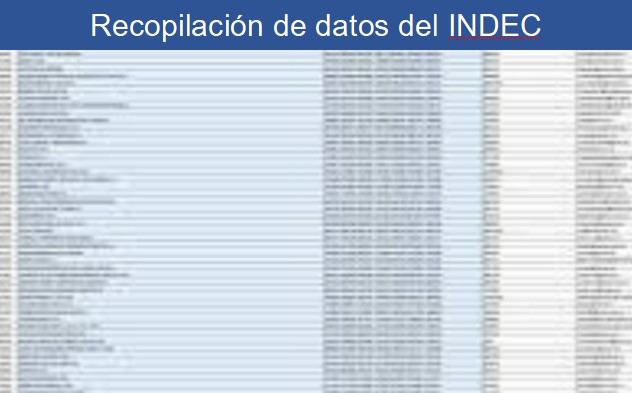
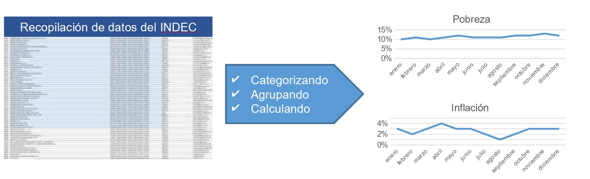
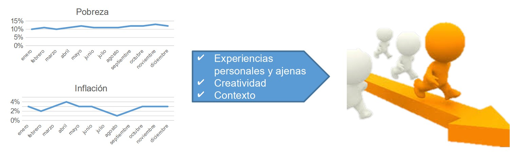
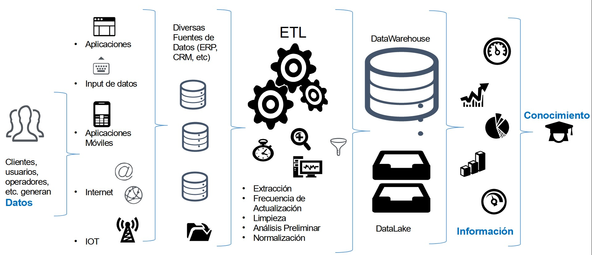

## Convertir los Datos en Conocimiento

### Datos

Los Datos son un conjunto de hechos almacenados:

### Información

Es el conjunto de datos procesados en tiempo y en forma, que constituyen un mensaje relevante y reduce la incertidumbre.

### Conocimiento

Se adquiere con la práctica y la experiencia. Dota a las personas con la capacidad de tomar decisiones. 

## Inteligencia de Negocios (BI)

* Con la experiencia nos hacemos expertos
* Adquirimos el conocimiento sobre el dominio del negocio.
* Somos capaces de describir su comportamiento y comprender sus aspectos y variables más importantes.
* ¿Está esa experiencia e información, de donde se obtuvo el conocimiento, plasmada en los datos?
* ¿Cuánto valor se le puede dar entonces a los datos que el negocio genera?
* ¿Cómo podemos hacer para generar información a partir de los datos?
* Ese es el objetivo principal de la Inteligencia de Negocios, convertir los datos en información oportuna y relevante por medio de diferentes técnicas de transformación, análisis y visualización.

### Soporte a la Decisión

* En una organización se toman decisiones
* Es importante mitigar la incertidumbre
* Lograr respaldo y seguridad
* La Inteligencia de Negocios, enfocada en la calidad del dato, procura procesarlo, desde su origen para su análisis
* Soporte a la toma de decisiones

## Ecosistema típico en una organización

## Homework

A lo largo del módulo ustedes serán los analistas de datos de una compañía de venta de insumos tecnológicos al público. A lo largo de las prácticas se harán cargo de la información de la empresa y realizarán el proceso completo de captura, limpieza, análisis, diagnóstico, documentación, explotación y publicación de resultados.

La Dirección de Ventas ha solicitado las siguientes tablas a Marketing con el fin de que sean integradas:

* La tabla de puntos de venta propios, un Excel frecuentemente utilizado para contactar a cada sucursal, actualizada en 2021.
* La tabla de empleados, un Excel mantenido por el personal administrativo de RRHH.
* La tabla de proveedores, un Excel mantenido por un analista de otra dirección que ya no esta en la empresa. 
* La tabla de clientes, alojada en el CRM de la empresa.
* La tabla de productos, un Excel mantenido por otro analista.
* Las tablas de ventas, gastos y compras, tres archivos CSV generados a partir del sistema transaccional de la empresa.

Es necesario realizar la captura de esos archivos e ingestarlos dentro de nuestra base de datos.