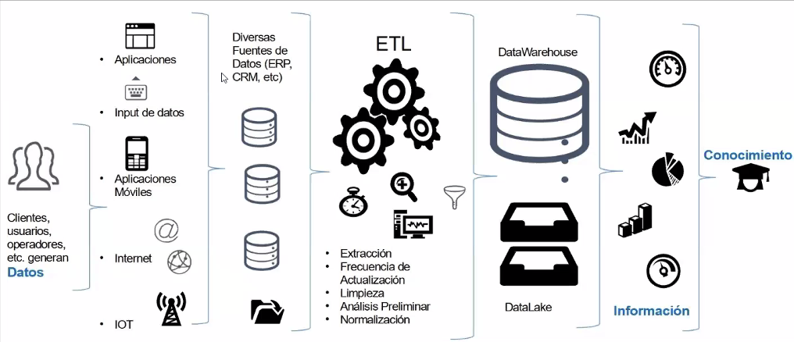

# CLASE 01

## De datos a conocimiento

Los __datos__ suelen estar desordenados. Por eso es necesario categorizarlos, agruparlos, incluso operarlos para poder convertirlos en __información__. Con esa información se puede generar __conocimiento__ a partir de experiencias, de la creatividad y el contexto.

## Inteligencia de negocios (Bussiness Inteligence)

Es el conocimiento acerca del negocio. La idea, es que este sea extraido de los mismos datos que se generan o registran en la empresa y que puedan estar al alcance de quien lo necesite. 

### Soporte a la decisión

El fin de estas transformaciones, análisis, inteligencia de negocios, KPIs es determinar cual es la mejor decisión a tomar según el contexto, así como ayudar a justificar el porque podría funcionar o en su defecto, una vez aplicada, por que no se cumplieron los objetivos esperados.

__E__ xtracción 
__T__ ransformación 
__L__ impieza 
