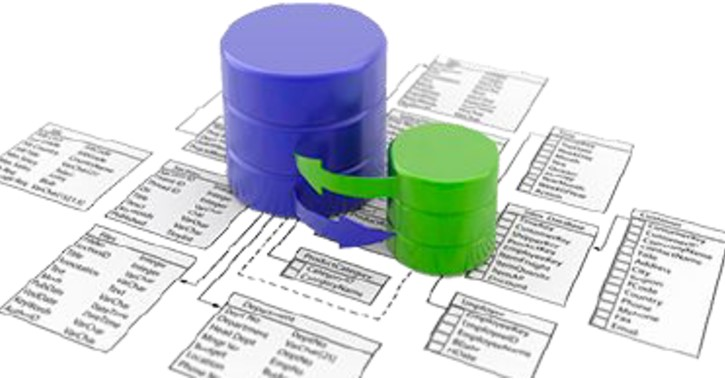
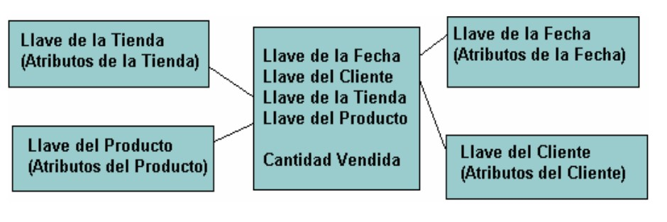
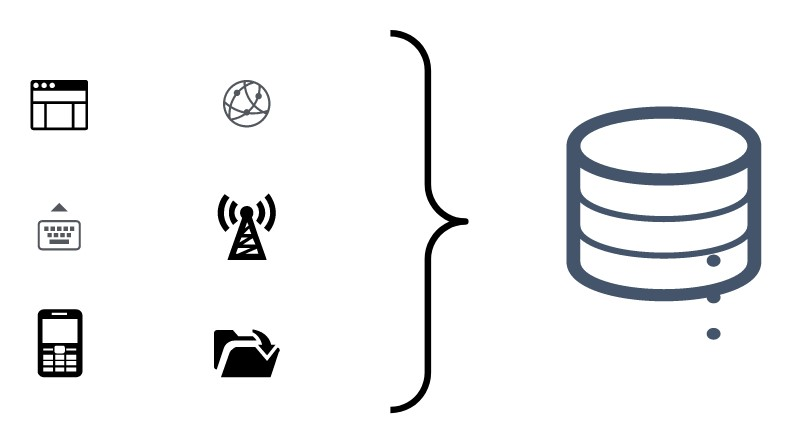
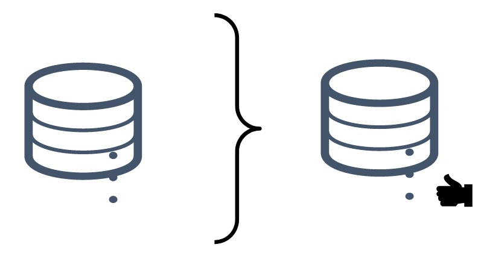
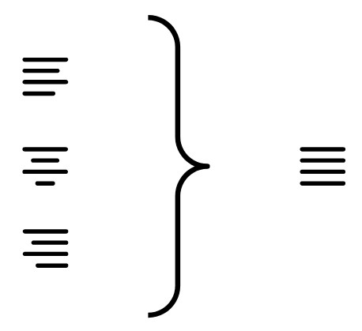
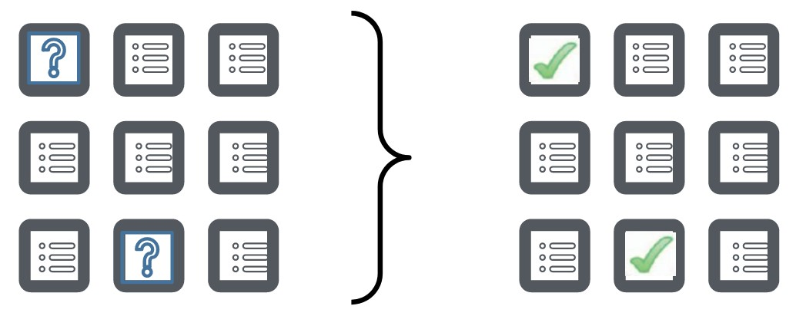
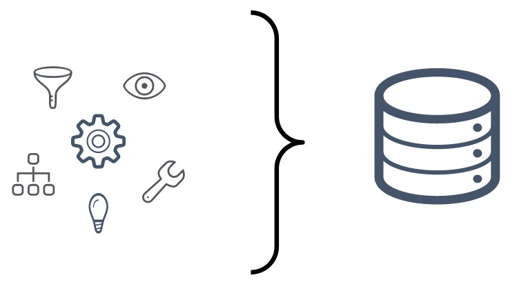
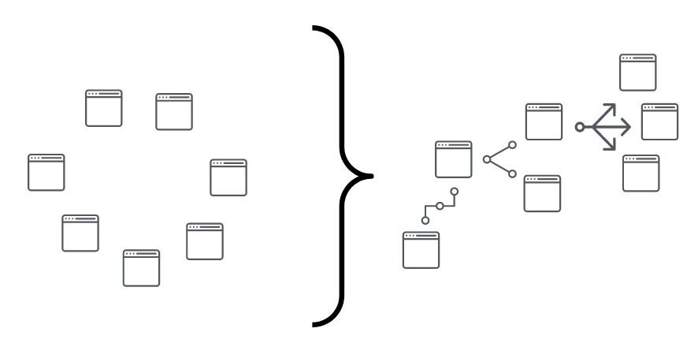
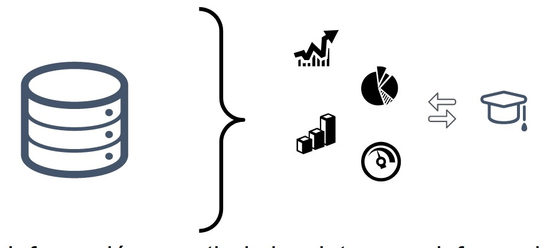

## Calidad del Dato

### ¿Para qué buscamos la calidad de los datos?

* La calidad de datos confiabiliza en análisis.
* Si utilizamos datos no confiables podemos llegar a conclusiones erróneas.
* Las fuentes son críticas en el proceso de selección de datos.
* Existen métodos de control, auditoría, corrección y confiabilización de datos.
* Recuperar información perdida o incompleta.
* Resolver conflictos en los datos.

### Definición

* Implica transformar los datos y disponibilizarlos.
* Los datos de la realidad pueden ser impuros debido a incompletitud, ruido o inconsistencias.
* Debemos asegurarnos la fiabilidad del dato, teniendo el camino del dato, es decir, la trazabilidad.

### Causas de la mala calidad de los datos

* Carga de datos en forma manual o Data Entry.
* Carga de datos externos sin los recaudos correctos para su adecuación.
* Problemas de carga originados en los sistemas transaccionales utilizados como fuente de datos.
* Implementación de nuevas aplicaciones en la organización, implica nuevos orígenes de datos, que necesitan ser congruentes con los datos ya existentes.
* Cambios en las aplicaciones existentes o migraciones de sus bases de datos.

## Criterios de la Calidad del dato

### Actualización

* Los datos deben estar actualizados. Debe existirreferencias de la fecha de confección o de la fecha de última actualización.
* Por ejemplo: Información de deuda sin una referencia en cuanto a la fecha de actualización.

### Completitud

* Los datos deben estar completos. Puede parecer obvio pero es una de las situaciones más habituales.
* Por Ejemplo: tablas con datos filiatorios y de contacto con campos vacíos aleatoriamente.

### Fiabilidad

* La procedencia y la trazabilidad del dato son características que hacen a la fiabilidad.
* Si trabajamos con una tabla de la que no conocemos su procedencia o bien que bajamos de una pagina poco confiable, los datos no serán fiables y nos pueden llevar a análisis erróneos.
* De igual manera, si no podemos reconstruir el camino completo del dato desde su captura hasta la actualidad, el conjunto de datos no tiene trazabilidad.

### Accesibilidad

* Los datos deben ser accesibles con bajo nivel de esfuerzo.
* Deben estar en lugares previsibles y ser fácilmente ubicables y elegibles.
* Ejemplo: Una tabla con nombres de campos numerados: Campo1, Campo2, etc…
* Ejemplo 2: Un reporte que se aloja en una ubicación poco habitual.

### Consistencia

* Interna: Calidad de caracteres y de lo que se guarda en los campos.
* Externa: Calidad de interdependencia y racionalidad de los campos.
* Ejemplo: Las claves primarias y las claves foráneas deben ser consistentes y permitir la relación entre tablas.

### Hechos y Dimensiones

Son tablas dimensionales o maestros, aquellas que contienen información respecto de las entidades que están incluidas en el modelo. Por ejemplo una tabla de clientes, donde se tenga una clave primaria para identificar a cada uno de manera unívoca, y ademas los datos filiatorios, como ser nombre, apellido, fecha de nacimiento ó nacionalidad. Existe un y sólo un registro por cada cliente.
Son tablas de hechos aquellas que guardan eventos donde se relacionan las entidades incluidas en el modelo y tambien las métricas asociadas. Por ejemplo una tabla de vetnas, donde se guarda la fecha de la venta, cliente y producto implicados, la sucursal actuante y el monto de la venta realizada. Existe un registro por evento, al cuál se asocian las entidades relacionadas y también una métrica. Consecuentemente, una tabla de hechos puede tambíen reflejar una entidad en sí misma, como el caso de la venta ó una generación de factura.
Concluyendo entonces que ambos, hechos y dimensiones, son también entidades.

## Preparación de los Datos

En la preparación de los datos se pueden generar conjuntos de datos mas pequeños que el original. En este sentido es importante la agrupación en «temas» o «familias» de datos.
El objetivo es generar «información de calidad» desestimando la información accesoria o redundante.

* La etapa de preparación de datos llega a insumir el 90% del trabajo de una tarea de análisis de datos.
* Sin la preparación de datos no es posible realizar análisis veraces.

### Metodología para la preparación y análisis

En la etapa de la preparación de datos se procede a la integración, limpieza, transformación, modelado y reportes.

Las técnicas de preparación son obligatorias para la incorporación de nuevos datos a nuestras bases, las mismas son: 
* Integración
* Limpieza del ruido
* Transformación
* Imputación de valores faltantes.

### Integración de Datos

Es el primer paso e implica integrar datos de diferentes fuentes e incorporar los datos a formatos tabulares si no lo estuvieran.

### Limpieza de Datos

Proceso por el cual se discriminan los datos importantes de los accesorios y a la vez los veraces de los erróneos. Luego se procede a desestimar o borrar aquellos datos que no serán utilizados y a validar los que se conservarán.

### Normalización de Datos

En este paso se identifican aquellos valores iguales con notaciones diferentes y se los reescribe de una manera uniforme.
Ejemplo: Calle S Martín, Calle Gral. San Martín, Calle José de San Martín…. = Calle Gral. José de San Martín.

### Imputación de Valores Faltantes

La imputación de valores faltantes esta relacionada con la identificación de los casos en donde exista perdida o ausencia de datos. En estos casos será importante realizar acciones de reconstrucción, aunque no siempre es posible resolverlas.

### Transformación de Datos

Este es el momento en que la información nueva será convertida a un formato compatible con base de datos. En este punto es crítico reducir el efecto distorsivo de la transformación.

### Modelado de Datos

Se establecen las relaciones entre los datos, se determinan que entidades contienen datos maestros y cuáles contienen hechos, dando lugar a las dimensiones y las métricas.

### Reportes y Visualización

Se genera Información a partir de los datos, esa información queda disponible para su análisis, que da lugar al Conocimiento.

### Claves subrogadas

Una clave subrogada es un identificador único que se asigna a cada registro de una tabla. Puede obtenerse a partir de la conjunción de columnas ya preexistentes.

### Recomendaciones Generales:

* Lo simple es mejor.
* Evitemos detalles superfluos.
* Creemos variables adicionales antes de destruir las originales.
* Analicemos los detalles antes de confiar en los resúmenes.
* Verificar la precisión de las variables derivadas y las recodificadas.

## Homework

Con el objetivo de asegurarse de que la calidad de la información con la que se va a trabajar sea la óptima, es necesario realizar una lista de propuestas de mejora teniendo en cuenta los siguientes puntos:

1) ¿Qué tan actualizada está la información? ¿La forma en que se actualiza ó mantiene esa información se puede mejorar?
2) ¿Los datos están completos en todas las tablas?
3) ¿Se conocen las fuentes de los datos?
4) Al integrar éstos datos, es prudente que haya una normalización respecto de nombrar las tablas y sus campos.
5) Es importante revisar la consistencia de los datos: ¿Se pueden relacionar todas las tablas al modelo? ¿Cuáles son las tablas de hechos y las tablas dimensionales o maestros? ¿Podemos hacer esa separación en los datos que tenemos (tablas de hecho y dimensiones)? ¿Hay claves duplicadas? ¿Cuáles son variables cualitativas y cuáles son cuantitativas? ¿Qué acciones podemos aplicar sobre las mismas?

### Limpieza, Valores faltantes y Normalización

6) Normalizar los nombres de los campos y colocar el tipo de dato adecuado para cada uno en cada una de las tablas. Descartar columnas que consideres que no tienen relevancia.
7) Buscar valores faltantes y campos inconsistentes en las tablas sucursal, proveedor, empleado y cliente. De encontrarlos, deberás corregirlos o desestimarlos. Propone y realiza una acción correctiva sobre ese problema.
8) Chequear la consistencia de los campos precio y cantidad de la tabla de ventas.
9) Utilizar la funcion provista 'UC_Words' para modificar a letra capital los campos que contengan descripciones para todas las tablas.
10) Chequear que no haya claves duplicadas, y de encontrarla en alguna de las tablas, proponer una solución.
11) Generar dos nuevas tablas a partir de la tabla 'empelado' que contengan las entidades Cargo y Sector.
12) Generar una nueva tabla a partir de la tabla 'producto' que contenga la entidad Tipo de Producto.
13) Es necesario contar con una tabla de localidades del país con el fin de evaluar la apertura de una nueva sucursal y mejorar nuestros datos. 
A partir de los datos en las tablas cliente, sucursal y proveedor hay que generar una tabla definitiva de Localidades y Provincias.
Utilizando la nueva tabla de Localidades controlar y corregir (Normalizar) los campos Localidad y Provincia de las tablas cliente, sucursal y proveedor.
14) Es necesario discretizar el campo edad en la tabla cliente.