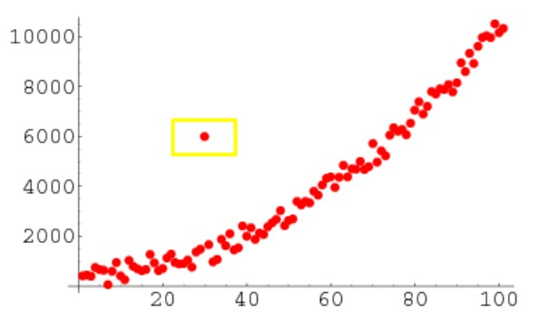
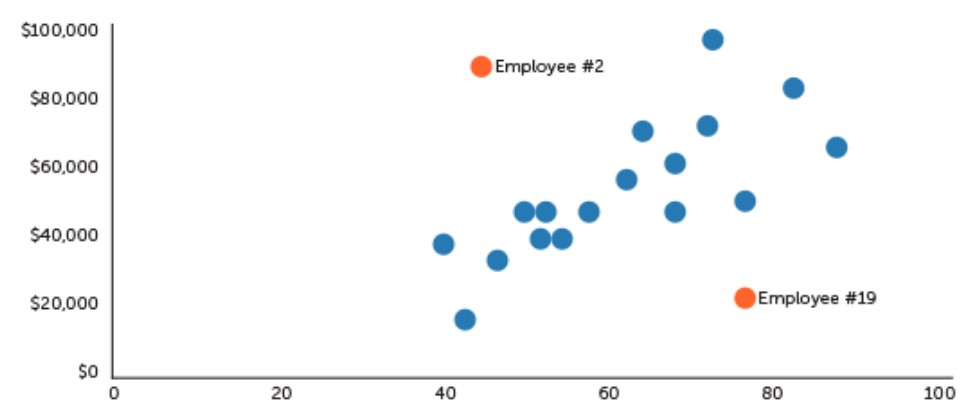
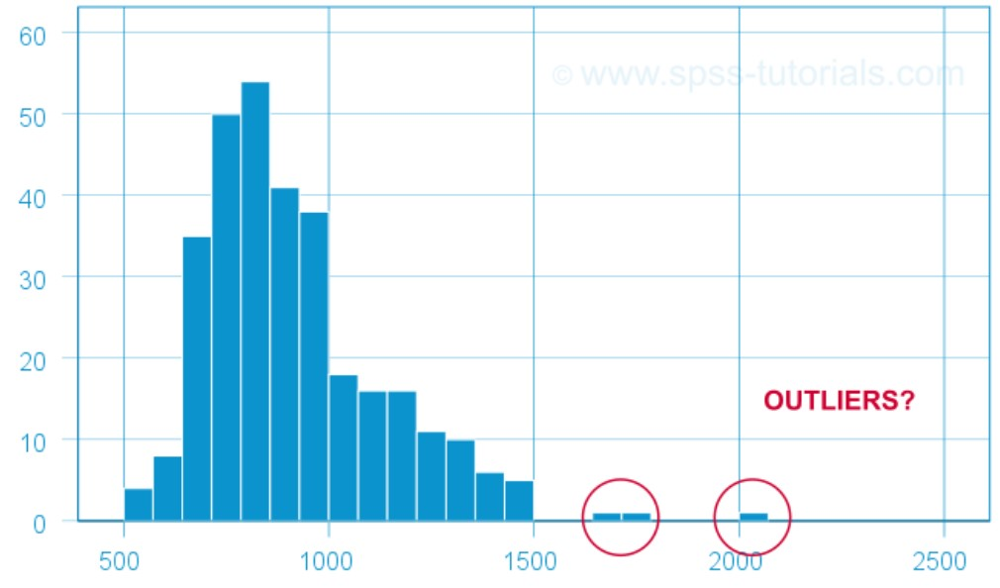
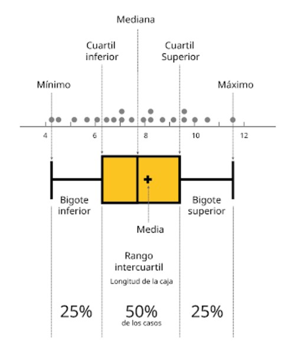
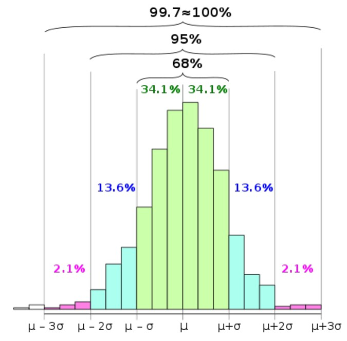
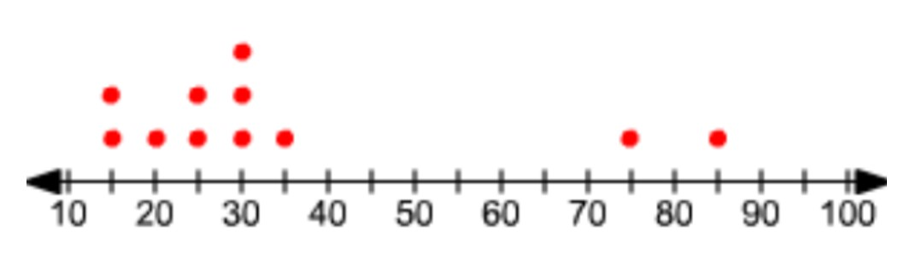

## Extracción, Transformación y Carga - ETL

Gracias a los procesos ETL es posible que cualquier organización:

* Mueva datos desde una o múltiples fuentes.
* Reformatee esos datos y los limpie, cuando sea necesario.
* Los cargue en otro lugar como una base de datos unificada.
* Una vez alojados en un destino, esos datos se analicen.
* O, cuando ya están cargados en su ubicación definitiva, se empleen en otro sistema operacional, para apoyar un proceso de negocio.

### Fase de Extracción

Para llevar a cabo el proceso de extracción, primera parte del ETL, hay que seguir los siguientes pasos:

* Extraer los datos desde los sistemas de origen.
* Analizar los datos extraídos obteniendo un chequeo.
* Interpretar este chequeo para verificar que los datos extraídos cumplen la pauta o estructura que se esperaba. Si no fuese así, los datos deberían ser rechazados.
* Convertir los datos a un formato preparado para iniciar el proceso de transformación.

### Fase de Transformación

La fase de transformación de un proceso ETL aplica una serie de reglas de negocio o funciones, sobre los datos extraídos para convertirlos en datos que serán cargados. Estas directrices pueden ser declarativas, pueden basarse en excepciones o restricciones pero, para potenciar su pragmatismo y eficacia, hay que asegurarse de que sean:

* Declarativas.
* Independientes.
* Claras.
* Inteligibles.
* Con una finalidad útil para el negocio.

## Outliers

Un elemento fundamental a descubrir dentro de las tareas de identificación del ruido son los valores atípicos o outliers.
Los Outliers son elementos que por su comportamiento se apartan notoriamente del comportamiento general. Esto se puede deber a un error en los datos o a un dato correcto que representa anomalías en la realidad.

### Diagrama de Caja

El Diagrama de Caja permite observar la distribución completa de los datos al mismo tiempo que su mediana y sus cuartiles. También, muestra los elementos que se escapan del universo, los outliers.

Rango intercuartílico o IQR: 
* mínimo = Q1 - 1.5 x IQR
* máximo = Q3 + 1.5 x IQR

### Regla de las tres sigmas

La Regla de las Tres Sigmas se basa en el valor promedio y la desviación estándar para obtener el rango, fuera del cual, podemos asumir que un valor es atípico.

* mínimo = Promedio – 3 * Desviación Estándar
* máximo = Promedio + 3 * Desviación Estándar

### Consideraciones

A veces, es la variable la que nos lo indica. Por ejemplo, la asistencia a un curso no puede ser menor que cero o mayor al número de alumnos que tiene el curso.

## Homework

1) Aplicar alguna técnica de detección de Outliers en la tabla ventas, sobre los campos Precio y Cantidad.
Realizar diversas consultas para verificar la importancia de haber detectado Outliers. Por ejemplo ventas por sucursal en un período teniendo en cuenta outliers y descartándolos.
2) Es necesario armar un proceso, mediante el cual podamos integrar todas las fuentes, aplicar las transformaciones o reglas de negocio necesarias a los datos y generar el modelo final que va a ser consumido desde los reportes. 
Este proceso debe ser claro y autodocumentado.
¿Se puede armar un esquema, donde sea posible detectar con mayor facilidad futuros errores en los datos?
3) Elaborar 3 KPIs del negocio. Tener en cuenta que deben ser métricas fácilmente graficables, por lo tanto debemos asegurarnos de contar con los datos adecuados.
¿Necesito tener el claro las métricas que voy a utilizar? 
¿La métrica necesaria debe tener algún filtro en especial? 
La Meta que se definió ¿se calcula con la misma métrica?