## Query Optimization

La optimización de consultas es de gran importancia para el rendimiento de una base de datos relacional, especialmente para la ejecución de sentencias SQL complejas. Un optimizador de consultas decide los mejores métodos para implementar cada consulta.

El optimizador de consultas selecciona, por ejemplo, si desea o no usar índices para una consulta determinada y qué métodos de unión usar al unir varias tablas. Estas decisiones tienen un tremendo efecto en el rendimiento de SQL, y la optimización de consultas es una tecnología clave para cada aplicación, desde sistemas operativos hasta sistemas de almacenamiento de datos y sistemas analíticos hasta sistemas de gestión de contenido.

Las principales consideraciones para optimizar las consultas son:

- Para que una consulta lenta sea más rápida, lo primero a tener en cuenta es que las tablas posean índices. Configurar índices en las columnas utilizadas en la cláusula, acelera la evaluación, el filtrado y la recuperación final de los resultados.

- Minimizar el número de análisis de tablas completas en sus consultas, especialmente para tablas grandes. Consultar cuando sea posible a partir de criterios especifícos.

- La investigación de la documentación del SGBD para poder utilizar funciones y procedimientos que performen de mejor que otras opciones.<br>
Por lo general LEFT(Nombre) = 'Rod' es menos performante que LIKE 'Rod%' (profundizaremos en estas funciones en las clases siguientes).

##### En las próximas clases avanzaremos sobre la utilización de funciones y consultas complejas, el abordaje inicial de estos temas nos permite entender los escenarios de su utilización y la mejor combinación al momentos de utilizarlas.

#### Estadísticas de consultas

La ficha Resultados del editor SQL posee Estadísticas de consulta que utiliza datos del esquema de rendimiento para recopilar métricas clave para la consulta ejecutada, como la sincronización, las tablas temporales, los índices, las combinaciones y mucho más.
Las estadísticas en MySQL se pueden consultar en el margen derecho de la pantalla de resultados, mediante la opción "Query Stats".

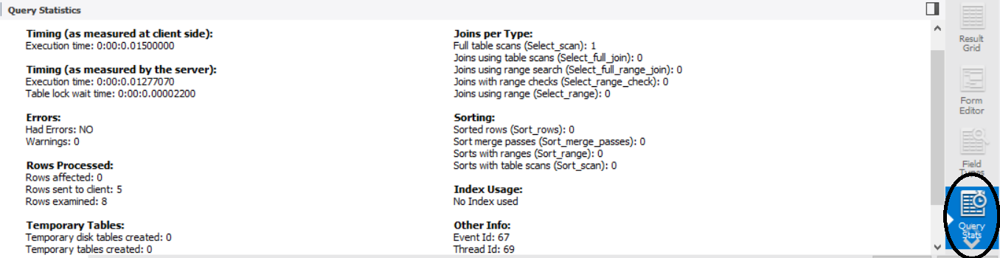

#### Plan de explicación visual

La característica de explicación visual genera y muestra una representación visual de la instrucción MySQL EXPLAIN mediante el uso de información extendida disponible en el formato JSON extendido. MySQL Workbench proporciona todos los formatos para las consultas ejecutadas, incluido el JSON extendido sin procesar, el formato tradicional y el plan de consulta visual.

Para ver un plan de ejecución visual explicado, ejecute la consulta desde el editor de SQL y, a continuación, seleccione Plan de ejecución en la ficha Resultados de la consulta. El plan de ejecución tiene como valor predeterminado, pero también incluye una vista similar a la que se ve al ejecutar EXPLAIN en el cliente MySQL. Para obtener información acerca de cómo MySQL ejecuta instrucciones, consulte Optimización de consultas con EXPLAIN.

El orden de ejecución en un diagrama de explicación visual es de abajo a arriba y de izquierda a derecha. Los ejemplos de diagramas que siguen proporcionan una visión general de las convenciones gráficas, textuales e informativas utilizadas para representar aspectos de los planes de explicación visual. Para obtener información específica, consulte:

- Convenciones gráficas.<br>
- Convenciones textuales e informativas.<br>

El diagrama de explicación visual de la primera figura muestra una representación visual de la siguiente consulta.

La ejecución de consultas y sentencias en un plan de ejecución de consultas gráfico es mostrada por íconos. Cada ícono tiene un color específico y representa una acción específica. La presentación gráfica provee un entendimiento rápido de las características y estructura básicas del plan, por lo tanto, es útil para el análisis del desempeño. También provee suficiente información para un análisis más profundo sobre el proceso de ejecución.

[Ejemplos de plan de ejecución visual](https://www.sqlshack.com/es/planes-de-ejecucion-de-consultas-entendiendo-y-leyendo-los-planes/)

[Plan de Ejecución Visual MySQL](https://dev.mysql.com/doc/workbench/en/wb-performance-explain.html)

[Plan de Ejecución Visual SQL Server](https://docs.microsoft.com/en-us/sql/relational-databases/performance/display-an-actual-execution-plan?view=sql-server-ver15)


### SQL – Índices 

Un índice SQL es una tabla de búsqueda rápida para poder encontrar los registros que los usuarios necesitan buscar con mayor frecuencia. Ya que un índice es pequeño, rápido y optimizado para búsquedas rápidas. Además, que son muy útiles para conectar las tablas relacionales y la búsqueda de tablas grandes.<br>
Los índices de SQL son la principal herramienta de rendimiento, por lo que generalmente se aplican si una base de datos se incrementa. SQL Server reconoce varios tipos de índices, pero uno de los más comunes es el índice agrupado. Esta clase de índice se crea automáticamente con una clave principal.
En el momento en el que se ejecuta la consulta, SQL Server creará automáticamente un índice agrupado en la columna especificada.

```SQL
CREATE TABLE carrera (
	idCarrera INT NOT NULL AUTO_INCREMENT,
	nombre VARCHAR (20) NOT NULL,
	PRIMARY KEY (idCarrera) --Aquí al crear una PK, SQL además crea un índice agrupado.
);
```
Podemos ver al comprbar mediante Workbench que la tabla "carrera" se encuentra indexada.

Los índices de las tablas ayudan a indexar el contenido de diversas columnas para facilitar la búsquedas de contenido de cuando se ejecutan consultas sobre esas tablas.<br>
De ahí que la creación de índices optimiza el rendiemiento de las consultas y a su vez el de la BBDD, pueden agregarse índices en caso de tablas puentes donde no se ha solucionado el problema de indexación aplicado claves concatenadas.<br>
En MySQL puede utilizarse CREATE INDEX para crear o añadir índices en las tablas de una base de datos.<br>

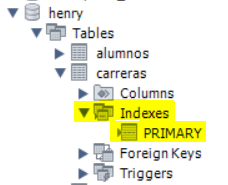

Con el código superior CREATE INDEX estaríamos creando uno o varios índices ordinarios en una tabla existente.

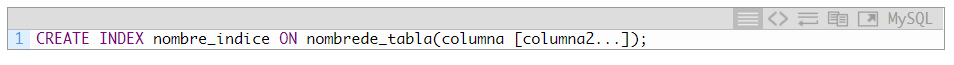

Cuando hacemos una consulta sobre un campo sin índices, el motor busca la condición de forma exhaustiva registro a registro para quedarse con aquellos que la cumplan. Sí por el contrario, contamos con una tabla de índices, esa busqueda se de forma más óptima, ya que se tienen conocimiento de la ubicación de cada registro.

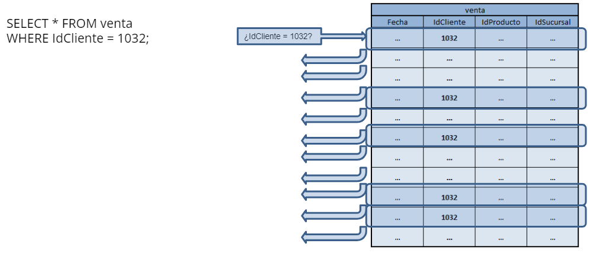

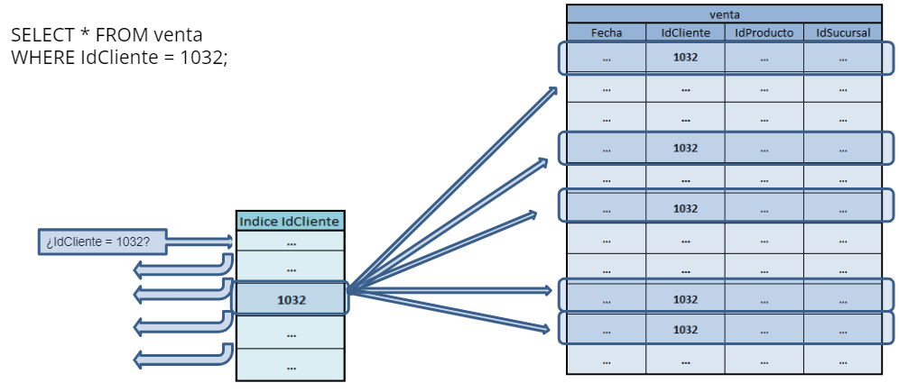


Podemos tener los siguientes tipos de índices en una tabla de MySQL:

- Únicos.<br>
- Primarios.<br>
- Ordinarios.<br>
- De texto completo.<br>
- Parte de campos o columnas.<br>

También se puedne eliminar índices mediante la sentencia DROP INDEX, siempre teniendo presente que la utlización de la sentencia DROP puede llevar a consucuencias indeseadas.

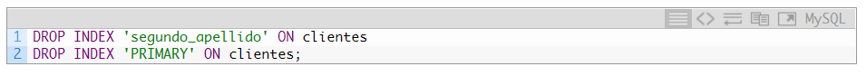


En conclusión, es una buena práctica indexar nuestras tablas, tanto mediante PK como de otros tipos de indices. Cuando la utilización de PK no resulte aplicable siempre se debe recurrir a otra alternativa de indexación.

### Funciones envueltas alrededor la cláusula WHERE

Un tema en la optimización es un enfoque constante en la cláusula WHERE. ¡Cuanto más rápido podamos dividir nuestro conjunto de datos a solo las filas que necesitamos, más eficiente será la ejecución de la consulta!

Al evaluar una cláusula WHERE, cualquier expresión involucrada debe resolverse antes de devolver nuestros datos. Si una columna contiene funciones a su alrededor, como DATEPART, SUBSTRING o CONVERT, estas funciones también deberán resolverse. Si la función debe evaluarse antes de la ejecución para determinar un conjunto de resultados, deberá analizarse la totalidad del conjunto de datos para completar esa evaluación.<br>


```SQL
#Utilizamos IN para crear un conjunto en la segmentación
SELECT *
FROM instructores
WHERE idInstructor IN (1,2,3,4,5)

#Utilizamos OR para crear el mismo conjuntos
SELECT *
FROM instructores
WHERE idInstructor = 1 OR idInstructor = 2 OR idInstructor = 3
OR idInstructor = 4 OR idInstructor = 5
```
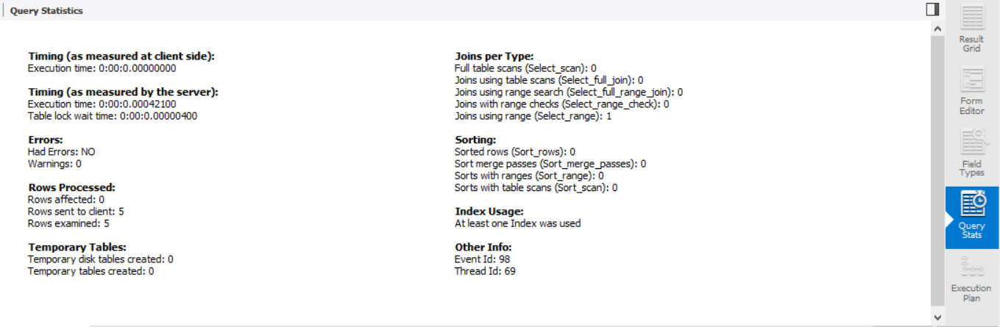


### Formas Normales

Las formas normales son conjuntos de criterios que utilizamos para diseñar la estructura de las bases de datos. Para mejorar el desempeño de una base de datos, así como evitar redundancia en la información que contiene y, en consecuencia, generar condiciones para un mejor diseño, se deben conocer las formas de normalización y condiciones en las que la desnormalización es recomendable.<br>

#### Primera Forma Normal (1FN)

Una relación se encuentra en 1FN sólo si cada uno de sus atributos contiene un único valor para un registro determinado.<br>
Supongamos que guardamos las sucursales donde compraron los clientes considerando el diseño de la imagen.<br>
Podemos observar, que en el mismo registro se guardan todas las sucursales asociadas al cliente, motivo por el cual no se cumple la 1FN.

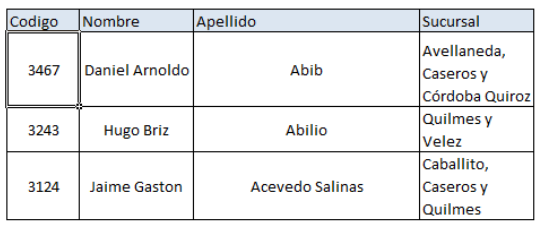

Para corregirlo, se crean dos tablas, donde vamos a poder ver que cada registro guarda un solo valor. De esta manera, el esquema cumple la 1FN.

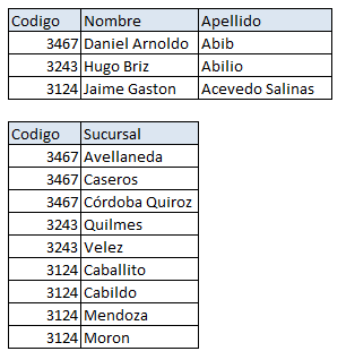

#### Segunda Forma Normal (2FN)

Una relación se encuentra en 2FN sólo si se cumple 1FN y todos sus atributos no clave dependen en forma completa de la clave.<br>
Supongamos que tenemos una tabla donde guardamos cuántas ventas se hizo a cada cliente en cada sucursal, y contamos con un esquema como el de la imagen.<br>
La clave de esta tabla, está formada por los campos Codigo_Cliente y Codigo_Sucursal y la relación se encuentra en 1FN, pero:<br>
- Apellido_Nombre sólo depende de Codigo_Cliente.<br>
- Sucursal sólo depende de Codigo_Sucursal.<br>
- Ventas depende de la clave completa Codigo_Cliente + Codigo_Sucursal.<br>
Por lo que ocurre en 1 y 2 no se cumple con la 2FN.

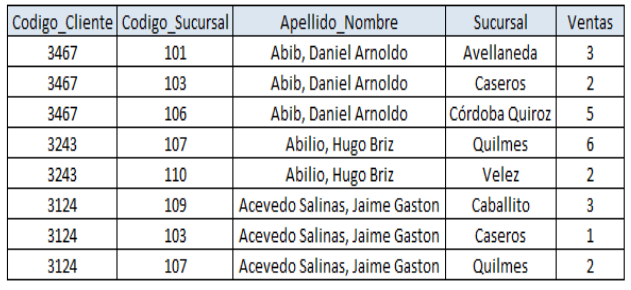

Para corregirlo, debemos llegar a un esquema de 3 tablas como el que se puede observar. De esta manera sí se cumple la 2FN para el esquema.

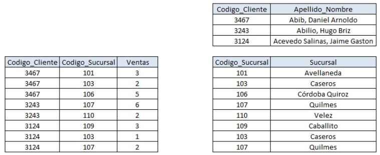

#### Tercera Forma Normal (3FN)

Una relación se encuentra en 3FN sólo si se cumple 2FN y los campos no clave dependen únicamente de la clave o los campos no clave no dependen unos de otros.<br>
Supongamos que tenemos una tabla donde guardamos datos filiatorios de clientes que tienen que ver con la Localidad y Provincia en que viven y tenemos la estructura de la imagen.<br>
Como se puede observar, surgen las siguientes dependencias:
- Codigo_Cliente Apellido_Nombre.<br>
- Codigo_Cliente Localidad.<br>
- Codigo_Cliente Provincia.<br>
Aunque cumple con la 2FN, la Provincia está tambien ligada a la Localidad, con lo que no se cumple la 3FN.

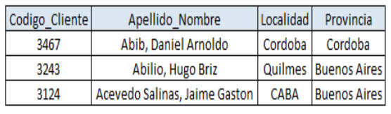

Para corregirlo, debemos llegar a un esquema de 2 tablas como el que se puede observar. De esta manera se cumple la 3FN para el esquema.

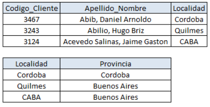

#### Cuarta Forma Normal (4FN)

Una relación se encuentra en 4FN sólo si se cumple 3FN y no posee dependencias multivaluadas no triviales.<br>
Supongamos que tenemos un esquema como el de la imagen, donde guardamos que una sucursal vende un determinado producto mediante un canal de venta.<br>
Notemos que debido a que la tabla tiene una clave única y ningún atributo no clave, no viola ninguna forma normal hasta la 3FN. Pero debido a que los canales de venta de una sucursal son independientes de los productos que vende, hay redundancia en la tabla: por ejemplo vemos tres veces que Caballito vende OnLine. Esto se describe como que Canal de Venta está teniendo una dependencia multivalor en Sucursal e impide que se cumpla con la 4FN en la relación.<br>

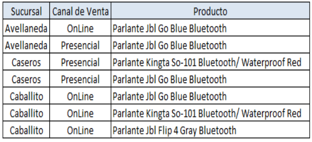

Para corregirlo, debemos poner los hechos sobre los Canales de Ventas por los que se vende en una tabla diferente a los hechos sobre los productos que se vende. De esta manera se cumple la 4FN para el esquema.

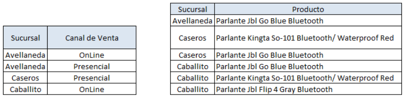

#### Quinta Forma Normal (5FN)

Una relación se encuentra en 5FN sólo si se cumple 4FN y cada dependencia de unión en ella es implicada por las claves candidatas.<br>
Siguiendo con el ejemplo anterior, la relación también será válida para la 5FN si existe una regla en el escenario real que limite una relación de una Canal de Venta con un Producto al no ser vendido ese Producto por la Sucursal.<br>
El hecho de que no haya forma de limitar las combinaciones inválidas del mundo real, limita el cumplimiento de la 5FN.<br>

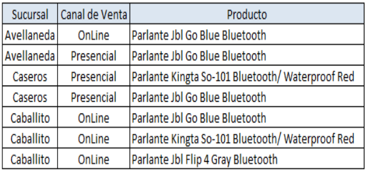

Para corregirlo, además de poner en tablas diferentes, la relaciones posibles Sucursal-Canal de Venta y Sucursal-Producto, debemos hacer lo propio con la relación Canal de Venta-Producto. De esta manera se cumple la 5FN para el esquema.<br>

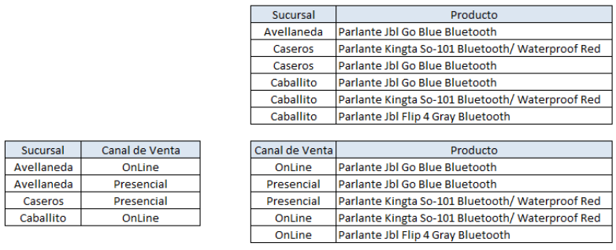

### Modelos de Datos

Los modelos de datos buscan representar un realidad que es posible representar mediante las entidades que la conforman. Esas entidades quedan representadas en tablas, y pueden ser de dos tipos:

- Tablas de Hechos: Registran las operaciones ocurridas, todo tipo de transacciones donde intervienen las diferentes entidades del modelo. Por lo general están confeccionadas por campos que refieren a un momento en el tiempo, campos que refieren a las entidades correspondientes y campos donde se guardan valores numéricos, que luego, pasan a ser métricas. Un ejemplo pueden ser las tablas de ventas, donde queda reflejado día y hora de la transacción, cliente, producto, sucursal como entidades, representadas por claves foráneas, y por último, los valores de precio y cantidad de unidades vendidas.<br>
- Tablas Maestros: Registran los atributos particulares de las entidades, representando cada registro a una única instancia, por medio de una clave primaria. Un ejemplo puede ser la tabla de maestro de clientes, donde cada registro posee un identificador único y representa los datos respectivos de un único cliente.<br>

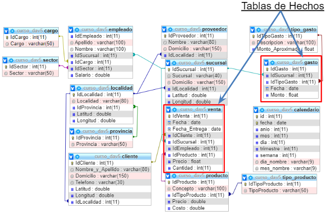

#### Modelos de Estrella

Es muy común encontrar en herramientas de BI, modelos de este tipo, donde las tablas de hecho son centrales, mientras que las tablas de maestros, que también son denominadas de dimensiones, están alrededor.
La nomenclatura típica, es anteponer “Fact_” a las tablas de hechos, y “Dim_” a las tablas de dimensiones o maestros.

Por su forma de trabajar filtrando la información en base a selecciones, en las herramientas de BI no se utilizan referencias circulares, ya que, al filtrar por una dimensión, el filtro se aplica en cascada sobre la tabla de hechos y las dimensiones asociadas a esos registros.

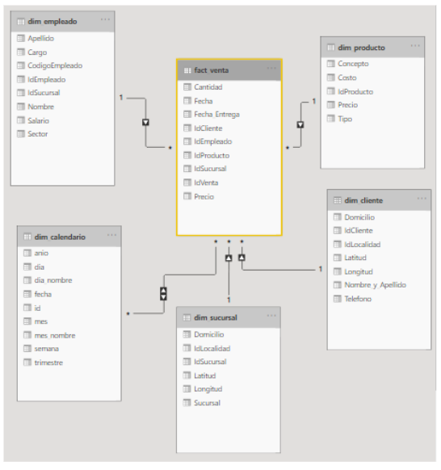

#### Modelos de Copo de Nieve

El esquema de copo de nieve consta de una tabla de hechos que está conectada a muchas tablas de dimensiones, que pueden estar conectadas a otras tablas de dimensiones a través de una relación de muchos a uno.<br>
Las tablas de un esquema de copo de nieve generalmente se normalizan en la tercera forma normal. Cada tabla de dimensiones representa exactamente un nivel en una jerarquía.<br>

En la siguiente figura se muestra un esquema de copo de nieve con dos dimensiones, cada una con tres niveles. Un esquema de copo de nieve puede tener varias dimensiones y cada dimensión puede tener varios niveles.<br>

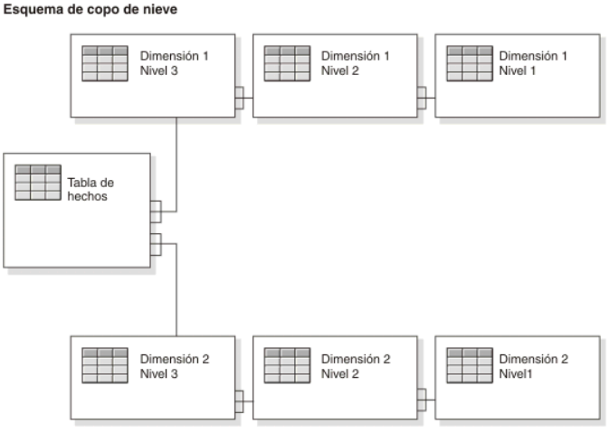

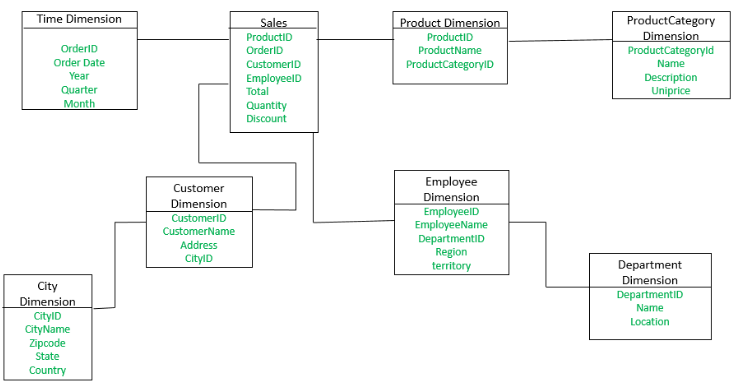

- La tabla de dimensiones de Empleado contiene los atributos: EmployeeID, EmployeeName, DepartmentID, Region, Territory.<br>
- El atributo DepartmentID se vincula con la tabla Empleado con la tabla de dimensiones Departamento.
- La dimensión Departamento se utiliza para proporcionar detalles sobre cada departamento, como el Nombre y la Ubicación del departamento.<br>
- La tabla de dimensiones del cliente ahora contiene los atributos: CustomerID, CustomerName, Address, CityID. Los atributos CityID vinculan la tabla de dimensiones del cliente con la tabla de dimensiones de la ciudad.<br>
- La tabla de dimensiones de la ciudad tiene detalles sobre cada ciudad, como el nombre de la ciudad, el código postal, el estado y el país.<br>

La principal diferencia entre el esquema de estrella y el esquema de copo de nieve es que la tabla de dimensiones del esquema de copo de nieve se mantiene en forma normalizada para reducir la redundancia. La ventaja aquí es que tales tablas (normalizadas) son fáciles de mantener y ahorran espacio de almacenamiento. Sin embargo, también significa que se necesitarán más combinaciones para ejecutar la consulta. Esto afectará negativamente al rendimiento del sistema. 

### Conclusión

La optimización del rendimiento de una base de datos no solo se limita a crear consultas performantes, este proceso comienza con la creación de una estructura eficiente que represente adecuadamente el modelo de negocios. La normalización excesiva o inadecuada puede repercutir en este punto. Por ejemplo:
- ¿Es necesario que nuestra BD tenga tablas de provinicas o localidades?.¿Es relevante para el negocio?.

Cuando el volumen de datos se vuelve considerable y las organizaciones se ven obligadas a implementar repositorios análiticos centralizados, el modelo de datos diseñado es fundamental para un buen rendimiento. Los modelos de datos análiticos presentadps tienen como objetivo una rápida recuperación de un gran volumen de datos, sacrificando normalización.

Si todo lo anterior se aborda de manera adecuada, será más sencillo para quien realice las consultas encontrar la manera más perfomante de escribirlas.


### Material complementario

- [Optimización](https://www.adictosaltrabajo.com/2016/10/24/optimizacion-de-consultas-en-mysql/)
- [Indices IBM](https://www.ibm.com/docs/es/mam/7.6.0.8?topic=databases-database-indexing).<br>
- [Indices MySQL](https://dev.mysql.com/doc/refman/8.0/en/mysql-indexes.html).<br>
- [Modelos de Datos](https://www.ibm.com/docs/es/ida/9.1.2?topic=schemas-snowflake).<br>


## Homework

1. Genere 5 consultas simples con alguna función de agregación y filtrado sobre las tablas. Anote los resultados del la ficha de estadísticas.
2. A partir del conjunto de datos elaborado en clases anteriores, genere las PK de cada una de las tablas a partir del campo que cumpla con los requisitos correspondientes.
3. Genere la indexación de los campos que representen fechas o ID en las tablas:
- calendario.
- venta.
- cana_venta.
- productp.
- tipo_producto.
- sucursal.
- empleado.
- localidad.
- proveedor.
- gasto.
- cliente.
- compra.
4. Ahora que las tablas están indexadas, vuelva a ejecutar las consultas del punto 1 y evalue las estadístias. ¿Nota alguna diferencia?.
5. Genere una nueva tabla que lleve el nombre fact_venta (modelo estrella) que pueda agrupar los hechos relevantes de la tabla venta, los campos a considerar deben ser los siguientes:
- IdFecha ,
- Fecha,
- IdSucursal,
- IdProducto,
- IdCliente,
- Precio
- Cantidad

6. A partir de la tabla creada en el punto anterior, deberá poblarla con los datos de la tabla ventas.

<table class="hide" width="100%" style='table-layout:fixed;'>
  <tr>
    <td>
      <a href="https://airtable.com/shrSzEYT4idEFGB8d?prefill_clase=00-PrimerosPasos">
        
        <br>
        Hacé click acá para dejar tu feedback sobre esta clase.
      </a>
    </td>
  </tr>
</table>
