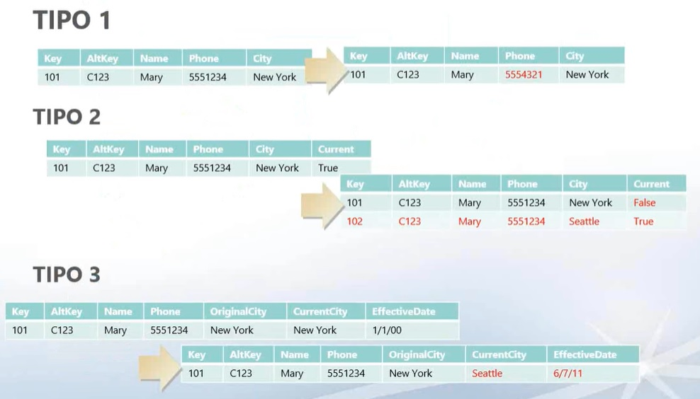
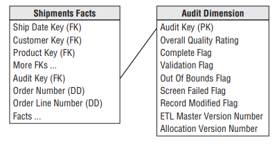
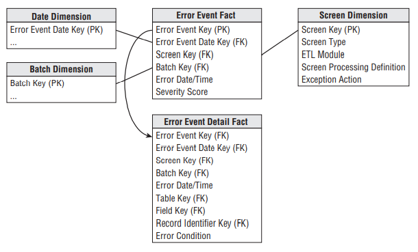

## Carga de Datos

Durante las clases anteriores comenzamos a descubrir como generar un proceso de ETL sencillo, una parte importante de este proceso se produce luego de que se encuentra el producción. Este proceso posterior se basa en la carga de datos la cual puede ser Full o Delta, en el primer caso se vuelcan todos los datos  y en el segundo solamente los datos no almacenados en el Mart previamente.<br>
Como una abordaje preliminar podrías preguntarte, ¿es eficiente cargar todos los registros históricos en cada ejecución del proceso?.Objetivamente es mejor una carga de datos Delta, es decir que solo vuelque las diferencias con respecto a la ultima carga,sin embargo depende de diferentes factores.

Orígenes de datos:<br>
Hay veces que la naturaleza del origen de datos imposibilita determinar cuales han sido las últimas modificaciones con respecto a la última carga.

Volumen de datos:<br>
Si el volumen de datos es pequeño es posible que no se precise de un Mart, por consiguiente la carga seria Full.
Si el volumen es muy grande el tiempo y costo de procesamiento podría ser muy elevado para una carga Full.

Velocidad de respuesta:<br>
En entornos donde se requiera un cierto tiempo de respuesta una carga Full puede no ser viable, sin embargo, en entornos donde la velocidad sea irrelevante, por ejemplo un Dashboard mensual una carga Full seria válida y mas fácil de desarrollar.

Niveles de Servicio:<br>
En algunos entornos en la nube, se paga por lo se consume (transacciones, uso de memoria, procesador, etc) con lo cual una gran carga podría comprometer el proceso si existen time outs, es por eso que una carga Full puede requerir incrementar el costo.

### Extracciones basadas en fechas<br>
Una extracción basada en fechas, normalmente selecciona todas las filas donde se crearon o modificaron los campos de fecha, lo que significa muchas veces "todos los registros de ayer". Cargar registros basados ​​puramente en el tiempo es un error común cometido por Desarrolladores ETL sin experiencia. Este proceso es terriblemente poco fiable. La selección puede cargar filas duplicadas y requerir intervención manual y limpieza de datos si el proceso falla por cualquier razón. Mientras tanto, si el proceso de carga nocturna no se ejecuta y se salta un día, hay un riesgo de que los datos perdidos nunca lleguen al almacén de datos.

Para utilizar este proceso se debe tener un campo fecha en la tabla de origen y de hechos, mediante una consulta SQL obtenemos esa fecha y la establecemos cono un filtro:<br>

```SQL
--¿Como obtendrías la última fecha de carga de la tabla fact_inicial?

INSERT INTO fact_inicial (IdFecha, Fecha, IdSucursal, IdProducto, IdProductoFecha, IdSucursalFecha, IdProductoSucursalFecha)
SELECT	Campos a cargar
FROM 	venta v JOIN calendario c
	ON (v.Fecha = c.fecha)
WHERE v.Fecha > ( Utima fecha de carga de la tabla fact_inicial)

--WHERE v.Fecha BETWEEN ( Utima fecha de carga de la tabla fact_inicial) AND (Fecha más reciente)
```

### Comparación de diferencias completas<br>
Una comparación de diferencias completa, mantiene una instantánea completa de los datos de ayer y los compara, registro por registro, contra los datos de hoy para encontrar qué cambió. La buena noticia es que esta técnica es minuciosa: tiene la garantía de encontrar todos los cambios. La mala noticia obvia es que, en muchos casos, esta técnica requiere muchos recursos. Si se compara una diferencia completa es necesario, intente hacer la comparación en origen, para que no tenga que transferir toda la tabla o base de datos al entorno ETL.


### Scrapping de registro de base de datos<br>
El scrapping de registros, toma una instantánea de los registros de la base de datos en un momento determinado. Este es un punto en el tiempo (normalmente medianoche) y luego busca transacciones que afecten a las tablas de interés para la carga ETL. Esta es probablemente la más complicada de todas las técnicas. No es raro que los registros de transacciones se llenen y eviten nuevas transacciones del procesamiento. Cuando esto sucede en un entorno de transacciones de producción, la reacción instintiva del DBA responsable puede ser vaciar el registro. para que las operaciones comerciales puedan reanudarse, pero cuando se vacía un registro, todas las transacciones dentro de ellos se pierden.


En las cargas de datos pueden darse dinstintas alternativas de conservación, en donde depende de las decisiones del equipo como va operar cada cambio al ser capturado.



## Data Profiling

El estado de sus datos depende de qué tan bien los perfile. Hemos abordado este concepto mediate los outlaiers, ahora retomaremos nuevamente este concepto.<br>
La elaboración de perfiles de datos es el proceso de examinar, analizar y crear resúmenes útiles de datos. El proceso produce una visión general de alto nivel que ayuda en el descubrimiento de problemas de calidad de datos, riesgos y tendencias generales.<br>
Más específicamente, el perfil de datos examina los datos para determinar su legitimidad y calidad. Los algoritmos analíticos
detectan las características del conjunto de datos, como la media, el mínimo, el máximo, el percentil y la frecuencia, para examinar los datos en detalle minucioso. A continuación, realiza análisis para descubrir metadatos, incluidas distribuciones de frecuencia, relaciones clave, candidatos de clave externa y dependencias funcionales. Finalmente, utiliza toda esta información para exponer cómo esos factores se alinean con los estándares y objetivos de su negocio.

La creación de perfiles de datos puede eliminar errores costosos que son comunes en las bases de datos de clientes. Estos errores incluyen valores nulos (valores desconocidos o faltantes), valores que no deben incluirse, valores con frecuencia inusualmente alta o baja, valores que no siguen los patrones esperados y valores fuera del rango normal.

### Tabla de auditoria<br>
La tabla de auditoría es una dimensión especial que se ensambla en el sistema ETL para cada tabla de hechos. La dimensión de auditoría contiene el contexto de metadatos en el momento en que se crea una fila específica de la tabla de hechos. Se podría decir se elevan metadatos a datos reales! Para visualizar cómo se crean las filas de dimensión de auditoría, imagine esta tabla de hechos de envíos se actualiza una vez al día a partir de un archivo por lotes. Supongamos que hoy Tiene una carga perfecta sin errores marcados. En este caso, generaría solo una fila de dimensión de auditoría, y se adjuntaría a cada fila de hechos cargada hoy.<br>
Todas las categorías, puntuaciones y números de versión serían los mismos.




### Tabla de errores<br>
La tabla de errores es un esquema dimensional centralizado cuyo propósito es registrar cada evento de error lanzado por una pantalla de en cualquier lugar de la canalización de ETL. Aunque nos enfocamos en el procesamiento ETL, este enfoque se puede usar en
aplicaciones genéricas de integración de datos (DI) donde los datos se transfieren entre aplicaciones.<br>
La tabla principal es la tabla de hechos de eventos de error. Sus registros se componen de cada error arrojado (producido) por una pantalla en cualquier parte del sistema ETL. Así cada error de pantalla produce exactamente una fila en esta tabla, y cada fila en la tabla corresponde a un error observado.<br>
La tabla de hechos de eventos de error también tiene una clave principal de una sola columna, que se muestra como la clave de evento de error. Esta clave sustituta, como las claves primarias de la tabla de dimensiones, es un simple entero asignado secuencialmente a medida que se agregan filas a la tabla. Esta columna clave es necesaria en aquellas situaciones en las que se añade una enorme cantidad de filas de error a la tabla. ¡¡Esperemos que esto no suceda!!.



### Triggers

Un disparador es un objeto con nombre dentro de una base de datos el cual se asocia con una tabla y se activa cuando ocurre en ésta un evento en particular.<br>
Un disparador queda asociado a una la tabla, la cual deb ser permanente, no puede ser una tabla TEMPORARY ni una vista. Otro punto importante es el momento en que el disparador entra en acción. Puede ser BEFORE (antes) o AFTER (despues), para indicar que el disparador se ejecute antes o después que la sentencia que lo activa.Por último, se debe establecer la clase de sentencia que activa al disparador. Puede ser INSERT, UPDATE, o DELETE. Por ejemplo, un disparador BEFORE para sentencias INSERT podría utilizarse para validar los valores a insertar.<br>
No puede haber dos disparadores en una misma tabla que correspondan al mismo momento y sentencia. Por ejemplo, no se pueden tener dos disparadores BEFORE UPDATE. Pero sí es posible tener los disparadores BEFORE UPDATE y BEFORE INSERT o BEFORE UPDATE y AFTER UPDATE.
Algunos usos para los disparadores es verificar valores a ser insertados o llevar a cabo cálculos sobre valores involucrados en una actualización. Por ejemplo, se puede tener un disparador que se active antes de que un registro sea borrado, o después de que sea actualizado.<br>

La sentencia CREATE TRIGGER crea un disparador que se asocia con la tabla. También se incluyen cláusulas que especifican el momento de activación, el evento activador, y qué hacer luego de la activación:

- La palabra clave BEFORE indica el momento de acción del disparador. En este caso, el disparador debería activarse antes de que cada registro se inserte en la tabla. La otra palabra clave posible aqui es AFTER.

- La plabra clave INSERT indica el evento que activará al disparador. En el ejemplo, la sentencia INSERT causará la activación. También pueden crearse disparadores para sentencias DELETE y UPDATE.

- Las sentencia siguiente, FOR EACH ROW, define lo que se ejecutará cada vez que el disparador se active, lo cual ocurre una vez por cada fila afectada por la sentencia activadora.

- Las columnas de la tabla asociada con el disparador pueden referenciarse empleando los alias OLD y NEW. OLD.nombre_col hace referencia a una columna de una fila existente, antes de ser actualizada o borrada. NEW.nombre_col hace referencia a una columna en una nueva fila a punto de ser insertada, o en una fila existente luego de que fue actualizada.

```SQL

CREATE TABLE alumno (
cedulaIdentidad INT NOT NULL AUTO_INCREMENT,
nombre VARCHAR(20),
apellido VARCHAR(20),
fechaInicio DATE,
PRIMARY KEY (cedulaIdentidad)
)

CREATE alumnos_auditoria (
id_auditoria INT NOT NULL AUTO_INCREMENT,
cedulaIdentidad_auditoria INT,
nombre_auditoria VARCHAR(20),
apellido_auditoria VARCHAR(20),
fechaInicio_auditoria DATE,
usuario VARCHAR (20),
fecha DATE,
PRIMARY KEY (id_auditoria)
)

CREATE TRIGGER auditoria AFTER INSERT ON alumno
FOR EACH ROW
INSERT INTO alumnos_auditoria (cedulaIdentidad_auditoria, nombre_auditoria, apellido_auditoria, fechaInicio_auditoria, usuario, fecha)
VALUES (NEW.cedulaIdentidad_auditoria, NEW.nombre_auditoria, NEW.apellido_auditoria, NEW.fechaInicio_auditoria,CURRENT_USER,NOW())
```

[Triggers](https://www.digitalocean.com/community/tutorials/how-to-manage-and-use-mysql-database-triggers-on-ubuntu-18-04-es)

[ETL Glue](https://www.youtube.com/watch?v=yxw6kVaczyw)

[Cargas incrementales en SQL Server](https://www.youtube.com/watch?v=NkJYEx7vFbk)

[Cargas Incrementales en Azure Data Factory](https://docs.microsoft.com/en-us/azure/data-factory/tutorial-incremental-copy-overview)

[Administración de ETL AWS - Glue](https://www.youtube.com/watch?v=mw6nu7-_4PI)

## Homework

1. Crear una tabla que permita realizar el seguimiento de los usuarios que ingresan nuevos registros en fact_venta.
2. Crear una acción que permita la carga de datos en la tabla anterior.
3. Crear una tabla que permita registrar la cantidad total registros, luego de cada ingreso la tabla fact_venta.
4. Crear una acción que permita la carga de datos en la tabla anterior.
5. Crear una tabla que agrupe los datos de la tabla del item 3, a su vez crear un proceso de carga de los datos agrupados.
6. Crear una tabla que permita realizar el seguimiento de la actualización de registros de la tabla fact_venta.
7. Crear una acción que permitan la carga de datos en la tabla anterior, para su actualización.