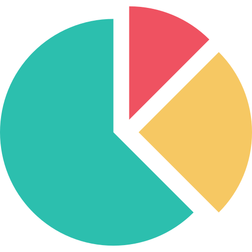

# Checkpoint - Módulo 5

## Elegir la opción correspondiente:


### 1.	¿Qué tipo de visualización sería la más adecuada para la siguiente tabla?


 
1.  Gráfico circular.
2.	Heatmap.
3.	Gráfico de líneas.
4.	Mapa coroplético.


### 2.	Si necesitamos comprender la distribución de una columna númerica, ¿que debería utilizar?
 

A. 
B. 
C. 

1.	A
2.	B
3.	C

#### 3.	¿La siguiente formula posee un error? (SI/NO) 

Calendario = CALENDAR(MAX(Ventas[Fecha]),MIN(Ventas[Fecha]))

### 4.	¿Qué es Data Analytics?

1. El proceso por el cual transformamos los datos
2. Conjunto de técnicas y procesos cuantitativos y cualitativos que son usados para la toma de decisiones, con el objetivo de mejorar la productividad y las ganancias de un negocio a través del conocimiento extraído de los datos.
3. Conjunto de procesos para la extracción y almacenamiento de datos

# Caso Práctico

Para un proceso de selección en una cadena de hoteles, se nos solicita desarrollar el analisis de un dataset de ocupación hotelera. Por lo tanto se nos otorga un dataset con los datos a analizar.
El mismo cuenta con las siguientes columnas:

**Data Dictionary**

-   **Booking_ID**: unique identifier of each booking
-   **no_of_adults**: Number of adults
-   **no_of_children**: Number of Children
-   **no_of_weekend_nights**: Number of weekend nights (Saturday or Sunday) the guest stayed or booked to stay at the hotel
-   **no_of_week_nights**: Number of week nights (Monday to Friday) the guest stayed or booked to stay at the hotel
-   **type_of_meal_plan**: Type of meal plan booked by the customer:
-   **required_car_parking_space**: Does the customer require a car parking space? (0 - No, 1- Yes)
-   **room_type_reserved**: Type of room reserved by the customer. The values are ciphered (encoded) by INN Hotels.
-   **lead_time**: Number of days between the date of booking and the arrival date
-   **arrival_year**: Year of arrival date
-   **arrival_month**: Month of arrival date
-   **arrival_date**: Date of the month
-   **market_segment_type**: Market segment designation.
-   **repeated_guest**: Is the customer a repeated guest? (0 - No, 1- Yes)
-   **no_of_previous_cancellations**: Number of previous bookings that were canceled by the customer prior to the current booking
-   **no_of_previous_bookings_not_canceled**: Number of previous bookings not canceled by the customer prior to the current booking
-   **price_per_room**: price per day of the reservation (in euros)
-   **no_of_special_requests**: Total number of special requests made by the customer (e.g. high floor, view from the room, etc)
-   **booking_status**: Flag indicating if the booking was canceled or not.
-   
-   **Aclaraciones:  price_per_room es el valor por noche, dentro de la reserva**	
-   **Aclaraciones:  cantidad total de noches = no_of_weekend_nights + no_of_week_nights**
		    


### 5.	¿Cuál es el precio más alto por noche en las reservas?  
	 1. 540
	 2. 3910
	 3. 34963
### 6.	¿Qué cantidad de reservas hay en el dataset?  
	 1. 36275
	 2. 27584
	 3. 30280 
### 7.	¿Cuánto fue el incremento porcentual de cantidad de reservas entre el año 2018 y el 2017?
	 1. 10.74%
	 2. -5.23%
	 3. 356.88% 
### 8.	¿Cuál es el mes con precio promedio por reserva mas alto? (leer aclaraciones en el diccionario de datos)


	 1. Julio
	 2. Septiembre
	 3. Diciembre
### 9.	¿Cuánto representan las reservas que repitieron (repeated_guest) sobre el total de reservas? (con dos decimales)
	 1. 2.56%
	 2. 3.03%
	 3. 10.3%
### 10.	¿Qué mes es el preferido por los clientes que tienen hijos?
	 1. Agosto
	 2. Septiembre
	 3. Junio
### 11.	¿Y las personas sin hijos eligen el mismo mes?
	 1. Sí
	 2. No

### 12.	¿Qué tipo de cliente (market_segment_type) utiliza en el total de sus reservas el plan de comidas(type_of_meal_plan) 'Meal Plan 1'?
	1. Corporate
	2. Online
	3. Aviacion

### Visualización de datos con python

### 3.	¿Cuál es la mejor visualización para representar este conjunto?<br> (siendo X variable categoria que representa años)
        X = [1975, 1980, 1985, 1990, 1995, 2000, 2005, 2010, 2015]
        y = [1243, 1543, 1619, 1831, 1960, 2310, 2415, 2270, 1918]

1.	Gráfico de áreas apiladas. 
2.	Heatmap.
3.	Gráfico de barras.
4.	Tarjetas.

### 14.	Teniendo en cuenta los objetos visuales de Python, ¿cuál sería el más adecuado?
1.	pie()
2.	boxplot()
3.	bar()
4.	heatmap()

### 15.	¿La siguiente línea de código representa el objeto visual que se expone más abajo? (Verdadero/Falso)

```python
	import matplotlib.pyplot as plt
	import numpy as np 
	x=np.arange(-8, 8, 1)
	y=x*x
	plt.plot(x,y)
	plt.show()
```


	1. Verdadero
	2. Falso
