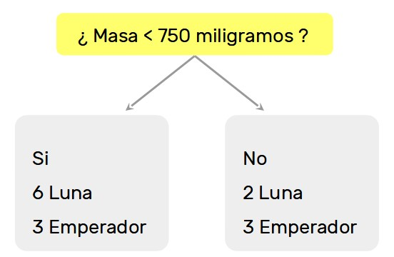
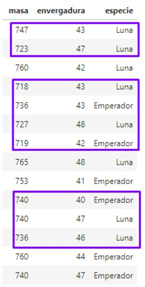
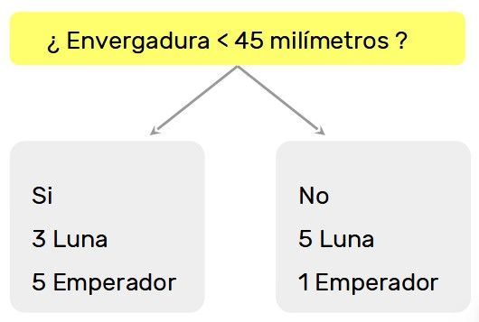

# **MODELOS DE CLASIFICACIÓN**

En los problemas de clasificación utilizamos algoritmos de ML que nos permiten diferenciar si un conjunto de datos pertenece a una determinada clase o a otra/s. El resultado de nuestra función $f(X)=y$ es una etiqueta de categoría, por lo que el algoritmo debe discernir si ciertos valores/atributos pertenecen a cierta categoría o no. 

En la presente clase abordaremos dos modelos predictivos para los problemas de clasificación del aprendizaje supervisado: `árboles de decisión` y `vecinos más cercanos.`

Como veníamos viendo, en el aprendizaje supervisado tenemos tres pasos indispensables:

1. En la primera etapa, tomamos nuestros datos e identificamos como variables predictoras **X** a algunas características, y en una variable **y** al atributo que queremos predecir. Cada componente x (instancia) de **X** (todas las instancias) tiene asociada una etiqueta y en **y**.

2. Le “mostramos” pares (x,y) —pares asociados de variables predictoras y etiquetas— a un modelo preparado para aprender de nuestros datos, de forma tal que crea un conjunto de reglas o asociaciones para, dada una entrada **x**, predecir su salida **y**. Esta fase se conoce como entrenamiento.

3. Una vez que el modelo está entrenado, podemos utilizarlo. En esta etapa -denominada *predicción*-, lo que esperamos es que el modelo nos diga la etiqueta correspondiente a instancias cuya etiqueta no conocemos.

El fundamento de los dos modelos que veremos en esta clase está bien diferenciado. El árbol de decisión busca encontrar en los datos preguntas que le permitan clasificar nuevas instancias a partir de los valores de algunas de sus propiedades. Vecinos más cercanos, por su parte, define las etiquetas viendo las instancias de entrenamiento más parecidas a la instancia que queremos clasificar.

## Regresion logistica

se busca clasificar resultados ***dicotomicos*** 

### Funcion Sigmoidal

su dominio se extiende por todos los reales pero su rango se contiene entre 1 y 0. *Es una probabilidad*
$P = (e**y) / 1 + e**y$

### Odds

es una razon determina la probabilidad de que pase el evento que se estudia. toma numeros > 0

---

## **`Árboles de decisión`**

Un árbol de decisión es una estructura compuesta de nodos, ramas y hojas. Dada una nueva instancia, esta es clasificada recorriendo el árbol de decisión: en cada nodo, el árbol hace una pregunta a la instancia sobre alguno de sus atributos. Según la respuesta a esta pregunta, deriva a la instancia por alguna de sus ramas, donde puede ocurrir que aparezca otro nodo -otra pregunta- o que termine en una hoja. La hoja contiene la etiqueta que le corresponde a esa instancia, finalizando su recorrido en el árbol.

En esencia, el árbol hace preguntas y va clasificando de acuerdo a las respuestas. Podría pensarse como una combinación if-elif-else y return.

A continuación, mostramos un esquema de funcionamiento de un árbol de decisión para clasificar un set de datos que contiene 3 categorías de flores:

A raíz de estas preguntas, las fronteras de decisión quedarían conformadas de la siguiente manera:

Ahora bien, ¿cómo decide el árbol qué preguntas realizar? Para esto, hay dos criterios: `Impureza Gini` o `Entropía`.

## ***Impureza Gini***

La impureza gini se calcula con la proporción de instancias que corresponden a cada clase en cada pregunta que realiza el árbol. Cuanto más alto es su valor, más impura es la muestra. En síntesis, la impureza gini cuantifica cuán puro (instancias con la misma etiqueta) es un conjunto. A más homogeneidad en las etiquetas, más puro es.

Como te imaginarás, la idea es ir construyendo preguntas para cada feature y viendo cuál es la que mejor separa las clases. Se elige el atributo con mayor reducción de impureza. Por supuesto, esto lo hará el modelo por nosotros.

Cuando las hojas contienen muestras de una sola clase, se dice que son hojas puras y ya no se pueden crear más ramas a partir de ellas -es decir, no se pueden desprender más preguntas-. En cambio, si las hojas contienen muestras de varias clases, son hojas impuras. Vale aclarar que cuantas más preguntas haga el árbol, más profundo será.

## ***Entropía***

También conocido como *ganancia de información*, este criterio se utiliza para medir el grado de impureza de una muestra y elegir el atributo que más la reduce. Como vemos, su esencia es bastante parecida al criterio anterior.

Existen otros criterios, que tienen ventajas en algunas situaciones específicas (por ejemplo, `Gain Ratio`, que corrige la preferencia de ganancia de información por atributos con demasiados valores).

Para comprender un poco más acerca del funcionamiento del árbol de decisión, recomendamos este [artículo](https://towardsdatascience.com/scikit-learn-decision-trees-explained-803f3812290d) de Towards Data Science.

## ***Prune tree***

Después de realizar iteraciones suficientes, puede que nuestro árbol haya quedado demasiado "grande". Uno de los criterios más utilizados para la selección de modelos es la parsimonia: el modelo debe ser lo más simple posible (recordemos que son representaciones de la realidad).

Por eso se realiza lo que se llama **pruning**: se poda el árbol hasta que sacar un nodo no mejore la performance del modelo en un test set.

Si bien pueden utilizarse funciones de costo para determinar hasta cuándo la poda es eficiente, el criterio del data scientist y la interpretabilidad del árbol deben siempre ser tenidas en cuenta.

---
## **Ejemplo de uso**

Vamos a repasar visualmente cómo funciona un árbol con un ejemplo tradicional en la materia: las especies de polillas. Tenemos un dataset con dos especies de polillas: *luna* y *emperador*. Asimismo, contamos con dos atributos: masa y envergadura. Miremos el dataset con el que contamos:

El árbol irá realizando preguntas para cada uno de los features, viendó cuál es la que mejor separa las clases.

|Pregunta del árbol en la rama|Registros que cumplen la condición|
|-|-|
|||

|Pregunta del árbol en la rama|Registros que cumplen la condición|
|-|-|
|||

A continuación, mostramos cómo el árbol va calculando internamente el índice gini a partir de la pureza de sus muestras en cada una de las hojas:

¿Qué atributo pensás que debería elegir el árbol para comenzar a preguntar?

La cantidad de preguntas que realice va a estar directamente relacionada con la profundidad que queramos darle al árbol. Ya volveremos sobre este concepto.

## **Ventajas y desventajas de los árboles de decisión**

Ventajas:

+ Fáciles de entender, interpretar y visualizar. Esto ayudará a la hora de comunicar nuestro trabajo

+ Entrenamiento rápido

+ Modelo base para otros más complejos (Random Forest, XGBoost, etc.)

Desventajas:

+ Poder de generalización relativamente bajo en ciertas circunstancias 

+ Desempeño inferior a modelos más modernos

---

## **`Vecinos más cercanos`**

Ahora veremos otro de los algoritmos predictivos de clasificación: *K-Nearest-Neighbor*.

Considerado un aprendiz perezoso, ya que no hay aprendizaje propiamente dicho en el modelo, K-vecinos cercanos predice la clasificación para un nuevo dato buscando, entre todos los pertenecientes al set de entrenamiento, a los K vecinos más parecidos.

Supongamos, entonces, que tenemos una instancia -llamémosle *p*- de la cual queremos saber su etiqueta; entonces, simplemente lo que necesitamos hacer es buscar la instancia más parecida -más cercana- que esté etiquetada y asignarle a *p* la etiqueta de esa instancia. Es decir, la etiqueta que asigna Vecinos más cercanos es la etiqueta de la instancia más parecida, lo que denominamos el vecino más cercano. El proceso se repite K veces para obtener los k-vecinos cercanos.

Veamos ahora un ejemplo. Si quisiéramos clasificar el punto blanco, ¿a qué categoría correspondería?

Pues bien, si buscáramos su vecino más cercano, le debería corresponder el color gris.

Ahora deberíamos definir ¿cómo medimos cercanía, es decir, distancias?

Una de las distancias más utilizadas es la `distancia Euclídea o L2`, que es básicamente la menor distancia entre dos puntos en 2D. De manera más general, se define la distancia Euclídea de la siguiente manera:

Es la raíz cuadrada de la suma del cuadrado de las diferencias entre el punto **a** y el punto **b**.

Pero esta distancia no es la única que podemos tener en cuenta. Pensemos cuando Google Maps nos señala cómo ir de un punto a otro. Este tipo de distancia se conoce como `distancia de Manhattan o L1` y su formulación es la siguiente:

Ambas distancias se insertan en lo que se conoce como ***métricas de Minkowski***.

En el ejemplo de recién, consideramos un solo vecino para realizar la clasificación -de allí que en el segundo gráfico observemos "k = 1"-.

Por regla general se suele utilizar k-vecinos más cercanos. Es decir, se buscan las k-instancias más cercanas y se asigna la etiqueta más frecuente (moda) entre esas instancias.

En resumen, las principales variaciones de K-NN son:

+ La cantidad de vecinos a considerar, k

+ La métrica de distancia a utilizar

+ Ponderación del voto. Podemos asumir que las instancias que estén más cerca de *p*, probablemente sean más parecidas. Entonces, podríamos asignar un peso en la votación a cada instancia vecina de p, dándole mayor importancia a las cercanas y menos a las lejanas

- - -

## **Ventajas y desventajas de vecinos más cercanos**

Ventajas:

+ Simple de interpretar

+ Rápido para entrenar

+ Nuevos datos no impactan en la precisión del algoritmo

+ El modelo se comporta bien ante un problema de clasificación multiclase

Desventajas:

+ Lento para predecir

+ Ocupa mucho espacio en disco (tiene que guardar todo el set de entrenamiento)

+ La métrica de distancia a elegir no es manifiesta

+ No se comporta de manera adecuada en datasets con muchas dimensiones (high dimensional data)

- - - 

## **Support Vector Machine**

El siguiente gráfico representa dos grupos de puntos de clases distintas, que se intenta separar:

 

Para hacerlo, la solución más sencilla puede ser con una recta, sin embargo, existen infinitas rectas posibles que separan perfectamente los grupos de datos. Además, el mejor criterio para seleccionar una de esas rectas, es escoger una línea que capture el patrón general en los datos de entrenamiento, así cabe una buena posibilidad de que separe bien los datos de prueba ó nunca vistos.

Es necesario entonces: 
* Buscar rectas que clasifiquen correctamente los datos de entrenamiento.
* Entre todas estas rectas, elegir la que tenga la mayor distancia <b>d</b>, a los puntos más cercanos a ella.

Los puntos más cercanos que identifican esta recta se conocen como <b>vectores de apoyo</b> (Support Vectors). Y la región que definen alrededor de la línea se conoce como el <b>Margen</b>.

 

Los datos que pueden ser separados por una recta (o en general, un <b>hiperplano</b>) se conocen como datos linealmente separables. El hiperplano actúa como un clasificador lineal. <b>SVM es extensible para n dimensiones</b>. En este caso, la recta de decisión se transformó en un <b>plano de decisión</b>, por tratarse de un problema de <b>3 dimensiones</b>.

 

En la realidad, los datos NO suelen ser separables con una recta. Aunque tampoco se quiere descartar por completo al clasificador lineal, ya que parece adecuado para el problema, excepto por algunos puntos erróneos.

 

En SVM, se puede especificar cuántos errores estamos dispuestos a aceptar mediante un parámetro llamado C, lo que permite dictaminar la relación entre:
* Tener un amplio margen.
* Clasificar correctamente la mayor cantidad de puntos de entrenamiento, dar un valor más alto de C implica que se esperan menos errores en los datos de entrenamiento.

 

* Se puede observar como la línea se inclina a medida que aumenta el valor de C. 
* A valores altos, intenta acomodar las etiquetas de la mayoría de los puntos rojos presentes en la parte inferior derecha de los gráficos. 
* Esto probablemente no es lo que queremos para los datos de prueba. 
* El primer gráfico con C=0,01 parece captar mejor la tendencia general, aunque adolece de una menor precisión en los datos de entrenamiento en comparación con los valores más altos de C.

 

* No siempre es posible separar los datos con una recta, plano o hiperplano. En esos casos es posible aumentar la dimensionalidad de los datos, agregando nuevas dimensiones que permitan aplicar clasificadores lineales.
* En este caso, no podemos separar los datos con un recta, entonces lo que hacemos es aumentar de 2 a 3 dimensiones, mediante una proyección a un nuevo espacio de 3D.
* Lo mejor posible con la recta del ejemplo, es un 75% de precisión en los datos de entrenamiento

Esto se puede resolver entonces, agregando una dimensión más a los datos, por ejemplo de alguna de las siguientes formas:

 

Ahora, los datos proyectados con la nueva variable, sí pueden quedar separados:

 

Para conocer el nuevo límite de separación, se mapea el hiperplano al espacio original.
* La forma del límite de separación en el espacio original depende de la proyección. 
* En el espacio proyectado, esto es siempre un hiperplano.
* Cuando se mapea de vuelta al espacio original, el límite de separación ya no es una recta. Esto también es cierto para los vectores de margen y de soporte. 
* En cuanto a nuestra intuición visual, tienen sentido en el espacio proyectado.

Entonces...
1) Para datos linealmente separables, SVM trabaja muy bien.
2) Para los datos que son casi linealmente separables, SVM puede funcionar bastante bien usando el valor correcto de C.
3) Para los datos que no son linealmente separables, podemos proyectar los datos a un espacio en el que sean perfectamente/casi linealmente separables, lo que reduce el problema a 1 ó 2.

Una gran parte de lo que hace que SVM sea universalmente aplicable es proyectar a dimensiones superiores. Y aquí es donde entran los <b>kernels</b>…

Un Kernel es una forma de calcular el <b>producto punto</b> de dos vectores x e y en algún espacio de características (posiblemente de mayor dimensionalidad), por lo que las funciones del kernel a veces se denominan “producto punto generalizado”.

Supongamos que tenemos un mapeo que trae nuestros vectores a algún espacio de características.
Un kernel es una función K que corresponde a este producto punto.			

Ejemplo: Definimos un mapeo polinómico a un espacio 3D:

 

Entonces la función kernel asociada es:

 

Normalmente no se define una proyección específica para los datos. En su lugar, se selecciona entre kernels disponibles, ajustándolos en algunos casos, para encontrar el que mejor se adapte.
Por supuesto que nada nos impide definir nuestros propios kernels, o realizar la 
proyección nosotros mismos, pero en muchos casos no es necesario. 

 

Entonces, por ejemplo, creamos una tercer variable que esté dada por la función X elevado al cuadrado, lo cual, como puede verse, logra separar las dos clases…

 

En el siguiente ejemplo, tenemos que la función x*y es la que mejor separa los puntos rojos de los azules:

 

Algunos Kernels disponibles:

 

Implementación con Scikit-Learn:

 

### ¿Qué pasa si tenemos más de dos clases en SVM?

* En un problema con K clases, resolvemos K problemas binarios.
* Cada SVM está entrenada para separar una clase del resto de los patrones.
* Para una nueva instancia x, se corren los K clasificadores y se retorna la clase que tenga una función de decisión con el valor más alto (la clase con mayor confianza).

 

Conclusiones:

SVM es un algoritmo de aprendizaje supervisado que se propone encontrar el hiperplano que mejor separe los datos, tal que se maximice el margen. 

* Hiperparámetros: C y Kernels.
* Ventajas: 
	* Eficaz en espacios de alta dimensión (incluso cuando son más que el número de instancias!).
	* Eficiente en memoria (sólo los vectores de soporte definen el hiperplano frontera).
	* Los kernels lo hacen muy versátil.
* Desventajas: 
	* Al usar kernels, hay que tener mucho cuidado de no caer en overfitting.
	* Funciona bien sólo para clasificación.

Enlaces recomendados: 
* [Support Vector Machines: A Visual Explanation with Sample Python Code] (https://www.youtube.com/watch?v=N1vOgolbjSc)
* (https://medium.com/datadriveninvestor/support-vector-machines-ae0ff2375479)
* (https://towardsdatascience.com/kernel-function-6f1d2be6091)
* (https://medium.com/@sitarzkonrad/interactive-3d-k-means-clustering-in-jupyter-1038470f687e)

Con los contenidos teóricos que has visto en esta clase, ahora es momento de pasar a la práctica e instanciar tus primeros modelos predictivos de árbol de decisión y K-NN.

