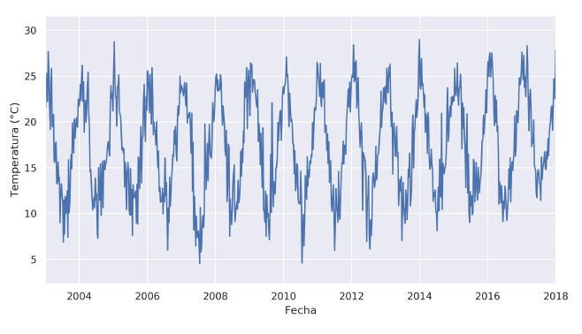
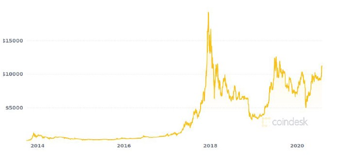

# **Series de tiempo**

Veremos en esta clase un campo con mucha aplicabilidad dentro de Machine Learning: **`time series`**.

Una serie de tiempo es una secuencia de valores ordenados en el tiempo, siguiendo a una unidad de observación. En otras palabras, un conjunto de valores tomados en un intervalo temporal determinado, considerando el mismo objeto de estudio. 

Por ejemplo:

+ Temperatura de la ciudad de Rosario en el periodo 2015-2017

+ Cotización de un activo financiero en el año 2020

+ Ventas de una compañía en el último semestre

En definitiva, suele ser la medición de una misma variable en una ventana o de sucesos que pasaron en un determinado momento. Esto se conoce como serie de tiempo **univariable**. También podríamos tener series de tiempo **multivariables**.

Ahora bien, podríamos aplicar un modelo predictivo para inferir, en un plazo de tiempo definido, las siguientes situaciones:

+ Precio de una criptomoneda

+ Ingresos de un comercio

+ Consumo energético

+ Pronóstico del clima

+ Indicadores macroeconómicos

*Serie de tiempo de la evolución del índice de pobreza en Argentina entre 1992 y 2020 :*

- - - 

## **Frecuencia de muestreo y ventanta temporal**

Nuestro dataset de time series tendrá una `frecuencia de muestreo`. Esta indica cada momento en que se realizó una medición, cada cuánto se guardó un registro. La frecuencia de muestreo de nuestros datos dependerá de la naturaleza del problema. Para algunos casos, necesitaremos mediciones prácticamente constantes -por ejemplo, milisegundos- y en otros tendremos mediciones por día, semana, mes, año, lustro, década, etc.

El escenario ideal sería que nuestros datos tengan una frecuencia de muestreo equidistante. Es decir, que cada uno de los valores estén equiespaciados. La realidad es que muchas veces esto no será así.

Para ello, existen varias soluciones: `time disaggregation models`, `time aggregation models` y **`resample`**. El resampleo consiste en resumir los datos a partir de una categoría temporal y es el que estudiaremos aquí. Dicho en otros términos, agrupamos nuestros datos por algún intervalo de tiempo estable.

Esta técnica no necesariamente la aplicaremos únicamente cuando no tengamos series de tiempo con datos equiespaciados. También podemos usarla para modificar la frecuencia de muestreo original de la serie. Por ejemplo: tenemos el nivel de ventas de una empresa medido día a día, para un periodo de 10 años. Cuando hagamos la gráfica de la serie, notaremos que, probablemente, obtengamos un gráfico demasiado distorsinado. Si, en cambio, resampleáramos los datos con una frecuencia de muestreo mensual o anual, se suavizará notoriamente y la información se verá resumida y con mayor claridad.

En este ejemplo descripto sobre ventas, pasamos de una frecuecia de muestreo más chica (diaria) a una más grande (mensual/anual).

El otro concepto importante en este apartado refiere a `ventana temporal`. La ventana es todo el espacio de muestreo de nuestros datos, desde el inicio hasta el final. Es decir, desde dónde hasta dónde vamos a trabajar nuestros datos. Vamos con otro ejemplo: tenemos una serie que mide la temperatura, con una frecuencia de muestreo de una hora. Una ventana podría tener un tamaño de 24 (24 registros en un día).

- - -

## **Tipos de series de tiempo**

Hablaremos aquí de una característica muy importante de las series, que tiene que ver con su tipología.

Veamos dos series bien diferentes entre sí respecto a su comportamiento.

|Temperatura de Bs As|Cotización histórica del Bitcoin
|-|-|
|||

Como primer acercamiento, podemos apreciar que la serie que mide la temperatura en Buenos Aires tiene más **estructura**. Por su parte, la serie de la derecha, que mide la cotización del Bitcoin, presenta un mayor grado de aleatoriedad.

Si estamos en presencia de una serie como la de la izquierda, decimos que estamos ante una **`serie estacionaria`**. En cambio, si estamos en presencia de una serie como la de la derecha, decimos que estamos ante una **`serie no estacionaria`**.

Podrán imaginarse que hay una de las series que sería más fácil de modelar que  la otra. En efecto, esto es así. Y pasamos a explicarlo:

+ Las **`series estacionarias`** cuentan con cierto nivel de estructura que les concede, en definitiva, un mayor grado de predictibilidad. Una serie estacionaria particular es el llamado ruido blanco (`white noise`), el cual tiene esperanza cero, varianza constante positiva y autocorrelación 

+ Las **`series no estacionarias`** son lo que se conoce como *explosivas*: continúan creciendo (o decreciendo) _ad-infinitum_. Esto dificulta seriamente la precisión de la predicción y el modelado.

- - -

## **Componentes de las series de tiempo**

Pasemos a descomponer cada uno de los elementos que integran una serie:

+ **`Tendencia`**: podríamos especificarlo como la dirección global de la serie. Indica su comportamiento a *largo plazo*. La tendencia puede ser de tres tipos -creciente, decreciente o estable-. En el tercer caso, estamos en presencia de una serie que es *estacionaria en su media*.

+ **`Estacionalidad`**: hace referencia a los procesos que tienen comportamientos repetitivos a lo largo del tiempo. Nos referimos a un patrón, una periodicidad que se da en determinado día, año, mes o cualquier período de tiempo.

+ **`Ciclo`**: fluctuaciones a largo plazo de la serie. Similar a la estacionalidad, en el sentido que se presenta para cierto período de tiempo, pero en este caso es de largo plazo. 

+ **`Ruido blanco`**: shocks aleatorios con media cero y varianza finita. Proceso que no puede explicarse con los otros componentes. 

+ **`Anomalías`**: valores que se alejan mucho de la media. Identificarlas ayuda a la hora de encontrar los componentes de tendencia y estacionalidad. Pasar las anomalías por alto puede distorsionar los componentes y resultados de los modelos predictivos.

- - -

## **Forecasting**

Uno de los casos de aplicación de las series de tiempo está directamente ligado a la creación de modelos predictivos. Contamos con varias técnicas de *forecasting*, aquí enunciaremos las más relevantes y profundizaremos en las que más se utilizan hoy en día.

Por un lado tenemos los **modelos clásicos** o tradicionales, basados en métodos estadísticos-econométricos. Entre estos modelos encontramos:

+ `Procesos AR (autoregresivos)` : se modela a partir de los valores de los registros anteriores -en la ventana de tiempo que se establezca-.

+ `Procesos MA (de media móvil)` :  se modela a partir de los ruidos blancos de los registros anteriores.

+ `ARMA` :  es la combinación entre procesos AR y MA.

+ `ARIMA` : contiene tres elementos (p,d,q). *p* representa el orden del proceso autorregresivo, *d* el número de diferencias que son necesarias para que el proceso sea estacionario y *q* representa el orden del proceso de medias móviles. Se define la diferencia como $\Delta X=X_t-X_{t-1}$ y se le llama *integración* de la variable $X$.

Modelos de Machine Mearning :

+ `One step` : el objetivo es predecir únicamente el siguiente valor de la serie. Por ejemplo, si esta tuviese una frecuencia de muestreo semanal, predeciría el valor de la serie de la semana siguiente.

+ `Multi step` : el objetivo es predecir los n valores siguientes de la serie. Se debe definir la cantidad de steps que se quieren predecir.

+ `Prophet` : elaborado por Facebook. Estudia los componentes de nuestra serie. Incluye modelos de predicción, de detección de anomalías, análisis de estacionalidad para distintas granularidades temporales, estudios de tendencia, entre muchas otras opciones.

Cerramos la parte teórica diciendo que: *la calidad de la predicción de un modelo dependerá, en gran parte, de las características del sistema y la predictibilidad de su comportamiento*.

- - -

Ya es momento de pasar a la práctica y empezar a aplicar nuestras primeras técnicas de forecasting. La práctica del día de hoy se dividirá en tres partes:

1. Análisis de series de tiempo

2. Forecasting con ARIMA

3. One-step, Multi-step y Prophet

