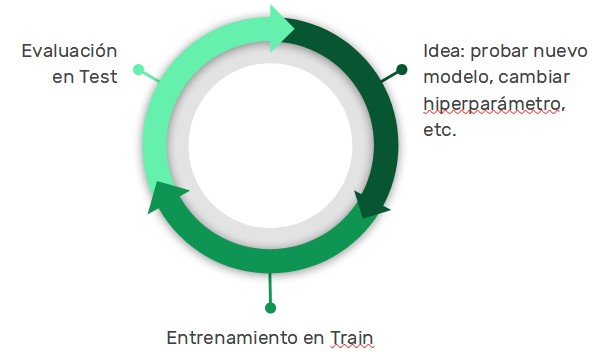
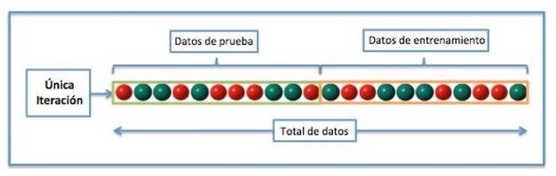
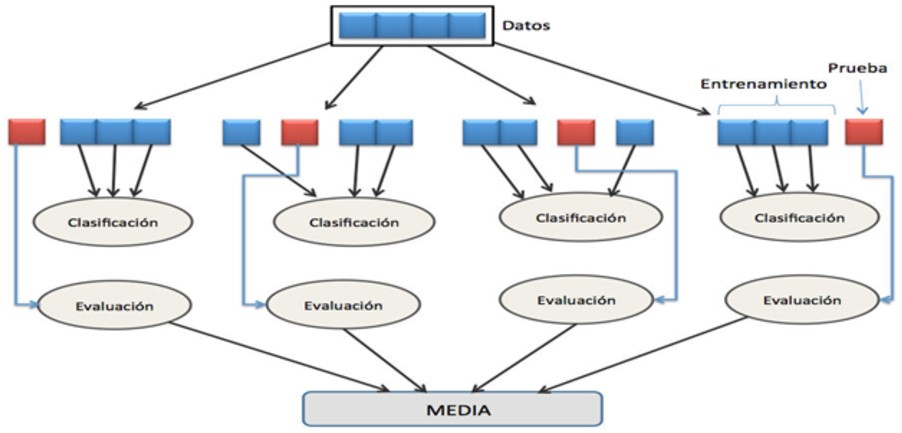
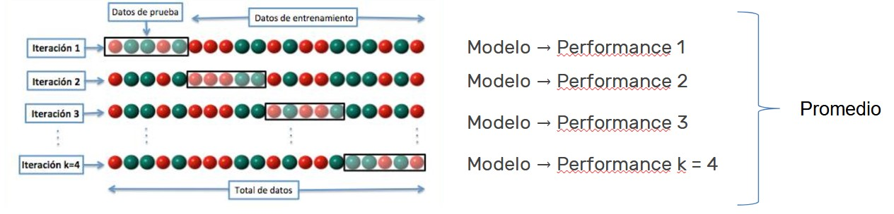
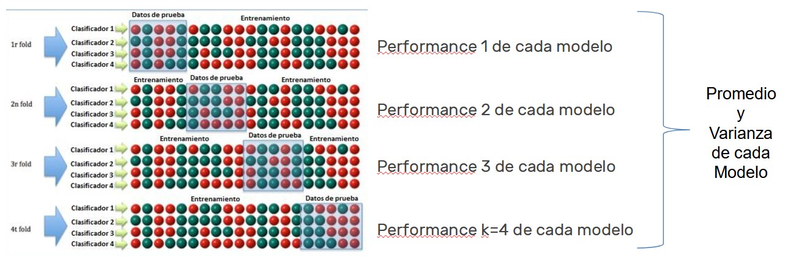
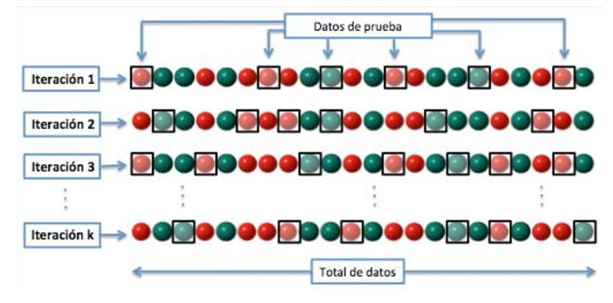
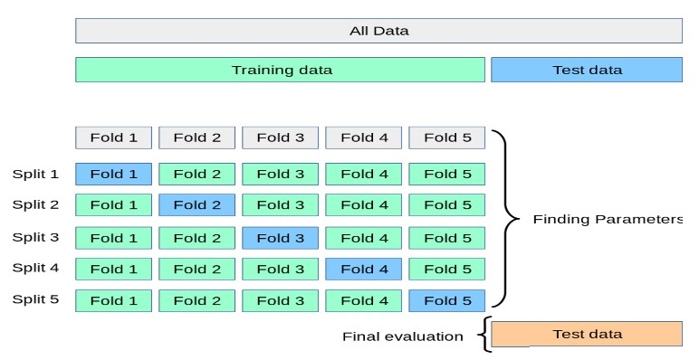
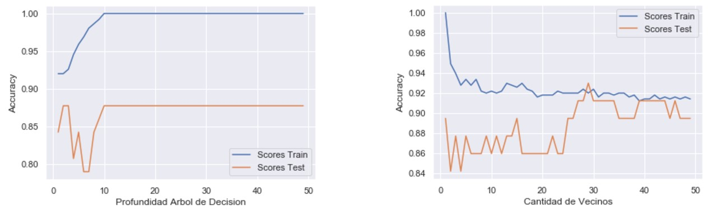
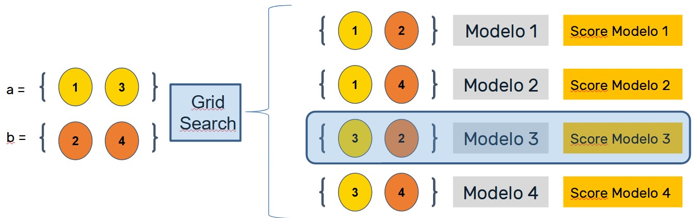
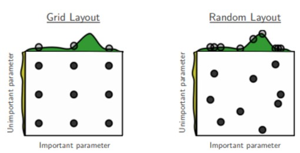

## Validación Cruzada

¿Cómo podemos evaluar si el modelo está aprendiendo o no de nuestros datos?
Una forma práctica de evaluar si nuestro modelo aprendió o no de nuestro datos es observar su desempeño frente a nuevas instancias.

En nuestro flujo de trabajo, tendremos que emular una situación donde el modelo es entrenado con ciertos datos y luego es evaluado con datos nuevos. 
* Train Test Split:
  * Separo los datos en dos conjuntos, Train y Test.
  * Entreno con los datos de Train
  * Evalúo el desempeño del modelo los datos de Test.

Evaluar el desempeño del sobreajuste de Test tiene varios usos:
* Obtenemos una evaluación realista del desempeño de nuestros modelos.
* Nos permite seleccionar el modelo que mejor desempeña sobre nuestros datos.

Pero Machine Learning involucra un proceso altamente iterativo. En general, entrenamos muchos modelos, ya sea de distinto tipo o variando hiperparámetros.

A medida que entrenamos nuevos modelos, puede ocurrir que un modelo tenga una buena performance en el conjunto de Test por azar.
Podemos creer que estamos seleccionando el mejor modelo disponible cuando en realidad estamos seleccionando un modelo mediocre. 
¿Se puede hacer mejor?

 

Separamos los datos con los que contamos en datos de entrenamiento y datos de prueba. 
Se entrena con los datos de entrenamiento y se mide la performance con los datos de prueba.

 

El objetivo de la validación cruzada es obtener una evaluación de performance de nuestro modelo que sea independiente de la partición en entrenamiento y prueba de los datos.

Haciendo muchas particiones esperamos que la medida de performance sea independiente de la partición de los datos.

 

### K-fold Cross Validation:

Es importante notar, que cada dato aparece una sola vez en los datos de prueba y k-1 en los datos de entrenamiento.

 

1) Desordenar los datos
2) Separar en K folds (muestras) del mismo tamaño
3) Para cada fold que separamos:
	1) Elegir la fold como Test set, y las K-1 folds restantes como Train set. 
	2) Entrenar y evaluar el modelo. 
	3) Guardar el resultado de la evaluación y descartar el modelo.
4) Obtener una medida de performance del modelo como el promedio de las K evaluaciones obtenidas en (3). También es una buena práctica incluir una medida de la varianza de las métricas obtenidas porque nos da una noción de cuanto puede afectar haber elegido un grupo de datos de Test u otro.

Comparando muchos modelos con K-fold Cross Validation:

 

Conclusiones sobre K-fold Cross Validation:

* La validación cruzada es un procedimiento de remuestreo que se utiliza para evaluar modelos de aprendizaje automático en una muestra de datos limitada.
* El hiperparámetro más importante es k que se refiere al número de grupos en que se dividirá una muestra de datos dada.
* Es un método popular porque es fácil de entender y porque generalmente resulta en una estimación menos sesgada o menos optimista de la habilidad del modelo que otros métodos, como una simple división de train / test.
* ¡No siempre hay que separar al azar! En algunos casos (por ejemplo, predicción con series de tiempo), la validación cruzada toma otra forma.
* La validación cruzada está íntimamente relacionada con la optimización de hiperparámetros.

### Validación Cruzada Aleatoria

En este caso, cada dato puede aparecer más de una vez en el conjunto de prueba.

 

1) Se hace un train/test split para separar dos conjuntos: uno de desarrollo (dev, también llamado train) y uno de Held-Out (también llamado a veces test):

| Desarrollo  | Held-Out  |
| :---      |  ---: |
|Experimentación con atributos, algoritmos e hiperparámetros  | Estimación realista de performance  |

2) Dentro del conjunto de desarrollo, se hacen todas las pruebas que consideremos necesarias y evaluamos los modelos resultantes usando validación cruzada. Se elige el modelo a partir del desempeño en estos datos (y las otras condiciones que consideremos para el problema, como exhaustividad, Navaja de Ockham, etc.).

* Navaja de Okham: Ante igualdad de condiciones, la explicación más sencilla suele ser la más probable

3) Se evalúa el desempeño del modelo elegido en el conjunto de Held-Out. Es el desempeño que se reporta.

 

Es muy importante, tanto que viene en todos los entornos de desarrollo de Machine Learning:

En Scikit-Learn:
- (https://scikit-learn.org/stable/modules/cross_validation.html)
- (https://scikit-learn.org/stable/modules/classes.html#module-sklearn.model_selection)

## Curvas de Validación

En general, el desempeño de un modelo depende de muchos hiperparámetros. Pero a veces hay uno que es el más importante, el que predomina sobre el resto. 
Para elegir el valor de ese hiperparámetro - y también caracterizar mejor el desempeño de nuestro modelo -, es útil obtener las curvas de validación.
Una curva de validación nos muestra el desempeño del modelo, tanto en el conjunto de entrenamiento como de testeo, en función de un hiperparámetro. 
Como en general el hiperparámetro que variemos va a modificar la “complejidad” del modelo (profundidad en árboles, vecinos en KNN, etc.), también nos sirve para diagnosticar overfitting y underfitting.
Es importante evaluar los modelos desde el punto de vista del problema que queremos resolver, y no quedarse únicamente en una medida de desempeño estadística.
La curva de validación, nos muestra el desempeño en función de los hiperparámetros, tanto para los datos de entrenamiento como los de prueba.

 

## Optimización de Hiperparámetros 

* ¿Cómo elegimos los mejores hiperparámetros para nuestro problema?
* ¿Qué es mejor, exactitud, precisión o exhaustividad? ¿Área bajo la curva ROC?
* Primero, se debe definir una métrica a optimizar. Una vez que se sabe cuál métrica optimizar, hay que probar los distintos valores de hiperparámetros.
* Se debe hacer una búsqueda exhaustiva. Es decir probando con todos los valores de los hiperparámetros que podamos y eligiendo la mejor combinación. Éste método se llama Grid Search (“búsqueda de cuadrícula”). 
* ¿Por ejemplo, si tenemos dos hiperparámetros, a y b, que pueden tomar valores a = {1,2} y b = {3,4}

 

Grid Search consiste en:

1) Elegir los valores que puede tomar cada hiperparámetro
2) Armar las combinaciones “todos con todos” → Armar la grilla
3) Recorrer la grilla entrenando el modelo para cada combinación y evaluarlo.
4) Elegir los hiperparámetros que definen el mejor modelo.

¿Cómo evaluar el modelo?

Al estar probando MUCHOS modelos, podría suceder que uno se desempeñe muy bien en el conjunto de Train simplemente por azar. 
Por esto ,es muy importante evaluar cada modelo creado por Grid Search con Validación Cruzada en el conjunto de entrenamiento.  
<b>Grid Search y Validación Cruzada suelen venir juntos.</b>

### Random Search

Si por ejemplo, se tienen cinco hiperparámetros y cinco valores para probar por hiperparámetro, el tamaño de la grilla comienza a crecer.
Además, para cada modelo se debe hacer la Validación Cruzada.
Este proceso puede ser computacionalmente muy demandante.
Random Search explora opciones y combinaciones al azar, de manera menos “ordenada”. En muchas circunstancias, esto es más eficiente, tanto desde el punto de vista de performance del modelo como de desempeño computacional.

 

Conclusiones:

1) Es necesario definir una métrica a optimizar (exactitud, precisión, RMSE, ROC AUC, etc.)
2) Un modelo (regresor o clasificador)
3) Una grilla de hiperparámetros. Depende del tipo de modelo utilizado.
4) Un método para buscar o muestrear los candidatos
Grid Search: Plantea opciones y explora todas las combinaciones
Random Search: explora opciones y combinaciones al azar.
5) Crear un modelo lo antes posible, en cualquier caso, un modelo fallido muchas veces da tanta información sobre el proceso real como uno válido

Los contenidos de la clase se agruparán en los siguientes tres notebooks:

## `Práctica`

+ Práctica_01: validación cruzada. Dev/hold-out. Optimización de hiperparámetros

+ Práctica_02: regularización Ridge y Lasso

+ Práctica_03: descenso de gradiente
