# **Aprendizaje no supervisado**

Llegó el momento de dejar atrás, al menos por un rato, al **aprendizaje supervisado**. Ahora nos abocaremos al estudio del **aprendizaje no supervisado**.

En esta etapa cambiaremos el enfoque con el que veníamos trabajando hasta el momento. `No supervisado` significa que ya no contamos con las etiquetas asociadas a nuestros datos. Es decir que las instancias no tienen asignadas una clase o un valor de salida. 

Muchas veces se indica que esta subrama de Machine Learning se aplica para encontrar patrones.

Pues esto es así. El objetivo aquí ya no consiste en predecir la etiqueta, sino -precisamente- en encontrar patrones en el set de datos.

Veremos dos técnicas de aprendizaje no supervisado. A saber:

+ Clustering

+ Reducción de dimensionalidad

- - -

## ***Clustering***

Técnica para agrupar datos de acuerdo a cuánto se parecen entre sí. Dado un set de datos, nuestra meta será encontrar grupos -clusters- en los cuales las instancias pertenecientes sean parecidas -estén cerca-.

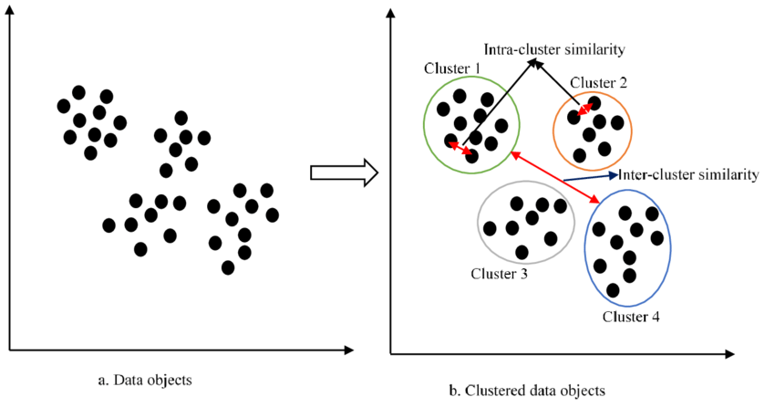

**Pero ¿cómo hacemos para agrupar los datos?**

🚨 Spoiler Alert: como no podía ser de otra forma, existen diversos algoritmos que nos facilitan esta tarea. Ellos son:

+ K-means

+ DBSCAN

+ Hierarchical clustering

+ Fuzzy C-means

+ GMM

El alcance de este curso cubrirá los dos primeros.

### `K-means`

El fundamento de este algoritmo radica en separar los datos en K clusters, ubicando a las instancias que estén dentro de una región cercana de un mismo cluster.

El centro de cada cluster -centroide- es el promedio de todos los puntos pertenecientes a ese cluster.

Cada punto está más cerca del centro de su cluster que de cualquier otro centroide.

Trabaja de manera iterativa:

1) Se inicializan los K centroides

2) Se asigna cada instancia al centroide más cercano

3) Se actualizan los centroides -la nueva posición del centroide es el promedio de las posiciones de las instancias en ese cluster (means)-

4) Se repiten los pasos 2 y 3 -hasta que la posición del centroide no varíe- 

Recomendamos el siguiente [enlace](https://stanford.edu/~cpiech/cs221/handouts/kmeans.html) de la Stanford University sobre el funcionamiento de este algoritmo.

### `DBSCAN`

*Density-Based Spatial Clustering of Applications with Noise*.

Quizás es un poco menos utilizado que el anterior, pero no por ello menos importante. No es necesario aquí seleccionar la cantidad de clusters, ya que el modelo los definirá automáticamente a partir de la densidad de puntos y no de centroides. También incorpora la dimensión de outliers -ruido-, los cuales deja sin clasificar.

El modelo permite agrupar formas más complejas, no necesariamente globulares.

Los cluster son regiones densas en el espacio de datos. Cada punto del cluster tiene que tener un mínimo de vecinos en un radio determinado para no ser un outlier.

Hay tres tipos de puntos:

+ Core point

+ Border point

+ Noise

Hiperparámetros claves del algoritmo:

+ Epsilon: magnitud del radio

+ MinPoints: cantidad mínima de vecinos

Para profundizar en este algoritmo, este [link](https://www.kdnuggets.com/2020/04/dbscan-clustering-algorithm-machine-learning.html) será de gran ayuda.

Respecto a la elección de uno u otro, dependerá del tipo de datos con el que contemos. Podemos señalar que `K-means` se adecúa mejor a clusters alejados, bien agrupados y globulares. Por su parte, DBSCAN es más flexible y permite adaptarse a formas más complejas.
- - -

[K-Means Clustering] (https://www.naftaliharris.com/blog/visualizing-k-means-clustering/)
[DBSCAN Clustering] (https://www.naftaliharris.com/blog/visualizing-dbscan-clustering/)

Cuadro comparativo K-Means y DBSCAN:

| K-Means | DBSCAN  |
| :------ | -----:  |
| Muy Rápido  | Es computacionalmente más costoso |
| No tiene parámetros | Hay que elegir bien los parámetros  |
| Fácil de asignar nuevas instancias  | |
| Hay que definir el número de clusters | No hay que elegir el número de clusters |
| Sólo funciona bien con clusters tipo esferas  | Detecta cualquier forma de clusters |
| Sensible a outliers | Determina automáticamente los outliers  |
| | No anda bien si hay clusters de diferentes densidades |

## **Métricas de evaluación**

Veremos, ahora, las métricas existentes para evaluar los modelos de aprendizaje no supervisado. A diferencia del paradigma del aprendizaje supervisado, que estuvimos viendo hasta hoy, aquí no tenemos etiquetas para comparar cuán alejado de ellas estuvo nuestro valor predicho. 

Pasemos a ver qué opciones tenemos para evaluar nuestros modelos en el aprendizaje no supervisado.

### `Elbow`

Se emplea para el algoritmo K-means. Busca la mejor cantidad K de clusters. Para ello, mide la distancia de cada punto al centroide más cercano. Luego de entrenar el modelo, la variable `model.inertia` tiene esta información.

K óptimo => buscar dónde está el codo de la curva. El valor de inercia siempre desciende con el número de clusters.

Si utilizamos como K los valores que están a la derecha del K óptimo, nuestro modelo comenzará a overfittear.

### `Silhouette`

Con esta métrica medimos qué tan parecidos son los datos con su propio cluster -cohesión- en comparación con qué tan parecidos son a otros clusters -separación-.

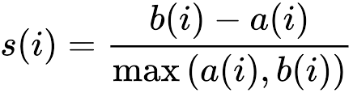

Se utiliza para cualquier técnica de clustering.

Su valor oscila entre -1 y 1. Un valor alto indica que el objeto está bien emparejado con su propio cluster y mal emparejado con los clusters vecinos. Si la mayoría de los objetos tienen un valor alto, entonces la configuración del cluster es apropiada. Si muchos puntos tienen un valor bajo o negativo, entonces la configuración de cluster puede tener demasiados o muy pocos clusters.

- - -

## ***Reducción de dimensionalidad***

La reducción de dimensionalidad busca disminuir la cantidad de features de un dataset, pero reteniendo la mayor cantidad de información posible.

Esto sirve para:

+ Mejorar eficiencia en modelos de regresión y clasificación

+ Disminuir el ruido

+ Facilitar la visualización

+ Detectar features relevantes en datasets

Esta técnica del aprendizaje no supervisado, generalmente, forma parte de la etapa de `preprocesamiento de datos`. Es decir, aplicamos primero este modelo previo a la utilización de otro modelo de Machine Learning.

Algoritmos utilizados para reducción de dimensionalidad:

+ SVD

+ PCA

+ MDS

+ t-SNE

+ Auto-encoders

+ LDA

Nuevamente, veremos los dos primeros algoritmos que son los más utilizados en la materia.

### `SVD`

*Singular Value Decomposition*.

Es un método de álgebra lineal que nos permite representar cualquier matriz en términos de la multiplicación de otras tres matrices.

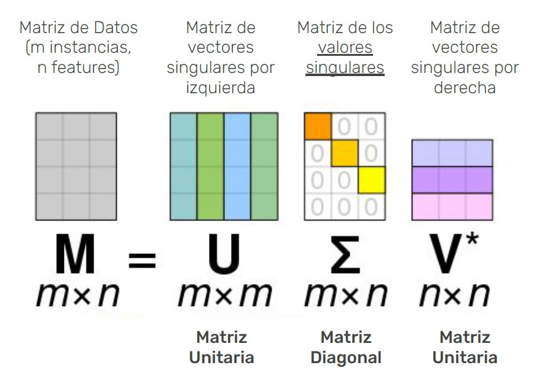

Entre sus tantas utilidades, podemos mencionar la de **reducir** una matriz M -pasar de tener muchos features a tener menos, pero que sean buenos-.

El objetivo consiste en reducir la cantidad de features. Para lograrlo, buscamos crear una nueva matriz B que reemplace a la M, para que tenga menos columnas -es decir, menos atributos-. Esto se conoce como **SVD truncado**.

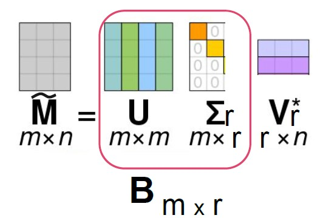

El hiperparámetro que debemos establecer en este modelo es **r**, que representa cuántos features terminaremos teniendo.

### `PCA`

*Principal Component Analysis*.

El método de PCA nos permite reducir la dimensionalidad de un conjunto de datos, sin perder información esencial. Funciona transformando un conjunto de $d$ variables correlacionadas $X=[X_1,X_2,...,X_d]$ en un conjunto de variables no correlacionadas $W=[W_1,W_2,...,W_d]$.

A través de combinaciones lineales de las variables originales que maximizan la varianza explicada se consiguen los llamados componentes principales. Estos son ortogonales entre si (producto escalar 0).

PCA se basa en el teorema de descomposición espectral de la llamada matriz de varianzas y covarianzas $\Sigma_{d\times d}$

La primera componente principal está en la dirección donde los datos presentan varianza máxima. La segunda componente principal está en la segunda dirección en términos de varianza, y así sucesivamente.

Estas componentes pueden representar dimensiones no medibles/no medidas en nuestros datos pero que están altamente correlacionadas: si poseemos, por ejemplo, una curva de bonos, teniendo **d** maturities (duración del bono) diferentes, podemos conseguir **d** componentes principales. Una vez que conseguimos, observando el comportamiento de los primeros tres, podemos explicar cerca del 100% de la variabilidad de los datos y podemos dar interpretaciones a cada componente.

El hiperparámetro principal a establecer es la cantidad de variables con las que nos queremos quedar.

<<<<<<< HEAD
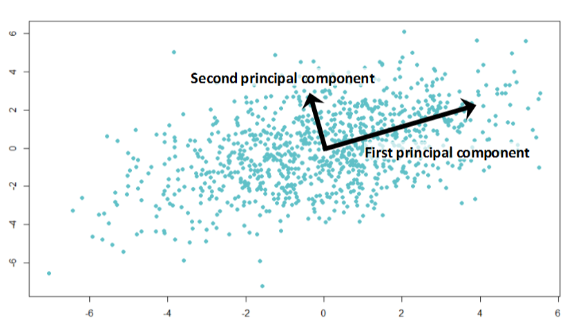

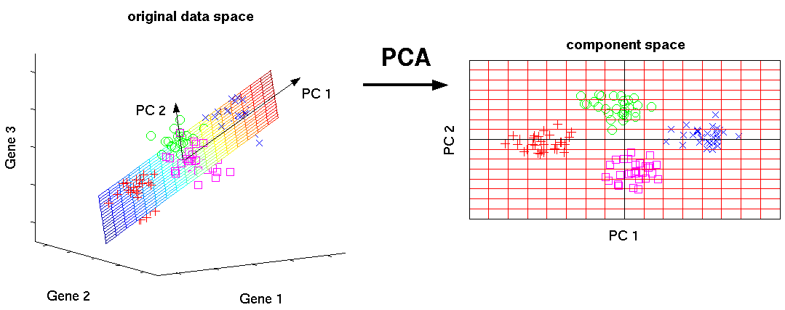
=======

>>>>>>> d48132453714123eeeb2410cacea843e6177b210

Dejamos un breve [video](https://www.youtube.com/watch?v=HMOI_lkzW08&ab_channel=StatQuestwithJoshStarmer) explicativo de el algoritmo PCA.

## Sistemas de Recomendación

Es muy común encontrar en diversas plataformas, recomendaciones de productos para consumo, en base al producto seleccionado: 
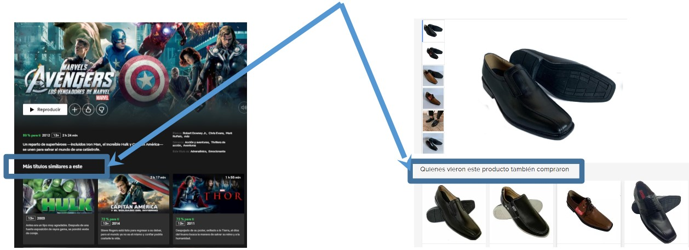 

* Existen usuarios e ítems. Los usuarios prefieren algunos ítems por sobre otros.
* Ejemplo: Usuarios de Netflix y Películas. De 1 a 5 estrellas.
* El objetivo del sistema de recomendación es poblar la matriz de utilidad de una manera inteligente y bajo los requisitos que imponga cada entorno. 
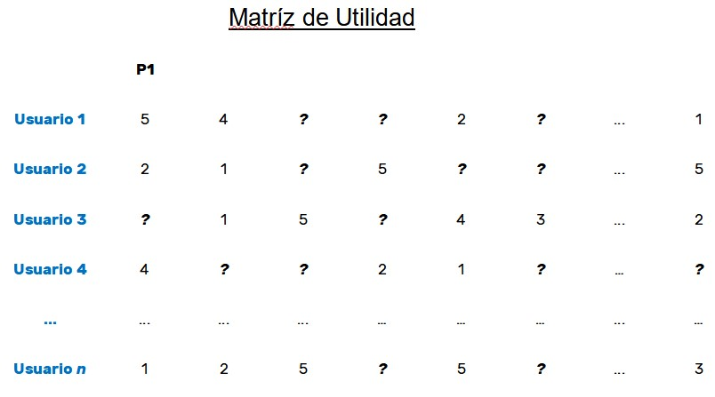 
* Por ejemplo, Netflix tiene 150 millones suscriptores y 5 mil películas. La matriz tiene 750 mil millones de espacios, de los cuales la mayoría están vacíos.
* Cuando buscamos recomendar, interesa más recomendar ítems que van a gustar que aquellos que no van a gustar.
* En algunos casos, interesa mostrar a los usuarios novedades. 
* Algunas veces, ni siquiera hay calificaciones, solamente si vio o no (o escuchó, leyó, compró, etc.).
* Históricamente, las recomendaciones se hacían por medio de crítica de expertos, listas de favoritos, listas de clásicos, más populares, recientes, etc. Hoy las recomendaciones son específicas para cada usuario.

### Es posible diferenciar dos formas de hacer las recomendaciones:

1) Pedir a los usuarios que puntúen los ítems.
  * Los usuarios no suelen hacerlo
  * Si lo hacen, puede estar sesgado (gente que prefiere puntuar cosas que no le gustan a puntuar cosas que sí, etc.).
2) Inferir a partir de acciones
  * Ejemplo: compra muchas cosas de camping → le gusta el camping, aire libre, etc.
  * ¿Qué pasa con las cosas que no le gustan?

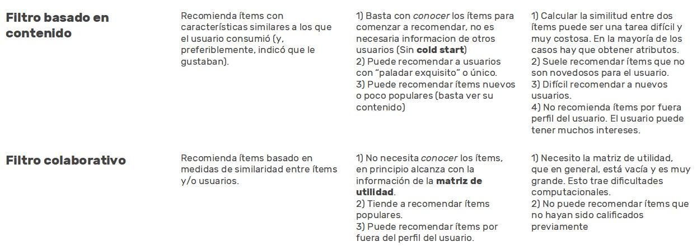 
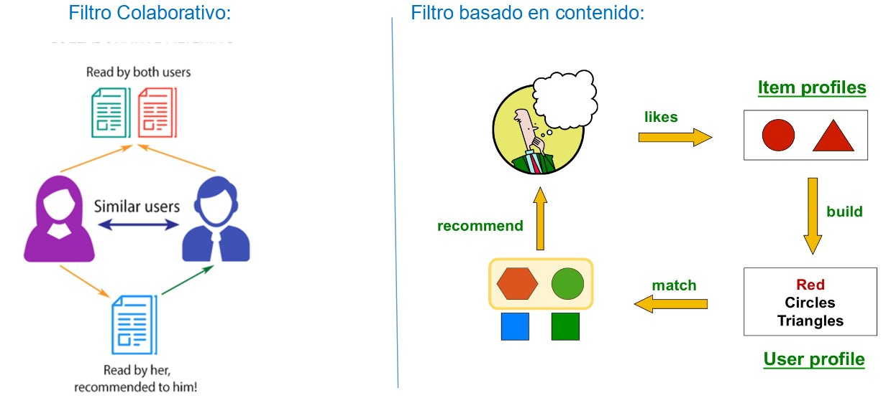 

### Filtro basado en contenido:

1) Para cada ítem, debemos construir un perfil. 
    * Casos sencillos: información fácilmente disponible. Películas: director, género, actores, año, etc.
    * Casos complejos: Debemos extraer features de los ítems. Noticias: hay que usar la batería de herramientas de NLP (tf-idf, etc.)
2) Idealmente, también hay que construir un perfil de qué cosas le gustan al usuario.
3) Usamos una métrica de distancia para encontrar ítems similares.
    * Índice Jaccard
    * Distancia coseno
4) Recomendamos 

### Filtro colaborativo:

1) Se debe llenar la matriz de utilidad, por ejemplo con técnicas de clusterización para encontrar grupos de usuarios similares. De esos usuarios similares, los que tengan algún faltante en un ítem, se lo completa con, por ejemplo, el promedio del cluster.
2) Descomposición UV: 
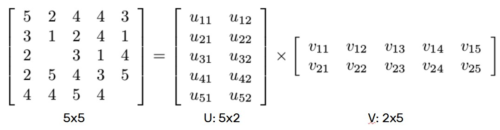 
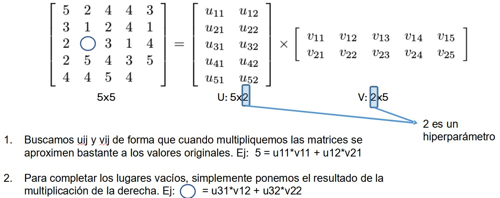 

#### ¿Cómo encontrar los valores para U y V?

* Utilizando una métrica para minimizar. En general, RMSE para los valores no nulos de la matriz.
* Se comienza en algún lugar al azar.
* Se busca el mínimo de la función de costo. Es el problema que resuelve el descenso por gradiente.

Un modelo híbrido, que utilice en paralelo ambos métodos, en ocasiones puede ser lo más adecuado 
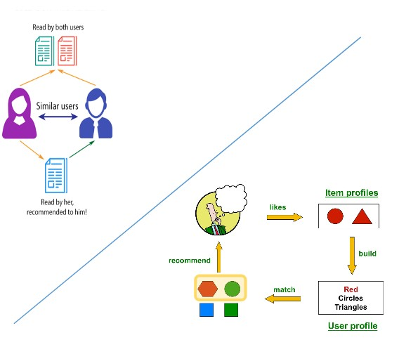 

- - -

## Práctica guiada

La práctica de la clase de hoy se conforma de la siguiente manera:

+ Práctica_01: modelos de clustering. Usaremos K-means y DBSCAN

+ Práctica_02: métricas de evaluación de clustering

+ Práctica_03: modelos de reducción de dimensionalidad. Usaremos SVD y PCA

+ Práctica_04: Sistemas de Recomendación

Para realizar estas prácticas, en la carpeta Datasets poseen un .zip que contiene los archivos a utilizar.

- - -

**La clase que viene volveremos al aprendizaje supervisado.**

