Para esta ocasión, es momento de volver al **aprendizaje supervisado**. 

## Estimación de grandes números

Con frecuencia nos encontramos con la necesidad de hacer una estimación, aún contando con poca información concreta del problema. 
Si bien se puede tener un cierto conocimiento del dominio, cuando hay pocos datos disponibles, una estimación aceptable es una tarea difícil. Sin embargo, hay conceptos matemáticos que pueden servir de herramienta para abordar este tipo de problemas y, a la vez, amigarse con las incertezas y los errores.
Imaginemos un frasco que se encuentra lleno de monedas de un peso, que a priori
no podemos contar, pero queremos saber
la cantidad de monedas que hay dentro.
Estudios demuestran que si planteamos la situación de estimar la cantidad de monedas del frasco a un cierto número de personas, sin más información que la simple visualización del frasco lleno, tendremos subyacente en esos datos un valor aceptablemente cercano a la cantidad real.
Se puede usar el valor promedio, la mediana
o el valor modal, pero si observamos cierta asimetría en la distribución de los datos, es decir, un sesgo o desbalance en la distribución del valor elegido, existe un valor que es más representativo y que logra llevar los datos a una distribución Normal o Gaussiana.

 

Si en lugar de usar el dato tal y como está, usamos la potencia de diez que se acerca al valor de ese dato, es decir, lo llevamos a escala logarítmica, nos encontramos con el concepto de media geométrica y en esa escala podemos tener un valor más adecuado.
Para el ejemplo, usamos una distribución Gamma simulando las posibles respuestas de 2000 personas. Mostramos su histograma y el histograma de los logaritmos, y, por último, comparamos los valores medios obtenidos.

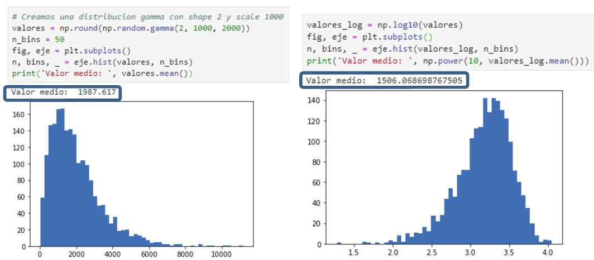 

* En física se denomina problema de Fermi, a problemas que involucran el cálculo de cantidades que parecen imposibles de estimar dada la <b>limitada información disponible</b>. Fermi era conocido por su habilidad para hacer buenos cálculos a partir de datos escasos o nulos, y existen problemas diseñados para enseñar análisis dimensional y cálculo de estimaciones, mostrando la importancia de <b>identificar claramente las hipótesis</b> utilizadas. Estas estimaciones usan números que sean <b>potencia de 10</b>.
* Se conoce como <b>sabiduría de las masas</b> al hecho de que juntando las estimaciones
de muchas personas, en el resultado
global haya una aproximación adecuada a la realidad.
* En Machine Learning este concepto se aplica en metodologías conocidas como <b>Ensambles</b> (Random forest, boosting, bagging), que consisten en juntar el resultado de muchos <b>estimadores débiles</b>, para aportar un resultado final óptimo.

Enlaces recomendados:
* https://www.youtube.com/watch?v=n98BhnwWmsc
* https://www.youtube.com/watch?v=0YzvupOX8Is

## Ensambles

Consiste en entrenar muchos modelos y quedarse con el de mejor rendimiento, es decir, el que mejor clasifique.
Sin embargo, si todos los modelos son muy parecidos, no van a agregar mucha información nueva en la votación. 
Se necesitan modelos diferentes entre sí, poco correlacionados. 
Los modelos pueden ser diferentes entre sí por una variedad de razones:

* Puede haber diferencia en la población de datos
* Puede haber una técnica de modelado utilizada diferente
* Puede haber una hipótesis diferente

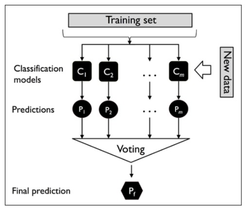 

## Ensambles - Bagging

El Bagging es una de las técnicas de construcción de conjuntos que también se conoce como Agregación Bootstrap (Muestreo con reemplazo de las instancias).
1) Dada una muestra de datos, se extraen varias muestras, <b>bootstrapped</b>
2) Esta selección se realiza de manera aleatoria.
3) Una vez que forman las muestras bootstrapped, se entrenan los modelos de manera separada. En general, estos modelos serán <b>modelos con mucha varianza</b>.
4) La predicción de salida final se combina en las proyecciones de todos los submodelos.

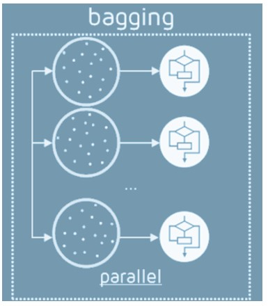 

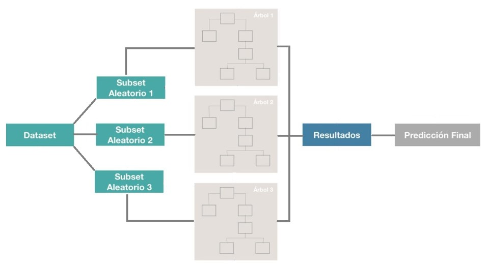 

## Ensambles – Random Forest

Uno de los problemas que hay con el árbol de decisión es que si se le da la profundidad suficiente, el árbol tiende a “memorizar” las soluciones en vez de generalizar el aprendizaje, es decir, hace overfitting.
Para evitar esto, se crean muchos árboles para que trabajen en conjunto, la salida de cada uno se contará como “un voto” y la opción más votada será la respuesta del “Bosque Aleatorio”.
La aleatoriedad está en la selección del valor k de características para cada árbol y en la cantidad de muestras que usaremos para entrenar cada uno.

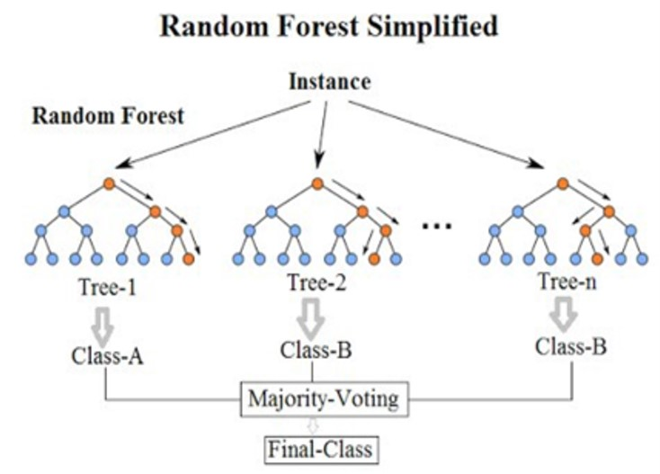 

Si pocos atributos ó features son predictores fuertes, todos los árboles se van a parecer entre sí. Esos atributos terminarán cerca de la raíz para todos los conjuntos generados con bootstrap.
Random Forest es igual a bagging, pero en cada nodo, hay que considerar sólo un subconjunto de m atributos elegidos al azar (random feature selection).

Funcionamiento:
1) Se seleccionan k features de las m totales (siendo k menor a m) y se crea un árbol de decisión con esas k features.
2) Se crean n árboles variando siempre la cantidad de k features
3) Se guarda el resultado de cada árbol obteniendo n salidas.
4) Se calculan los votos obtenidos para cada “clase” seleccionada y se considera a la más votada como la clasificación final del “bosque”.

Conclusiones:
* Random Forest es robusto frente a outliers y ruido.
* Provee buenos estimadores de error (oob_score) e importancia de variables
* Entrenar muchos árboles puede llevar mucho tiempo, pero es fácilmente paralelizable.
* No funciona bien con conjuntos pequeños de datos.

Enlaces recomendados:
* https://medium.com/ml-research-lab/ensemble-learning-the-heart-of-machine-learning-b4f59a5f9777
* https://becominghuman.ai/ensemble-learning-bagging-and-boosting-d20f38be9b1e
* https://www.aprendemachinelearning.com/random-forest-el-poder-del-ensamble/

## Ensambles – Boosting

Se entrena una secuencia de modelos donde se da más peso a los ejemplos que fueron clasificados erróneamente por iteraciones anteriores. 
Al igual que con bagging, las tareas de clasificación se resuelven con una mayoría ponderada de votos, y las tareas de regresión se resuelven con una suma ponderada para producir la predicción final.

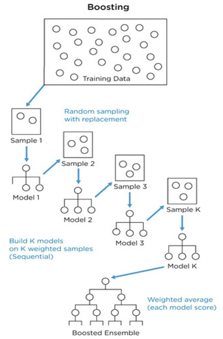 

Ejemplo: Se plantea un problema de clasificación binaria con 10 elementos de entrenamiento, 5 positivos y 5 negativos:
El algoritmo va a iterar hasta lograr una separación aceptable de las clases… 
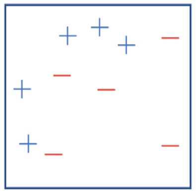 
El primer clasificador débil, genera una recta vertical. A la derecha de la recta, se considera que todos los ejemplos son negativos, mientras que a la izquierda son positivos. 
La recta clasifica mal a tres positivos. 
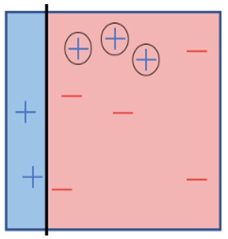 
Ahora los tres ejemplos mal clasificados aparecen de un mayor tamaño que el resto de los ejemplos. 
Esto simboliza que dichos ejemplos tendrán una mayor importancia al momento de seleccionar el clasificador débil de la segunda iteración. 
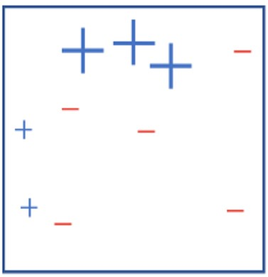 
El segundo clasificador débil, es otra recta vertical colocada más hacia la derecha, se equivoca también en tres ejemplos, ya que clasifica mal ejemplos negativos.  
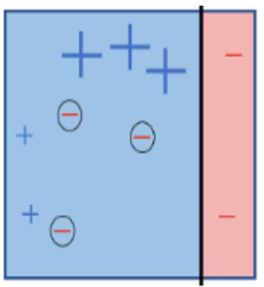 
Para la tercera iteración los ejemplos negativos mal clasificados tienen ahora el mayor tamaño, es decir, tendrán mayor importancia en la siguiente iteración. 
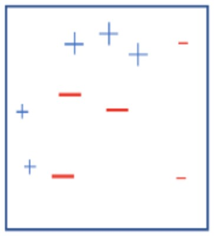 
En la tercera iteración el clasificador débil resultante es una recta horizontal, como se puede observar en el cuadro de la derecha. 
Este clasificador se equivoca en la clasificación de un ejemplo negativo y dos positivos, que de igual forma aparecen encerrados en un círculo. 
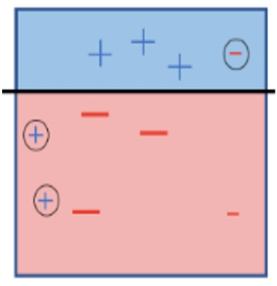 
Finalmente, se ilustra el clasificador fuerte que resulta de crear un ensamble con tres clasificadores débiles. La forma en que se utilizan estos tres clasificadores débiles es mediante una decisión por mayoría. 
Al clasificar un nuevo ejemplo, le preguntamos a cada uno de los tres clasificadores débiles su opinión. Si la mayoría opina que el nuevo ejemplo es positivo, pues entonces la decisión del clasificador fuerte será que es un ejemplo positivo.  
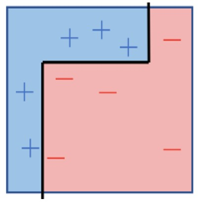 

### Ensambles – XG Boost, Extreme Gradient Boosting

* XGBoost es un algoritmo que recientemente ha dominado el aprendizaje automático y sobre todo las competiciones de Kaggle (para datos estructurados). 
* XGBoost es una implementación de árboles de decisión potenciados por el algoritmo de descenso por gradiente, diseñado para aumentar la velocidad y mejorar el rendimiento.
* XGBoost es una librería de software que se puede descargar e instalar y luego acceder desde una variedad de interfaces: CLI, C++, Python, R, Julia, etc.
* No sólo tiene buena performance computacional, también posee un muy buen desempeño con el manejo de los datos.

Características principales:
* Paralelización de la construcción de árboles utilizando todos los núcleos de la CPU durante el entrenamiento.
* Computación distribuida para el entrenamiento de modelos muy grandes utilizando clusters de máquinas.
* Computación "fuera de núcleo" para conjuntos de datos muy grandes que no caben en la memoria.
* Optimización de caché de estructuras de datos y algoritmos para aprovechar al máximo el hardware.

Instalación: sudo pip install xgboost

Ejemplos: https://github.com/tqchen/xgboost/tree/master/demo/guide-python 

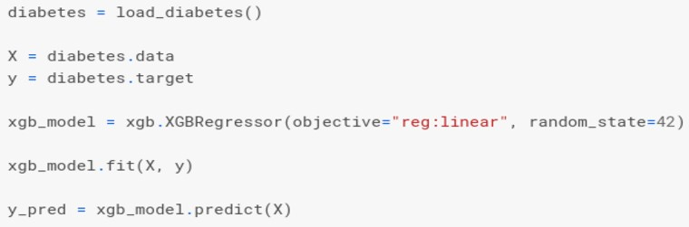 

## Ensambles – Bagging vs. Boosting

| Bagging | Boosting  |
| :------ | -------:  |
| Modelos entrenados de manera independiente. | Bastantes modelos entrenados enfocados en mejorar las fallas de los anteriores. |
| Resuelve promediando los N modelos. | Promedio pesado de los N modelos (su peso depende de su performance). |
| Enfocado en <b>reducir la Varianza</b>. Ayuda a prevenir overfitting. | Enfocado en <b>reducir el Sesgo</b>. En casos puede causar overfitting.  |
| Se suele usar con modelos de bajo Sesgo y alta varianza.  | Se suele usar con modelos de baja varianza y alto sesgo.  |
| Fácilmente paralelizable. | No se puede paralelizar fácilmente. |

Enlaces recomendados:
* https://machinelearningmastery.com/gentle-introduction-xgboost-applied-machine-learning/
* https://towardsdatascience.com/understanding-random-forest-58381e0602d2
* https://towardsdatascience.com/ensemble-methods-bagging-boosting-and-stacking-c9214a10a205

## Ensambles – Stacking

Se crea una función de ensamble que combina los resultados de varios modelos base, en uno sólo. 
Los modelos de nivel de base se entrenan con un conjunto de datos completo, y luego sus salidas se utilizan como características de entrada para entrenar una función de ensamble. 
Normalmente, la función de ensamble es una simple combinación lineal de las puntuaciones del modelo base.

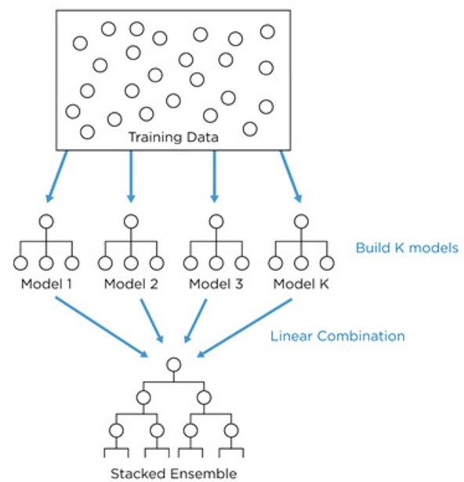 

## Ensambles - Voiting Classifier

Utilizando las predicciones de múltiples clasificadores, se hace predicciones basadas en el más frecuente. 
El hiperparámetro “estimadores” crea una lista para los objetos clasificadores asignándoles nombres. 
El hiperparámetro “votación” se establece en estricto (duro) o no estricto (blando).
Si se establece en estricto, el clasificador de votaciones emitirá juicios basados ​​en las predicciones que aparezcan con mayor frecuencia. De lo contrario, si se establece en no estricto, utilizará un enfoque ponderado para tomar su decisión.
Por ejemplo, se puede configurar en suave cuando se usa un número par de clasificadores debido a su enfoque ponderado y configurarlo en difícil cuando se usa un número impar de clasificadores debido a su enfoque de “mayoría lleva el voto”.

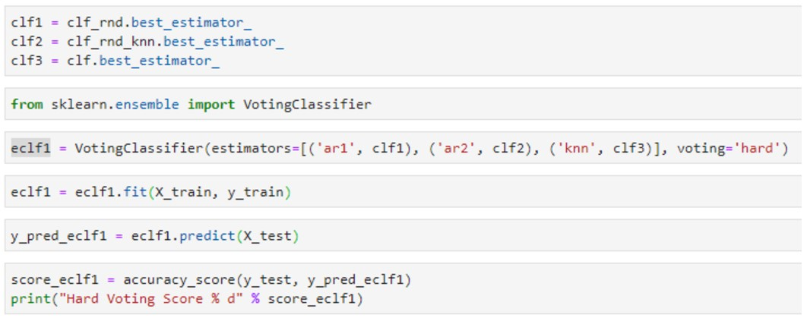 

- - -

En la práctica, veremos modelos de ensamble y las técnicas para generarlos. Finalmente, cerraremos con la puesta en producción/pipeline de Machine Learning.

Los notebooks se dividirán de la siguiente manera:

+ Práctica_01: bagging

+ Práctica_02: boosting

+ Práctica_03: stacking

+ Práctica_04: voting

+ Práctica_05: pipeline

