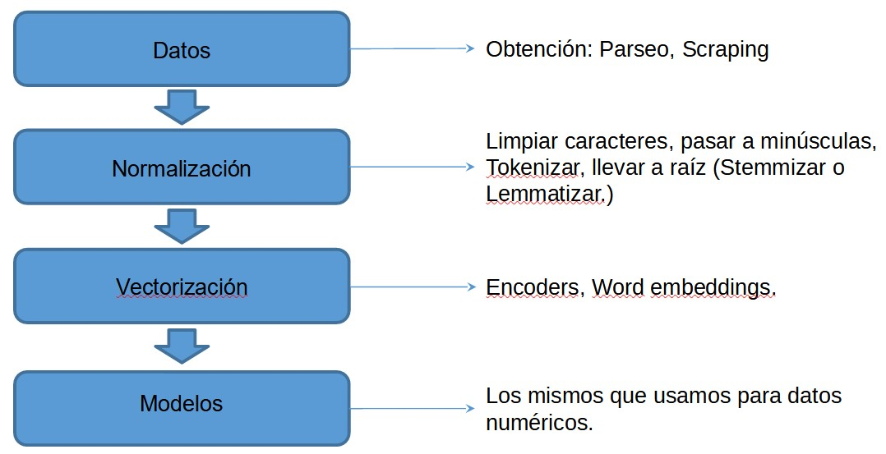
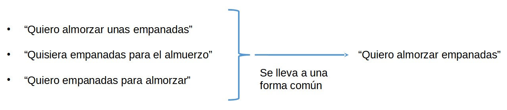
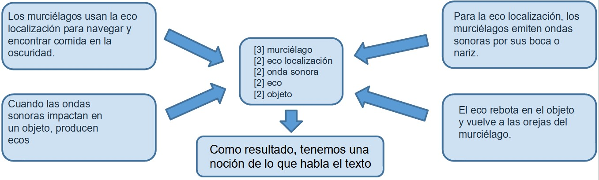
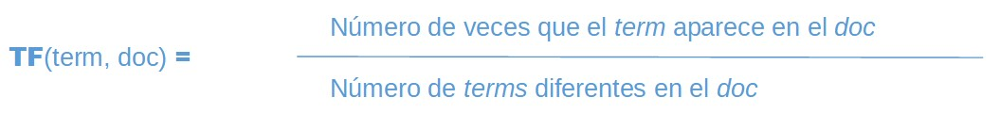
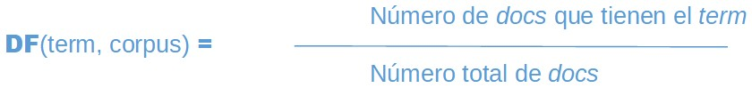
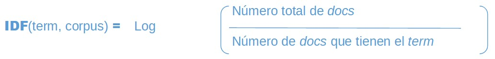
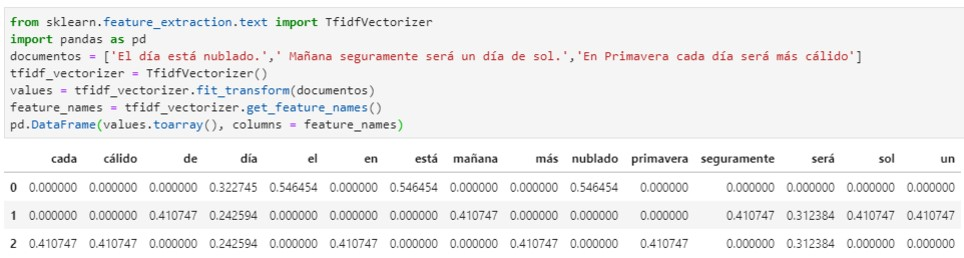

## Procesamiento del Lenguaje Natural

En 1950 Alan Turing crea la famosa Prueba de Turing: 
“Si una persona, en una conversación con una máquina, no es capaz de distinguirlo de un humano, esta es aprobada como inteligente”.

Consiste en que un humano que en principio desconoce si su interlocutor es un humano o una máquina diseñada para generar respuestas similares a las de un humano, evalúe si su conversación fue o no con una máquina. 
La conversación se limita a un medio únicamente textual. En el caso de que el evaluador no pueda distinguir entre el humano y la máquina acertadamente (Turing originalmente sugirió que la máquina debía convencer a un evaluador, después de 5 minutos de conversación, el 70 % del tiempo), la máquina habría pasado la prueba.

<br>

Como resultado de un gran avance en el uso de Internet como medio de interacción entre las personas, existe mucho dato en formato no estructurado que día a día se genera, en un caudal sin precedentes y que contiene sin dudas información relevante.

El procesamiento del lenguaje natural es una rama de la inteligencia artificial que se enfoca en permitirle a las computadoras entender y procesar texto en lenguaje coloquial.

## Flujo de Trabajo en PLN

<br>

### Expresiones Regulares

* Una expresión regular es una secuencia de caracteres que determina un patrón de búsqueda
* Es un lenguaje muy flexible que sirve para identificar y extraer información de un cuerpo de caracteres no estructurado.
* Un recurso muy útil para practicar es https://regexr.com/

| Elemento  | Descripción |
| :-------  | ----------: |
| ()	| Capturing group  |
| \w	| carácter alfanumérico  |
| \d	| dígito  |
| \s	| espacio en blanco  |
| []	| conjunto  |
| (?:)	| Non-capturing group  |
| .	| cualquier cosa menos \n  |
| [m-z3-9]	| rangos  |
| +	| uno o más del elemento anterior  |
| *	| cero o más del elemento anterior  |
| {4,}  | cuatro o más del elemento anterior  |

## Normalizar

Consiste en llevar todo el texto a un formato común donde palabras escrita de manera distinta o con significados similares se representen de la misma manera.

<br>

Pasar a minúsculas todos los caracteres de un texto a su forma minúscula para homogeneizar.

Tokenizar: Pasar de un único string de texto a una lista de strings de oraciones, a su vez, pasar de un único string de texto de la oración, a una lista de strings de palabras ó Tokens:

* “El texto se puede dividir en oraciones. Las oraciones se pueden dividir en palabras.”
* [El texto se puede dividir en oraciones.] [Las oraciones se pueden dividir en palabras.]
* [[El] [texto] [se] [puede] [dividir] [en] [oraciones][.]] [[Las] [oraciones] [se] [pueden] [dividir] [en] [palabras][.]]

Limpiar caracteres: quedarse sólo con los caracteres de interés. Esto dependerá de nuestro problema en particular. En nuestro caso vamos a utilizar la librería ‘re’, que nos permite modificar texto y utiliza expresiones regulares:

[Esto es un #hashtag.] -->  [Esto es un hashtag]

```python
>>> import re
>>> re.sub("[^a-zA-Z]"," ",str(texto))
```

### Llevar a raíz

Llevar palabras distintas con significados similares a una forma común.

* Stemmizer: Recorta las palabras mediante un proceso heurístico. Es rápido y fácil de usar, pero a veces no es certero:

[“starting”, “wants”, “repartitions”, “america’s”]  --> [“start”, “want”, “repar”, “america”]

```python
>>> from nltk.stem import PorterStemmer
>>> stemmer = PorterStemmer()
>>> stemmer.stem(palabra)
```

* Lemmatizer: Utiliza un vocabulario y realiza un análisis morfológico de las palabras. Precisa que se le informe cual es la función de la palabra en el texto:


| | | | | | | | |
|:-|-|-|-|-|-|-|-|
|Buenos Aires |es |la |capital |y |la |más |poblada|
|Sustantivo Propio	|Verbo	|Artículo	|Sustantivo	|Conjunción	|Artículo	|Adverbio	|Verbo|

Para determinar la función de la palabra automáticamente nos ayudamos con la función ‘nltk.pos_tag’. A esta función se le llama POS (Part of Speech)

En lingüística, el lema es una unidad semántica que constituye el léxico de un idioma. Si se trata de verbos, es la conjugación verbal en infinitivo; si se trata de sustantivos, es el singular….

[escribiendo], [caminé], [textos]		-->		[escribir], [caminar], [texto]			
			
```python
>>> from nltk.stem import WordNetLemmatizer
>>> wordnet_lemmatizer = WordNetLemmatizer()
>>> wordnet_lemmatizer.lemmatize(palabra, get_wordnet_pos(palabra)
```

Es más preciso que el Stemmizer, pero lleva más tiempo y su performance depende de la precisión con la que le pasemos los POS.

## Vectorizar

Se representa cada texto (instancia de la base de datos) como un vector que podamos usar como vector de features para entrenar un modelo:

Para el texto:

"Los murciélagos usan la eco localización para navegar y encontrar comida en la oscuridad. Para la eco localización, los murciélagos emiten ondas sonoras por sus boca o nariz. Cuando las ondas sonoras impactan en un objeto, producen eco. El eco rebota del objeto y vuelve a las orejas del murciélago."

Podemos obtener:

[0]Los [1]murciélagos [2]usan [3]la [4]eco [5]localización [6]para 
[7]navegar [8]y [9]encontrar [10]comida [11]en [12]la [13]oscuridad
[14]. [15]Para [16]eco [17]localizar[18], [19]los [20]murciélagos [21]emiten [22]ondas [23]sonoras [24]por [25]sus [26]boca [27]o [28]nariz[29]. [30]Cuando [31]las [32]ondas [33]sonoras [34]impactan [35]en [36]un [37]objeto[38], [39]producen [40]eco [41]. [42]El [43]eco [44]rebota [45]del [46]objeto [47]y [48]vuelve [49]a [50]las [51]orejas [52]del [53]murciélago[54].

* Bag of words: Generar un vector que represente todas las palabras del corpus. Representar cada instancia como un vector con la cantidad de veces que aparecen las palabras.

[2] Los
[2] murciélagos
[1] usan 
[3] la 
[4] eco 
[2] localización 
[2] para 
[1] navegar 
[2] y 
[1] encontrar
[1] comida
[3] en
[1] oscuridad
[1] emiten 
[2] ondas 
[2] sonoras
[1] por 
[1] sus
[1] boca
[1] o
[1] nariz
[1] cuando
[1] las
[1] impactan
[1] un
[2] objeto
[1] producen
[2] el
[1] rebota
[1] vuelve
[1] a
[1] a
[1] las
[1] orejas
[1] del
[1] murciélago

* Para implementar esto utilizamos una función de sklearn llamada CountVectorizer: 	
from sklearn.feature_extraction.text import CountVectorizer

Se pude aplicar el lema de cada palabra, además quedarse con los sustantivos y los verbos, y ordenar por aquellas palabras más usadas

[4] eco
[3] murciélago 
[2] localización
[2] onda 
[2] sonora
[2] objeto
[1] usar 
[1] navegar 
[1] encontrar
[1] comida
[1] oscuridad
[1] emitir
[1] boca
[1] nariz
[1] impactar
[1] producir
[1] rebotar
[1] volver
[1] oreja

* Surge el problema de que nos quedan muchos features debido a que la cantidad de palabras es muy grande, por lo tanto nos quedamos con las más frecuentes:

[4] eco
[3] murciélago 
[2] localización
[2] onda 
[2] sonora
[2] objeto

* N-Gramas: Hay palabras que cobran sentido cuando se las agrupa con otras, por ejemplo “eco localización”. Además de cada palabra por separado, se agregan los grupos de 2 (ó N) palabras contiguas a nuestro vector de Features:

CountVectorizer(max_features=max_features, stop_words="english" , ngram_range=(1, 2))

<br>

## TF – IDF (Term Frecuency – Inverse Document Frecuency)

* Se busca diferenciar cada documento (frase) por las palabras que lo componen, asumiendo que las palabras que están en TODOS ellos no aportan información.
* Hay que medir no sólo cuanto aparece una palabra en una instancia (documento), sino también qué tan frecuente es esa palabra en todo el corpus del texto.
* Term Frecuency: Frecuencia de una palabra (term) en una instancia o documento (doc)
<br>

* Document Frecuency: Fracción de todos los documentos en el corpus que continenen el término.
<br>

* Inverse Document Frecuency: Logaritmo inversa de DF. 
<br>

Notar que si está en todos los docs entonces log(N/N) = log(1) = 0

* TF-IDF: Producto del valor TF por el de IDF.
<br>

Cada palabra tiene un valor asociado en cada documento, con esto se forma el vector, donde no necesariamente serán valores enteros:<br>

<br>

Enlaces recomendados:

* https://towardsdatascience.com/introduction-to-natural-language-processing-for-text-df845750fb63
* https://medium.com/@gon.esbuyo/get-started-with-nlp-part-i-d67ca26cc828
* Natural Language Processing with Python - https://www.nltk.org/book/
* OpenAI GPT-2 - Parte 1 - (https://www.youtube.com/watch?v=8ypnLjwpzK8) 
* OpenAI GPT-2 - Parte 2 - (https://www.youtube.com/watch?v=0OtZ8dUFxXA)

## Práctica guiada

Hemos llegado a la última clase del módulo. Hoy profundizaremos en tres áreas que están en auge y tienen mucha aplicabilidad en el mundo de Machine Learning.

+ Práctica_01: Procesamiento de Lenguaje Natural

Para realizar estas prácticas, en la carpeta Datasets poseen un .zip que contiene los archivos a utilizar.